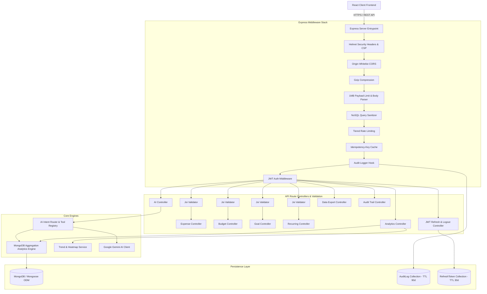
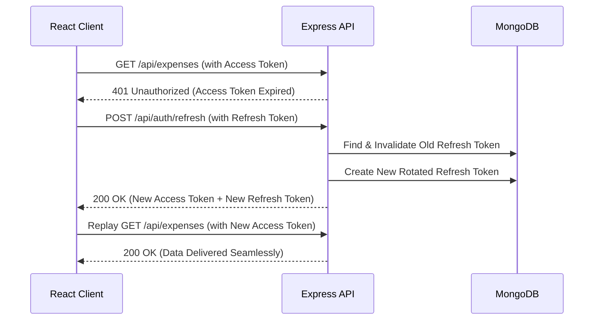

# 🛠️ Richy Rich — Backend Architecture & Intelligence System Documentation (v2.2.0)

Welcome to the comprehensive technical documentation for the **Richy Rich** personal finance backend service. This system is designed as a **Production-Grade, AI-First Personal Finance Intelligence Platform**, combining deterministic mathematical calculations with hybrid AI reasoning via Google Gemini API and fintech-standard security hardening.

---

## 📐 Architecture Overview

The backend is built as a RESTful API service using **Node.js**, **Express.js**, and **MongoDB / Mongoose ODM**. It guarantees 100% mathematical accuracy for financial calculations through a deterministic Analytics Engine, while enriching the user experience with an AI reasoning layer.



---

## 📁 Directory & File Structure

```
server/
├── .env                       # Environment variables (PORT, MONGODB_URI, JWT_SECRET, GEMINI_API_KEY)
├── package.json               # Node.js dependencies & scripts
├── src/
│   ├── server.js              # Express app entrypoint, security stack, graceful shutdown
│   ├── config/
│   │   └── db.js              # MongoDB connection handler with in-memory fallback
│   ├── middleware/
│   │   ├── auth.js            # JWT verification & req.user attachment
│   │   ├── sanitize.js        # NoSQL injection sanitizer ($ and . stripping)
│   │   ├── rateLimiter.js     # Tiered rate limiting (global, auth, AI)
│   │   ├── auditLogger.js     # Mutating request auditor with PII redaction
│   │   ├── idempotency.js     # 24h idempotent POST cache
│   │   └── validate.js        # Joi schema validation middleware factory
│   ├── utils/
│   │   └── AppError.js        # Structured application error class with factory helpers
│   ├── validators/
│   │   ├── authValidator.js   # Auth registration, login & refresh schemas
│   │   ├── expenseValidator.js# Expense create & update schemas
│   │   ├── budgetValidator.js # Budget create & update schemas
│   │   ├── goalValidator.js   # Goal create & update schemas
│   │   └── recurringValidator.js # Subscription schemas
│   ├── models/
│   │   ├── User.js            # User authentication schema
│   │   ├── RefreshToken.js    # JWT refresh token rotation schema (TTL 30d)
│   │   ├── Expense.js         # Transaction / expense schema
│   │   ├── Budget.js          # Category budget limit schema
│   │   ├── Goal.js            # Savings goal schema
│   │   ├── RecurringExpense.js# Subscriptions & recurring bills schema
│   │   ├── Category.js        # Spending categories schema
│   │   └── AuditLog.js        # Audit trail schema with 90-day TTL index
│   ├── routes/
│   │   ├── authRoutes.js      # Register, Login, Refresh, Logout, Me, Demo endpoints
│   │   ├── expenseRoutes.js   # CRUD endpoints for expenses
│   │   ├── budgetRoutes.js    # Budget management endpoints
│   │   ├── goalRoutes.js      # Goal tracking endpoints
│   │   ├── recurringRoutes.js # Subscriptions & payment recording
│   │   ├── categoryRoutes.js  # Category endpoints
│   │   ├── analyticsRoutes.js # Analytics & dashboard statistics
│   │   ├── aiRoutes.js        # AI Copilot, Smart Categorizer & Synthesis
│   │   ├── auditRoutes.js     # Audit trail querying
│   │   └── exportRoutes.js    # CSV & JSON streaming data export
│   ├── controllers/
│   │   ├── authController.js  # Auth handlers + JWT rotation lifecycle
│   │   ├── expenseController.js
│   │   ├── budgetController.js
│   │   ├── goalController.js
│   │   ├── recurringController.js
│   │   ├── categoryController.js
│   │   ├── analyticsController.js
│   │   ├── aiController.js
│   │   ├── auditController.js
│   │   └── exportController.js
│   └── services/
│       ├── analytics/
│       │   ├── analyticsService.js  # MongoDB Aggregation Analytics Engine
│       │   └── trendService.js      # Weekly trends, heatmaps, merchant frequencies
│       └── ai/
│           ├── geminiClient.js      # Google Gemini API SDK wrapper
│           ├── aiService.js         # AI synthesis, smart categorizer & copilot handler
│           ├── contextBuilder.js    # Financial ground truth context assembler
│           ├── intentRouter.js      # Query intent classifier for Copilot
│           └── toolRegistry.js      # Tool executor mapping intents to analytics calls
└── tests/                           # Jest Automated Integration Test Suite (67 tests)
    ├── auth.test.js                 # Auth lifecycle + JWT refresh & token rotation tests
    ├── expenses.test.js
    ├── budgets.test.js
    ├── goals.test.js
    ├── recurring.test.js
    ├── validation.test.js
    ├── exportAndAudit.test.js
    └── analytics.test.js
```

---

## 🗄️ Database Schemas & Data Models

### 1. User Model (`User.js`)
Stores user authentication details and encrypted password hashes.
```javascript
{
  name: { type: String, required: true, trim: true },
  email: { type: String, required: true, unique: true, lowercase: true },
  passwordHash: { type: String, required: true }, // Hashed using bcryptjs (salt rounds: 10)
  preferredCurrency: { type: String, default: '₹' },
  locale: { type: String, default: 'en-IN' },
  timezone: { type: String, default: 'Asia/Kolkata' },
  themePreference: { type: String, enum: ['dark', 'light', 'system'], default: 'dark' }
}
```

### 2. RefreshToken Model (`RefreshToken.js`)
Stores cryptographically secure refresh tokens with automatic 30-day TTL expiry and token rotation.
```javascript
{
  userId: { type: Schema.Types.ObjectId, ref: 'User', required: true, index: true },
  token: { type: String, required: true, unique: true, index: true },
  expiresAt: { type: Date, required: true } // TTL index (30 days)
}
```

### 3. Expense Model (`Expense.js`)
Represents financial outflow transactions with compound indexes on `(userId, date)` and `(userId, category)`.
```javascript
{
  userId: { type: Schema.Types.ObjectId, ref: 'User', required: true, index: true },
  title: { type: String, required: true, trim: true },
  amount: { type: Number, required: true, min: 0 },
  category: { type: String, required: true, trim: true, index: true },
  merchant: { type: String, default: '', trim: true },
  paymentMethod: { type: String, enum: ['Card', 'Cash', 'UPI', 'Bank Transfer', 'Other'], default: 'Card' },
  date: { type: Date, default: Date.now, index: true },
  note: { type: String, default: '' },
  tags: [{ type: String }],
  recurringExpenseId: { type: Schema.Types.ObjectId, ref: 'RecurringExpense', default: null },
  source: { type: String, enum: ['manual', 'recurring', 'ai_suggested', 'import'], default: 'manual' }
}
```

### 4. AuditLog Model (`AuditLog.js`)
Immutable audit trail recording all user mutations with automatic 90-day TTL expiry.
```javascript
{
  userId: { type: Schema.Types.ObjectId, ref: 'User', default: null, index: true },
  action: { type: String, required: true },
  resourceType: { type: String, enum: ['expense', 'budget', 'goal', 'recurring', 'user', 'export', 'ai'] },
  resourceId: { type: String, default: null },
  ipAddress: { type: String, default: 'unknown' },
  userAgent: { type: String, default: '' },
  requestBody: { type: Schema.Types.Mixed, default: null }, // Sensitive fields redacted
  success: { type: Boolean, default: true },
  statusCode: { type: Number },
  createdAt: { type: Date, default: Date.now } // TTL index (90 days)
}
```

---

## 🔄 JWT Refresh Token Architecture

The authentication pipeline follows modern fintech standards (**Revolut / Cash App**):

1. **Short-Lived Access Tokens**: Signed JWT with 15-minute validity (`JWT_EXPIRES_IN=15m`).
2. **Long-Lived Refresh Tokens**: 40-byte cryptographically secure random hex string with 30-day validity stored in MongoDB.
3. **Token Rotation**: Every time `/api/auth/refresh` is called, the old refresh token is deleted and a brand new refresh token + access token pair is issued.
4. **Client Interceptor**: The frontend API client (`apiFetch`) intercepts `401 Unauthorized` responses, refreshes the token transparently via `/api/auth/refresh`, and seamlessly replays the original request without user disruption.



---

## 🧮 High-Performance Analytics Engine (`analyticsService.js` & `trendService.js`)

All financial metrics are calculated **deterministically** via high-efficiency **MongoDB Aggregation Pipelines** ($match, $group, $facet, $sort) without pulling raw documents into Node.js heap memory.

### Key Analytical Methods:
1. **Monthly Summary (`getMonthlySummary`)**: Computes total spend, transaction count, average daily pace, and remaining days.
2. **Category Breakdown (`getCategoryBreakdown`)**: Groups transactions by category and computes percentage contributions.
3. **Month-Over-Month Comparison (`getMonthlyComparison`)**: Executes a single `$facet` pipeline comparing current vs previous calendar months in one database round-trip.
4. **Budget Utilization (`getBudgetUtilization`)**: Aggregates spend per budgeted category and evaluates threshold alerts.
5. **Spending Velocity (`getSpendingVelocity`)**: Projects month-end spending velocity based on daily pace.
6. **Z-Score Anomaly Detection (`getAnomalies`)**: Two-pass statistical algorithm flagging transactions where $Z > 2.0$ and $x \ge 1.5 \times \mu$.
7. **Weekly Spending Trend (`TrendService.getWeeklyTrend`)**: Aggregates spend across the trailing 12 weeks for sparklines.
8. **Category Heatmap (`TrendService.getCategoryHeatmap`)**: Matrix of spending by category × day of week.
9. **Merchant Frequency (`TrendService.getMerchantFrequency`)**: Top merchants by transaction count and average ticket size.

---

## 🛡️ Security & Fintech-Grade Defenses

1. **Helmet Security Suite**: Comprehensive HTTP security headers (CSP, HSTS, X-Frame-Options, X-Content-Type-Options, Referrer-Policy).
2. **Tiered Rate Limiting (`express-rate-limit`)**:
   - Global: 100 req / 15 min / IP
   - Auth (`/api/auth`): 10 req / 15 min / IP (brute-force protection)
   - AI (`/api/ai`): 30 req / 15 min / IP (quota protection)
3. **Strict Input Validation (`Joi`)**: All mutations validated against declarative schemas with field-level error messages before reaching controllers.
4. **Idempotency Layer (`idempotency.js`)**: Caches POST responses by `Idempotency-Key` header with 24-hour TTL to prevent double-charging or duplicate submissions on network retries.
5. **Auditing & Compliance (`auditLogger.js`)**: Records every create, update, and delete action with automatic password/token redaction.
6. **Streaming Data Export (`exportController.js`)**: Cursor-based streaming CSV/JSON export to prevent server memory spikes during large data downloads.
7. **NoSQL Injection Sanitization (`sanitize.js`)**: Recursive sanitizer stripping malicious MongoDB query operators (`$ne`, `$where`, etc.).
8. **Graceful Shutdown**: Drains open HTTP connections and cleanly disconnects from MongoDB upon `SIGTERM` or `SIGINT`.

---

## 🔑 Complete REST API Endpoints Reference

### 1. Authentication (`/api/auth`)
| Method | Endpoint | Description | Auth Required |
| :--- | :--- | :--- | :--- |
| `POST` | `/api/auth/register` | Register new user (Joi validated) | No (Rate limited) |
| `POST` | `/api/auth/login` | Login user & get access + refresh tokens | No (Rate limited) |
| `POST` | `/api/auth/refresh` | Rotate & refresh access token | No (Rate limited) |
| `POST` | `/api/auth/logout` | Invalidate refresh token | No |
| `GET` | `/api/auth/me` | Fetch authenticated profile | Yes (JWT) |
| `POST` | `/api/auth/demo` | Seed / load demo user data | No |

### 2. Transactions / Expenses (`/api/expenses`)
| Method | Endpoint | Description | Auth Required |
| :--- | :--- | :--- | :--- |
| `GET` | `/api/expenses` | List transactions (search, category, date, page) | Yes |
| `GET` | `/api/expenses/summary` | Get running totals and transaction count | Yes |
| `GET` | `/api/expenses/:id` | Get single transaction | Yes |
| `POST` | `/api/expenses` | Create expense (Joi validated, Idempotent) | Yes |
| `PUT` | `/api/expenses/:id` | Update expense (Joi validated) | Yes |
| `DELETE`| `/api/expenses/:id` | Delete expense | Yes |

### 3. Budgets & Pace (`/api/budgets`)
| Method | Endpoint | Description | Auth Required |
| :--- | :--- | :--- | :--- |
| `GET` | `/api/budgets` | Get category budgets & utilization % | Yes |
| `POST` | `/api/budgets` | Create / upsert category budget | Yes |
| `PUT` | `/api/budgets/:id` | Update category budget amount/threshold | Yes |
| `DELETE`| `/api/budgets/:id` | Delete budget limit | Yes |

### 4. Savings Goals (`/api/goals`)
| Method | Endpoint | Description | Auth Required |
| :--- | :--- | :--- | :--- |
| `GET` | `/api/goals` | List all savings goals | Yes |
| `POST` | `/api/goals` | Create savings goal (Joi validated) | Yes |
| `PUT` | `/api/goals/:id` | Update goal progress / status | Yes |
| `DELETE`| `/api/goals/:id` | Delete goal | Yes |

### 5. Subscriptions & Recurring (`/api/recurring`)
| Method | Endpoint | Description | Auth Required |
| :--- | :--- | :--- | :--- |
| `GET` | `/api/recurring` | List active subscriptions | Yes |
| `POST` | `/api/recurring` | Create subscription (Joi validated) | Yes |
| `GET` | `/api/recurring/:id/history`| Get subscription payment timeline | Yes |
| `POST` | `/api/recurring/:id/pay` | Record cycle payment & advance date | Yes |
| `PUT` | `/api/recurring/:id` | Update subscription details | Yes |
| `DELETE`| `/api/recurring/:id` | Delete subscription | Yes |

### 6. Analytics & Intelligence (`/api/analytics`)
| Method | Endpoint | Description | Auth Required |
| :--- | :--- | :--- | :--- |
| `GET` | `/api/analytics` | Consolidated analytics overview | Yes |

### 7. AI & Finance Copilot (`/api/ai`)
| Method | Endpoint | Description | Auth Required |
| :--- | :--- | :--- | :--- |
| `POST` | `/api/ai/categorize` | Smart categorize expense transaction | Yes (AI limited) |
| `GET` | `/api/ai/summary` | AI Monthly Ground-Truth Synthesis | Yes (AI limited) |
| `GET` | `/api/ai/explanation`| Spending change breakdown explanation | Yes (AI limited) |
| `POST` | `/api/ai/copilot` | Chat with Finance Copilot | Yes (AI limited) |
| `GET` | `/api/ai/insights` | Prioritized insight action cards | Yes (AI limited) |

### 8. Data Export (`/api/export`)
| Method | Endpoint | Description | Auth Required |
| :--- | :--- | :--- | :--- |
| `GET` | `/api/export/expenses` | Stream export expenses (format=csv/json) | Yes |

### 9. Audit Trail (`/api/audit`)
| Method | Endpoint | Description | Auth Required |
| :--- | :--- | :--- | :--- |
| `GET` | `/api/audit` | Paginated immutable audit trail | Yes |

---

## ⚡ Automated Test Suite

The backend includes a comprehensive Jest integration test suite containing **67 automated tests** across 8 test suites:

```bash
cd server
npm test
```

### Test Coverage Breakdown:
- **`auth.test.js`** — User registration, password complexity validation, login credentials, JWT validation, refresh token rotation lifecycle, and logout invalidation.
- **`expenses.test.js`** — CRUD operations, filters, pagination, search, cross-user security isolation.
- **`budgets.test.js`** — Budget creation, upserting, utilization calculations, threshold limits.
- **`goals.test.js`** — Savings goal milestones, auto-status transitions (`active` → `achieved`).
- **`recurring.test.js`** — Subscription schedules, payment recording with automatic date advancement.
- **`validation.test.js`** — Joi schema validation, error formatting, boundary conditions, field stripping.
- **`exportAndAudit.test.js`** — CSV/JSON streaming data export, audit log recording, idempotency key caching.
- **`analytics.test.js`** — Deterministic analytics math, Copilot intent routing, and fallback synthesis.
