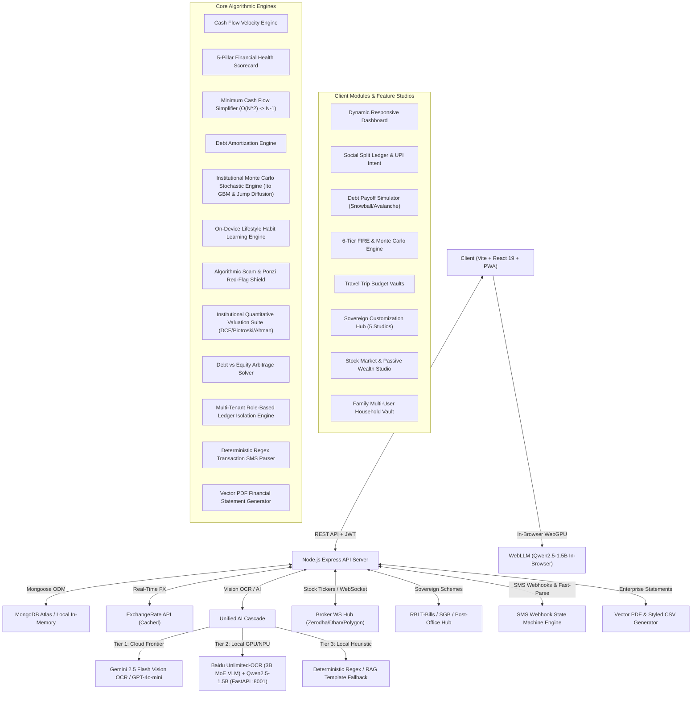

# 🧠 Richy Rich (Expense Tracker V2) — Sovereign Knowledge Hub (MOC)

> **Architecture Instruction**: This Knowledge Hub acts as the **Single Source of Truth (SSOT)** for all architectural choices, feature specs, mathematical models, API contracts, design systems, and engineering manuals.

---

## 🗺️ Visual Architecture Map

---

## 📚 Repository Documentation Hierarchy

### 01. System Architecture (`Documentation/01-Architecture/`)
- [[Services-and-Engines]] — Algorithmic design, time complexities, and mathematical formulations for all backend services.
- [[Database-Models]] — MongoDB collection models, compound index definitions, TTL caches, and encryption specs.
- [[API-Contracts]] — Comprehensive REST API endpoint definitions, request/response JSON schemas, and error codes.
- [[Security-and-Middleware]] — Helmet, express-rate-limit, JWT refresh rotation, and sanitation middleware.
- [[State-Management-and-Contexts]] — Client React contexts (`AuthContext`, `ThemeContext`, `DataContext`).

### 02. Design System (`Documentation/02-Design-System/`)
- [[Design-System-Master]] — Global color tokens, OLED dark theme, typography, buttons, cards, and modal rules.
- [[Component-Catalog]] — Atomic UI elements, animated cards, flow sparklines, and metric donuts.
- [[Design-Tokens]] — Complete CSS token definitions for spacing, depth, and palettes.
- [[Page-Directory]] — View specifications and responsive breakpoint standards.

### 03. Core Features Specifications (`Documentation/03-Features/`)
- [[AI-Copilot-and-OCR-Engine]] — Gemini 2.5 Flash vision parser and structured transaction extractor.
- [[Cash-Flow-Velocity-Engine]] — Velocity analytics, runway predictor, and 5-Pillar Scorecard.
- [[Minimum-Cash-Flow-Graph-Solver]] — Group bill split engine, $O(N^2) \to N-1$ graph reduction, and dynamic UPI QR generation.
- [[Monte-Carlo-and-FIRE-Simulator]] — Institutional stochastic Monte Carlo engine and 6-tier FIRE planner.
- [[Multi-Currency-FX-Engine]] — Multi-currency trip budgets and real-time forex conversions.
- [[Customization-Hub-and-Feature-Flag-Engine]] — 5-Studio customization suite, staged toggles, and snapshot rollback.
- [[Lifestyle-and-Habit-Learning-Engine]] — On-device behavior profiling ($C_v$, $\lambda$) and proactive financial nudges.
- [[Adaptive-Device-Capability-Profiler]] — Automated hardware inspection and dynamic client feature gating.
- [[Stock-Market-and-Wealth-Intelligence-Ecosystem]] — Real-time tickers, Sovereign Scheme Radar, Scam Shield, and DCF valuation.
- [[Family-Multi-User-Ledgers-and-Enterprise-Exports]] — Multi-tenant household vaults, role-based permissions, and PDF reports.
- [[Local-Voice-AI-and-Modular-Model-Hub]] — Resilient continuous voice recognition and on-demand local AI weights.

### 04. Architecture Decision Records (`Documentation/04-ADR/`)
- [[ADR-001-Dual-Token-JWT-Authentication]] — Dual token auth and rotation.
- [[ADR-002-Minimum-Cash-Flow-Graph-Reduction]] — Greedy heap settlement.
- [[ADR-003-Multimodal-OCR-Fallback-Cascade]] — 3-Tier OCR fallback cascade.
- [[ADR-004-Client-Side-AES-GCM-Encrypted-Vault]] — PBKDF2 + AES-GCM 256-bit vault.
- [[ADR-005-Deterministic-RAG-Financial-Advisor]] — Rule-based RAG financial synthesis.
- [[ADR-006-Local-Unlimited-OCR-and-SLM-Fallback-Pipeline]] — Baidu Unlimited-OCR microservice.
- [[ADR-007-Local-Financial-SLM-Intelligence-and-Fallback-Architecture]] — 3-Tier on-device SLM intelligence.
- [[ADR-008-Stochastic-Monte-Carlo-and-FIRE-Engine]] — Ito calculus jump diffusion engine.
- [[ADR-009-Adaptive-Device-Hardware-Profiling-and-Feature-Optimization]] — Dynamic hardware gating tiers.
- [[ADR-010-Modular-Feature-Flags-State-Snapshot-Backup-and-Customization-Hub]] — Atomic staged flags.
- [[ADR-011-Stock-Market-Sovereign-Schemes-and-Valuation-Engine]] — Broker WebSockets and valuation suite.
- [[ADR-012-Family-Multi-User-Ledgers-SMS-Webhooks-and-Enterprise-Exports]] — Household vaults and SMS parser.
- [[ADR-013-Local-Voice-AI-and-On-Demand-Modular-Intelligence-Hub]] — Voice AI & Audio Visualizer.
- [[ADR-014-Wealth-Simulator-Fintech-UIUX-Alignment]] — High-density quant UX design.
- [[ADR-015-Live-Dynamic-Data-Pipelines-and-Resilient-Market-Sync]] — Dynamic FX and market feeds.

### 05. Tasks, Roadmaps & Blueprints (`Documentation/05-Tasks/`)
- [[Master-Plan-Prompt-Blueprint]] — Master Antigravity AI-First blueprint and product evolution specs.
- [[Project-Kanban]] — Live status board of sprints and active tasks.
- [[Changelog]] — Production release notes and version history.

### 06. Manuals & Guides (`Documentation/Manual/`)
- [[TEAM_COLLABORATION_MANUAL]] — Complete onboarding, Git workflow, Antigravity IDE, and architecture guide.
