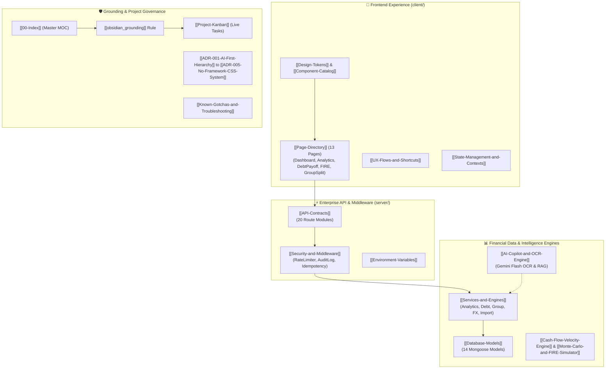

# 🧠 Expense Tracker V2 — Master Knowledge Graph & MOC

> **AI-First Sovereign Personal Finance Intelligence Platform**  
> *Deterministic Financial Core · Graph-Mapped Codebase · Zero-Hallucination Grounding*

---

## 🗺️ Visual Architecture Map

---

## 📚 Master Vault Navigation Index

### 1. 🏗️ System Architecture & Contracts (`01-Architecture/`)
- **[[Database-Models]]** — Comprehensive schemas for all 14 Mongoose models (`User`, `Expense`, `Income`, `Budget`, `Goal`, `Debt`, `Group`, `TripVault`, `SecretVault`, etc.).
- **[[API-Contracts]]** — Detailed REST API reference covering 20 route modules, HTTP methods, headers, request payloads, and response shapes.
- **[[Services-and-Engines]]** — Deep-dive into backend service algorithms in `server/src/services/`.
- **[[Security-and-Middleware]]** — Zero-trust security pipeline: JWT rotation, rate limiting, duplicate hashing, and audit logging.
- **[[State-Management-and-Contexts]]** — Frontend React context architecture (`AuthContext`, `PrivacyContext`).
- **[[Environment-Variables]]** — Complete configuration matrix for `server/.env` and `client/.env`.

### 2. 🎨 Design System & UI Components (`02-Design-System/`)
- **[[Design-Tokens]]** — CSS custom properties, dark/light theme definitions, HSL palettes, glassmorphism tokens, and micro-animation keyframes.
- **[[Component-Catalog]]** — Reusable component specs: Quick-Loggers, Financial Health Dial, Debt Avalanche Charts, and Modal Dialogs.
- **[[Page-Directory]]** — Catalog of all 13 frontend pages in `client/src/pages/`.
- **[[UX-Flows-and-Shortcuts]]** — Keyboard shortcuts (`Alt+P`, `Ctrl+/`), animation physics, and micro-interactions.

### 3. 🚀 Features & Mathematical Engines (`03-Features/`)
- **[[Feature-Roadmap]]** — Phase 1–4 capabilities matrix.
- **[[Stock-Market-and-Wealth-Intelligence-Ecosystem]]** — Real-time trading desk, quantitative DCF & TA models, verified bank/govt scheme radars, and passive income compounding (`[[STOCK_MARKET_TRADING_ANALYSIS_AND_GENUINE_SCHEMES_MASTER_PLAN]]`).
- **[[Blockchain-and-Emerging-Tech-Ecosystem]]** — Web3, Merkle audits, zk-SNARKs, and Edge AI ecosystem (`[[BLOCKCHAIN_AND_FUTURE_TECH_FEATURE_PLAN]]`).
- **[[Cash-Flow-Velocity-Engine]]** — Math formulas for net cash flow, savings rate %, daily burn rate, and runway.
- **[[AI-Copilot-and-OCR-Engine]]** — Multimodal Gemini 2.5 Flash receipt scanner & deterministic RAG context injection.
- **[[Minimum-Cash-Flow-Graph-Solver]]** — Greedy graph reduction for split bills ($O(N^2) \to N-1$) + NPCI UPI Intent QR generation.
- **[[Monte-Carlo-and-FIRE-Simulator]]** — 1,000-run stochastic wealth simulation ($P_{10}, P_{50}, P_{90}$) and Rule-of-25 FIRE math.
- **[[Multi-Currency-FX-Engine]]** — Real-time currency exchange rates and travel trip budget vaults.

### 4. 🏛️ Architecture Decision Records (`04-ADR/`)
- **[[ADR-001-AI-First-Hierarchy]]** — Strict dependency hierarchy: *DB $\to$ Analytics $\to$ AI $\to$ User Action*.
- **[[ADR-002-Graphify-Code-Graph]]** — AST-extracted code knowledge graph for deterministic code navigation.
- **[[ADR-003-Client-Side-Encrypted-Vault]]** — Zero-knowledge AES-256-GCM client-side encryption for `SecretVault`.
- **[[ADR-004-Dual-Token-JWT-Rotation]]** — Dual-token authentication with cryptographic refresh rotation.
- **[[ADR-005-No-Framework-CSS-System]]** — Why bespoke Vanilla CSS variables were chosen over Tailwind utility bloat.

### 5. 📋 Sprint Execution & Health (`05-Tasks/`)
- **[[Project-Kanban]]** — Interactive task checklist for human + Antigravity pair programming.
- **[[Changelog]]** — Semantic release version history (`v1.0.0` to `v3.0.0`).
- **[[Known-Gotchas-and-Troubleshooting]]** — Port collisions, MongoDB TTL indexing, and Node ESM rules.
- **[[PROJECT_STATUS]]** — Runtime service health and test suite reports.

### 6. 🎨 Visual Canvases (`Visual-Canvases/`)
- **`Architecture-Map.canvas`** — Interactive visual node canvas connecting all project layers.

---

## 🔍 Anti-Hallucination Grounding Protocol

When Antigravity or any AI agent executes tasks on this codebase:
1. **Spec Lookup First**: Read the corresponding note in `01-Architecture/`, `02-Design-System/`, or `03-Features/`.
2. **Deterministic Schemas**: Do not invent new fields or parameters without consulting the spec.
3. **Keep Graph Fresh**: Run `graphify update .` after making structural code modifications.
