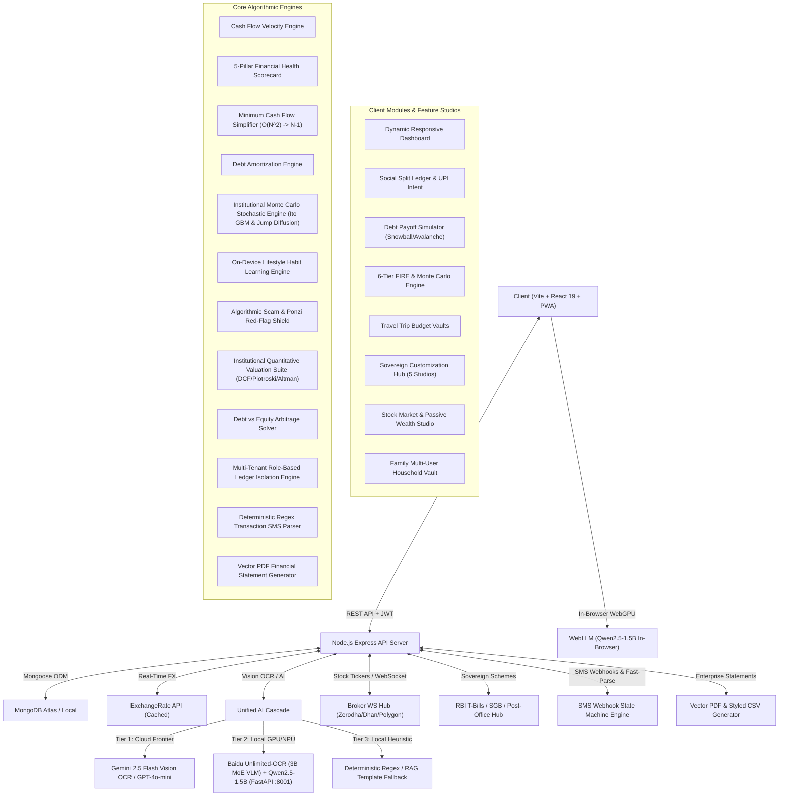

# 🧠 Expense Tracker V2 — Sovereign Knowledge Graph (MOC)

> **Antigravity AI Instruction**: This Obsidian Knowledge Vault acts as the **Single Source of Truth (SSOT)** for all architectural choices, feature specs, mathematical models, API contracts, and active tasks. Before implementing any major feature, refer to this graph. After implementation, synchronize this graph and document any Architecture Decision Records (ADRs).

---

## 🗺️ Visual Architecture Map

---

## 📚 Vault Hierarchy & Map of Content (MOC)

### 01. System Architecture (`Documentation/01-Architecture/`)
- [[System-Overview]] — Full-stack system architecture, deployment topologies, security boundaries, and environment configurations.
- [[Services-and-Engines]] — Algorithmic design, time complexities, and mathematical formulations for all backend services.
- [[Database-Schema]] — MongoDB collection models, compound index definitions, TTL caches, and encryption-at-rest specs.
- [[API-Contracts]] — Comprehensive REST API endpoint definitions, request/response JSON schemas, and error codes.

### 02. Research & Deep Benchmarks (`Documentation/`)
- [[LOCAL_UNLIMITED_OCR_AND_SLM_BILL_PARSING_RESEARCH]] — Comprehensive benchmarks on Baidu Unlimited-OCR (3B MoE VLM) & Qwen2.5-1.5B for local bill extraction.
- [[LOCAL_FINANCIAL_SLM_INTELLIGENCE_AND_FALLBACK_RESEARCH]] — Benchmarks on on-device Financial SLMs (Qwen2.5, Llama-3.2, SmolLM2) for spending explanations and zero-outage intelligence.
- [[LOCAL_LIFESTYLE_HABIT_LEARNING_AND_SOVEREIGN_WEBAPP_ARCHITECTURE]] — Research on On-Device Habit Intelligence, Privacy-Preserving Feature Vectors, and PWA Web App Architecture.
- [[ADAPTIVE_DEVICE_HARDWARE_PROFILING_AND_CAPABILITY_OPTIMIZATION_RESEARCH]] — Non-invasive client-side hardware profiling (RAM, CPU, WebGPU, Battery, WASM benchmark).
- [[MODULAR_FEATURE_FLAG_ENGINE_AND_STATE_SNAPSHOT_CUSTOMIZATION_HUB_RESEARCH]] — Architecture research on Staged Feature Flags, Atomic Commits, Pre-Sync Memento Snapshots & Customization Hub.
- [[LOCAL_VOICE_AI_AND_ON_DEMAND_MODULAR_INTELLIGENCE_RESEARCH]] — Master research report on local STT, OCR, SLM, and Embeddings for sovereign on-device intelligence.

### 03. Core Features Specifications (`Documentation/03-Features/`)
- [[Multimodal-Receipt-OCR]] — Gemini 2.5 Flash vision parser and structured transaction extractor.
- [[Cash-Flow-and-Financial-Health]] — Velocity analytics, runway predictor, and 5-Pillar Scorecard.
- [[Social-Splits-and-UPI-QR]] — Group bill split engine, $O(N^2) \to N-1$ graph reduction, and dynamic NPCI QR generation.
- [[Debt-Freedom-Payoff-Simulator]] — Snowball vs. Avalanche payoff strategy engine.
- [[Monte-Carlo-and-FIRE-Simulator]] — Institutional stochastic Monte Carlo engine (Ito GBM, Merton Jump Diffusion, 50k runs) and 6-tier FIRE planner.
- [[Travel-Vaults-and-Real-Time-FX]] — Multi-currency trip budgets and real-time forex conversions.
- [[Offline-Mode-and-Privacy-Shield]] — IndexedDB optimistic cache and global `Alt+P` privacy blur shield.
- [[Customization-Hub-and-Feature-Flag-Engine]] — 5-Studio customization suite, staged toggles, and snapshot rollback.
- [[Lifestyle-and-Habit-Learning-Engine]] — On-device behavior profiling ($C_v$, $\lambda$, $\mathcal{L}_{\text{inf}}$) and proactive financial nudges.
- [[Adaptive-Device-Capability-Profiler]] — Automated hardware inspection and dynamic client feature gating.
- [[Stock-Market-and-Passive-Wealth-Studio]] — Real-time tickers, Sovereign Scheme Radar (T-Bills/SGB/FD), Scam Shield, DCF valuation, and Debt vs. Equity Arbitrage solver.
- [[Family-Multi-User-Household-Ledgers]] — Multi-tenant household vaults, role-based permissions (`OWNER`, `ADMIN`, `CONTRIBUTOR`, `VIEWER`), and pooled expense budgets.
- [[Bank-SMS-Webhook-and-Instant-Parser]] — Regex state machine parsing Indian bank transaction SMS alerts across HDFC, SBI, ICICI, Axis, Kotak, PayTM, and UPI.
- [[Enterprise-Financial-Reports-and-Vector-Exports]] — Executive PDF statements and formatted Excel schedules.
- [[Local-Voice-AI-and-Modular-Model-Hub]] — Resilient continuous voice recognition, Web Audio visualizer, and on-demand local AI weights studio.

### 04. Architecture Decision Records (`Documentation/04-ADR/`)
- [[ADR-001-Dual-Token-JWT-Authentication]] — Accepted. Access token (15m) + Refresh token (7d) in HttpOnly cookies with Redis blacklisting.
- [[ADR-002-Minimum-Cash-Flow-Graph-Reduction]] — Accepted. Greedy heap algorithm for $O(N \log N)$ debt settlement.
- [[ADR-003-Multimodal-OCR-Fallback-Cascade]] — Accepted. Multi-tier cascade with Gemini Vision $\to$ Local Unlimited-OCR / Qwen2.5 SLM $\to$ Regex.
- [[ADR-004-Client-Side-AES-GCM-Encrypted-Vault]] — Accepted. Zero-knowledge PBKDF2 + AES-GCM 256-bit client-side secrets encryption.
- [[ADR-005-Deterministic-RAG-Financial-Advisor]] — Accepted. Sanitized aggregated financial metrics injected into AI system prompts.
- [[ADR-006-Local-Unlimited-OCR-and-SLM-Fallback-Pipeline]] — Accepted. Microservice architecture for Baidu Unlimited-OCR 3B MoE VLM and Qwen2.5-1.5B GBNF grammar parser.
- [[ADR-007-Local-Financial-SLM-Intelligence-and-Fallback-Architecture]] — Accepted. 3-tier fallback architecture: Cloud Frontier $\to$ Local Host SLM (Ollama/llama.cpp) or In-Browser WebGPU (WebLLM) $\to$ Rule Templates.
- [[ADR-008-Stochastic-Monte-Carlo-and-FIRE-Engine]] — Accepted. Formulated Ito calculus drift correction, Merton Jump Diffusion, 50k runs, and 6-tier FIRE milestones.
- [[ADR-009-Adaptive-Device-Hardware-Profiling-and-Feature-Optimization]] — Accepted. Client-side hardware profiler classifying Tier 0 (Eco), Tier 1 (Balanced), Tier 2 (Sovereign Pro).
- [[ADR-010-Modular-Feature-Flags-State-Snapshot-Backup-and-Customization-Hub]] — Accepted. Dual-state buffer, atomic 4-step commit pipeline, and automated pre-sync Memento snapshots.
- [[ADR-011-Stock-Market-Sovereign-Schemes-and-Valuation-Engine]] — Accepted. Real-time broker WebSockets, RBI T-Bill / SGB radar, Scam Shield, and DCF/Piotroski/Altman valuation.
- [[ADR-012-Family-Multi-User-Ledgers-and-Bank-SMS-Ingestion]] — Accepted. Multi-tenant household vaults, role-based permissions, bank SMS regex state machine, and vector PDF reports.
- [[ADR-013-Local-Voice-AI-and-On-Demand-Modular-Intelligence-Hub]] — Accepted. Resilient continuous voice recognition, Web Audio frequency equalizer, and on-demand local AI weights studio.
- [[ADR-014-Wealth-Simulator-Fintech-UIUX-Alignment]] — Accepted. Sovereign high-density quant visual hierarchy, dynamic responsive layout, and tooltips.
- [[ADR-015-Live-Dynamic-Data-Pipelines-and-Resilient-Market-Sync]] — Accepted. Multi-tier live FX engine, universal dynamic stock/crypto connector, MacroService central bank calibration, and auto-updating UI.

### 05. Tasks, Roadmap & Sprints (`Documentation/05-Tasks/`)
- [[Project-Kanban]] — Live interactive status board of all sprints, phases, and active Pair-Programming tasks.
- [[Changelog]] — Production release notes and version history.
