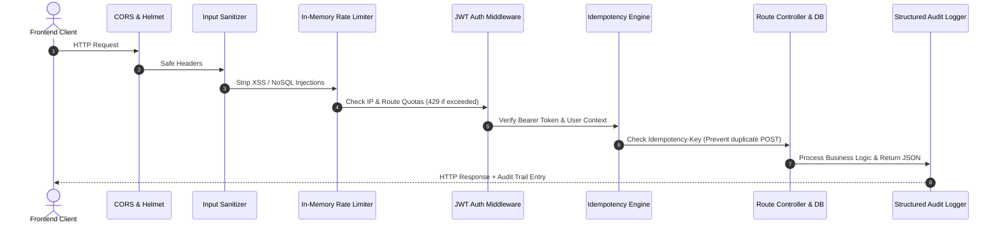

# 🛡️ Security & Enterprise Middleware Architecture

This document specifies the defense-in-depth security model implemented in `server/src/middleware/`.

---

## 1. Middleware Execution Pipeline

Every incoming HTTP request traverses this deterministic sequence:

---

## 2. Security Subsystems

### 1. Dual-Token JWT Authentication (`authMiddleware.js`)
- **Access Token**: Short-lived (15 minutes), signed with `JWT_SECRET`, carried in `Authorization: Bearer <token>`.
- **Refresh Token**: Long-lived (7 days), persisted as SHA-256 hash in MongoDB (`RefreshToken` collection) with automatic MongoDB TTL index cleanup.
- **Rotation**: On every `/api/auth/refresh` call, the old refresh token is invalidated and a fresh pair is minted.

### 2. Rate Limiting (`rateLimiter.js`)
- Protects public and sensitive endpoints (`/auth/login`, `/auth/register`, `/ai/*`).
- Configurable window (default 15 minutes, 100 requests max per IP; login capped at 10 attempts).

### 3. Idempotency Control (`idempotency.js`)
- Critical for financial operations (adding transactions, processing group settlements).
- Client passes an `Idempotency-Key` header (UUID or hash).
- Cached responses return identical output for 120 seconds if retried, preventing duplicate charges.

### 4. Input Sanitization & NoSQL Injection Guard (`sanitizer.js`)
- Strips any keys containing `$` or `.` from request bodies and query parameters.
- Encodes HTML entities on free-form text inputs to mitigate XSS vulnerabilities.

### 5. Structured Audit Logging (`auditLogger.js`)
- Records security-sensitive operations (`AUTH_LOGIN`, `PASSWORD_RESET`, `TRANSACTION_DELETE`, `VAULT_ACCESS`).
- Logs client IP, User-Agent, user ID, status (`SUCCESS` / `FAILED`), and timestamp to MongoDB `AuditLog` collection.
