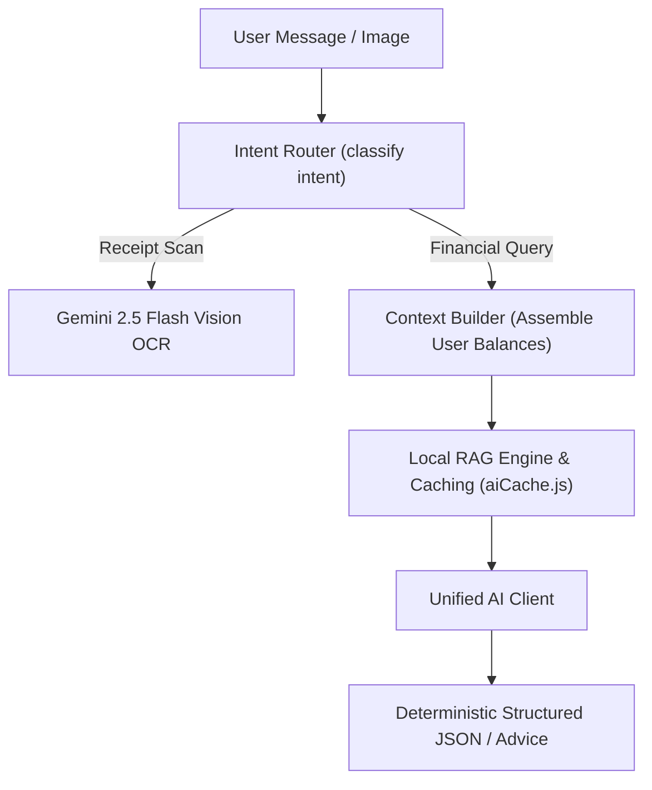

# ⚙️ Backend Services & Algorithmic Engines

Located at: `server/src/services/`

This document specifies the internal architecture, mathematical calculations, and input/output contracts for all backend engine services.

---

## 1. Analytics & Financial Calculation Engines (`server/src/services/analytics/`)

### `analyticsService.js`
- **Purpose**: Computes multi-dimensional financial aggregates for dashboard and charts.
- **Key Functions**:
  - `getDashboardSummary(userId)`: Computes Total Balance, Monthly Income, Monthly Expense, and Net Savings.
  - `getCategoryBreakdown(userId, startDate, endDate)`: Aggregates spend by category with % share calculations.
  - `getMonthlyTrends(userId, monthsBack)`: Returns array of `{ month, income, expense, net }` for bar/line charts.
  - `getBurnRateAndRunway(userId)`: Calculates daily burn rate and estimated liquidity runway in months.

### `fireSimulatorEngine.js`
- **Purpose**: Stochastic Monte Carlo wealth forecasting and FIRE (Financial Independence, Retire Early) retirement calculator.
- **Key Functions**:
  - `calculateFireNumber(annualExpenses, swrPercent = 4)`: Returns target nest egg: $\text{Annual Expenses} \times (100 / \text{swrPercent})$.
  - `simulateMonteCarlo({ currentNetWorth, monthlyContribution, years, meanReturn, stdDev, simulations = 1000 })`: Generates 1,000 randomized return paths and extracts $P_{10}, P_{50}, P_{90}$ wealth trajectories.

---

## 2. Artificial Intelligence & Copilot Subsystem (`server/src/services/ai/`)

### `unifiedAIClient.js` & `geminiClient.js`
- **Model**: Google Gemini 2.5 Flash (`@google/genai` / SDK).
- **Fallbacks**: Offline regex extractor for receipts when network is unavailable.
- **Caching**: `aiCache.js` uses in-memory LRU cache to prevent duplicate billing on identical financial queries.

### `localRagEngine.js` & `contextBuilder.js`
- **Context Injection**: Retrieves sanitized, aggregated user metrics (Total Income, Top 3 Expense Categories, Budget Overruns) and injects them into system instructions.
- **Guardrail**: Instructs the model to never give legal/tax guarantees and always base advice on the injected context.

---

## 3. Social & Debt Optimization Engines

### `debtSimplificationEngine.js` (`server/src/services/group/`)
- **Algorithm**: Minimum Cash Flow Greedy Graph Solver.
- **Input**: Array of member balances $\{ \text{memberId}, \text{netBalance} \}$.
- **Output**: Minimum list of transactions $\{ \text{from}, \text{to}, \text{amount}, \text{upiIntentUrl} \}$.
- **Complexity**: $O(N \log N)$ sorting + $O(N)$ transfers (at most $N-1$ transfers).

### `debtAmortizationEngine.js` (`server/src/services/debt/`)
- **Strategies**:
  - **Snowball**: Pay minimum on all, accelerate lowest balance first (psychological momentum).
  - **Avalanche**: Pay minimum on all, accelerate highest interest rate APR first (mathematical optimization).
- **Output**: Month-by-month payment schedule, total interest paid, debt-free date comparison.

---

## 4. Ingestion & Foreign Exchange Engines

### `importService.js` (`server/src/services/import/`)
- **CSV Bank Ingestion**: Auto-detects column headers for Date, Amount, Description, and Debit/Credit.
- **Deduplication**: Computes SHA-256 hash of `(userId + date + amount + description)` to reject previously imported rows.

### `fxService.js` (`server/src/services/fx/`)
- **Foreign Exchange Rates**: Real-time currency conversions cached with 1-hour TTL.
- **Trip Isolation**: Converts foreign trip vault expenses into user base currency automatically.
