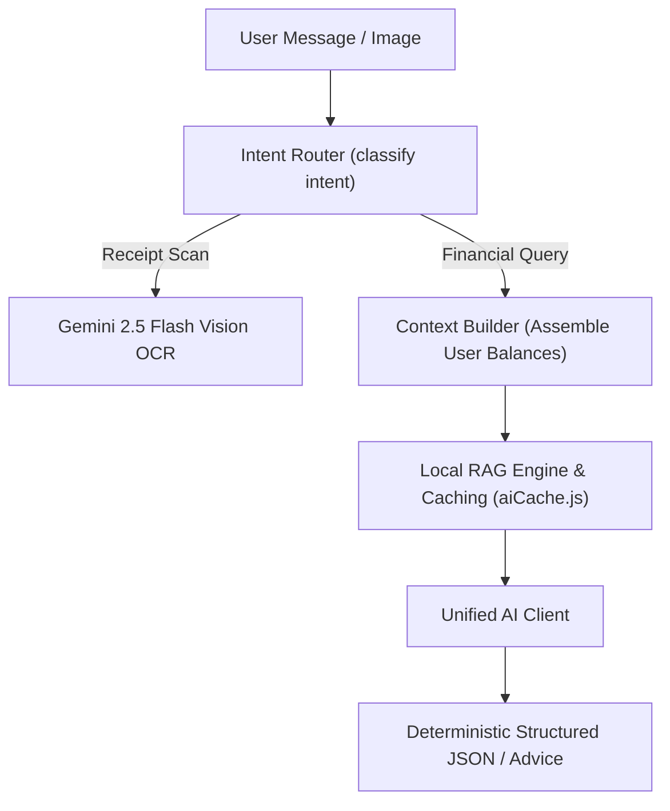

# ⚙️ Backend Services & Algorithmic Engines

Located at: `server/src/services/`

This document specifies the internal architecture, mathematical calculations, and input/output contracts for all backend engine services.

---

## 1. Analytics & Financial Calculation Engines (`server/src/services/analytics/`)

### `analyticsService.js`
- **Purpose**: Computes multi-dimensional financial aggregates for dashboard and charts.
- **Key Functions**:
  - `getDashboardSummary(userId)`: Computes Total Balance, Monthly Income, Monthly Expense, and Net Savings.
  - `getCategoryBreakdown(userId, startDate, endDate)`: Aggregates spend by category with % share calculations.
  - `getMonthlyTrends(userId, monthsBack)`: Returns array of `{ month, income, expense, net }` for bar/line charts.
  - `getBurnRateAndRunway(userId)`: Calculates daily burn rate and estimated liquidity runway in months.

### `fireSimulatorEngine.js`
- **Purpose**: Stochastic Monte Carlo wealth forecasting and FIRE (Financial Independence, Retire Early) retirement calculator.
- **Key Functions**:
  - `calculateFireNumber(annualExpenses, swrPercent = 4)`: Returns target nest egg: $\text{Annual Expenses} \times (100 / \text{swrPercent})$.
  - `simulateMonteCarlo({ currentNetWorth, monthlyContribution, years, meanReturn, stdDev, simulations = 1000 })`: Generates 1,000 randomized return paths and extracts $P_{10}, P_{50}, P_{90}$ wealth trajectories.

### `lifestyleHabitEngine.js` (`server/src/services/analytics/lifestyleHabitEngine.js`)
- **Purpose**: On-device behavioral finance engine profiling income cadence ($C_v$), payday euphoria decay ($\lambda$), late-night spending biases, and lifestyle inflation ($\mathcal{L}_{\text{inf}}$).
- **Key Functions**:
  - `generateHabitProfile(expenses, incomes)`: Produces encrypted habit fingerprint with proactive nudges.
  - Adheres to `[[ADR-008-Local-Lifestyle-Habit-Learning-and-PWA-Architecture]]` and `[[Lifestyle-and-Habit-Learning-Engine]]`.

### `deviceCapabilityProfiler.js` (`client/src/services/deviceCapabilityProfiler.js`)
- **Purpose**: Client-side hardware profiler inspecting WebGPU, RAM, CPU cores, battery level, storage quota, and running a 30ms WASM micro-benchmark.
- **Key Functions**:
  - `evaluateDevice()`: Classifies the client into Tier 0 (Eco), Tier 1 (Balanced), or Tier 2 (Sovereign Pro) and resolves feature gates.
  - Adheres to `[[ADR-009-Adaptive-Device-Hardware-Profiling-and-Feature-Optimization]]` and `[[Adaptive-Device-Capability-Profiler]]`.

### `customizationService.js` & `CustomizationContext.jsx`
- **Purpose**: Manages staged feature flag draft states, automated pre-sync Memento snapshots, and dynamic layout self-formatting.
- **Key Functions**:
  - `confirmAndApplyChanges()`: Executes the atomic 4-step commit pipeline (Validation $\to$ Snapshot $\to$ Sync $\to$ Layout Re-Flow).
  - `restoreSnapshot(snapshotId)`: Instant 1-click state rollback from IndexedDB.
  - Adheres to `[[ADR-010-Modular-Feature-Flags-State-Snapshot-Backup-and-Customization-Hub]]` and `[[Customization-Hub-and-Feature-Flag-Engine]]`.

---

## 2. Artificial Intelligence & Copilot Subsystem (`server/src/services/ai/`)

### `unifiedAIClient.js` & `geminiClient.js`
- **Primary Model**: Google Gemini 2.5 Flash (`@google/genai` / SDK) & OpenAI GPT-4o-mini.
- **Fallbacks**: Cascades automatically to `localOcrService.js` (Baidu Unlimited-OCR + Qwen2.5 SLM) when offline, followed by Tesseract/Regex fallback.
- **Caching**: `aiCache.js` uses in-memory LRU cache to prevent duplicate billing on identical financial queries.

### `localOcrService.js` (`server/src/services/ai/localOcrService.js`)
- **Engine**: Microservice adapter calling local Python Sidecar (`http://127.0.0.1:8001`).
- **Stage 1 (Perception)**: Baidu Unlimited-OCR (3B MoE VLM) with R-SWA for high-resolution layout and table parsing.
- **Stage 2 (Structuring)**: Qwen2.5-1.5B-Instruct running via `llama-cpp-python` with GBNF grammar constraints.
- **Contract**: Accepts image buffer $\to$ returns validated `{ merchant, date, totalAmount, cgst, sgst, igst, lineItems, isECommerce }` adhering to `[[ADR-006-Local-Unlimited-OCR-and-SLM-Fallback-Pipeline]]`.

### `localSlmClient.js` (`server/src/services/ai/localSlmClient.js`)
- **Engine**: Lightweight client adapter interfacing with local **Ollama** (`http://127.0.0.1:11434`), `llama.cpp`, or the Python Sidecar.
- **Model**: **Qwen2.5-1.5B-Instruct** (or Llama-3.2-1B/3B).
- **Purpose**: Generates natural language monthly summaries, "Why Did My Spending Change?" variance explanations, Copilot Q&A, and transaction categorization when cloud APIs are offline or rate-limited (`[[ADR-007-Local-Financial-SLM-Intelligence-and-Fallback-Architecture]]`).

### `localRagEngine.js` & `contextBuilder.js`
- **Context Injection**: Retrieves sanitized, aggregated user metrics (Total Income, Top 3 Expense Categories, Budget Overruns) and injects them into system instructions.
- **Guardrail**: Instructs the model to never give legal/tax guarantees and always base advice on the injected context.
- **Zero-AI Fallback**: Provides deterministic template strings if neither cloud AI nor local SLMs are active.

---

## 3. Social & Debt Optimization Engines

### `debtSimplificationEngine.js` (`server/src/services/group/`)
- **Algorithm**: Minimum Cash Flow Greedy Graph Solver.
- **Input**: Array of member balances $\{ \text{memberId}, \text{netBalance} \}$.
- **Output**: Minimum list of transactions $\{ \text{from}, \text{to}, \text{amount}, \text{upiIntentUrl} \}$.
- **Complexity**: $O(N \log N)$ sorting + $O(N)$ transfers (at most $N-1$ transfers).

### `debtAmortizationEngine.js` (`server/src/services/debt/`)
- **Strategies**:
  - **Snowball**: Pay minimum on all, accelerate lowest balance first (psychological momentum).
  - **Avalanche**: Pay minimum on all, accelerate highest interest rate APR first (mathematical optimization).
- **Output**: Month-by-month payment schedule, total interest paid, debt-free date comparison.

---

## 4. Ingestion & Foreign Exchange Engines

### `importService.js` (`server/src/services/import/`)
- **CSV Bank Ingestion**: Auto-detects column headers for Date, Amount, Description, and Debit/Credit.
- **Deduplication**: Computes SHA-256 hash of `(userId + date + amount + description)` to reject previously imported rows.

### `fxService.js` (`server/src/services/fx/`)
- **Foreign Exchange Rates**: Real-time currency conversions cached with 1-hour TTL.
- **Trip Isolation**: Converts foreign trip vault expenses into user base currency automatically.
