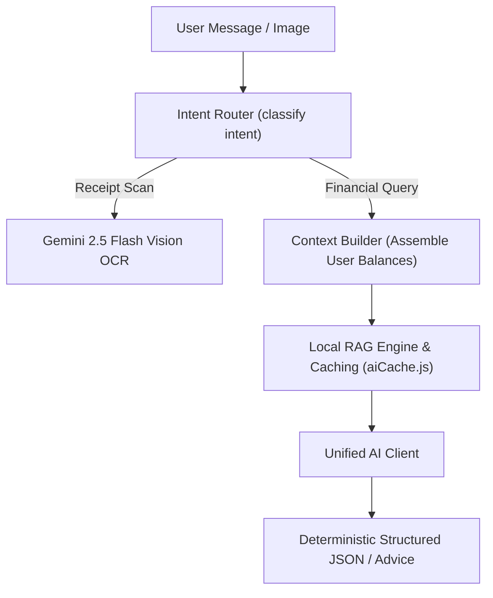

# ⚙️ Backend Services & Algorithmic Engines

Located at: `server/src/services/`

This document specifies the internal architecture, mathematical calculations, and input/output contracts for all backend engine services.

---

## 1. Analytics & Financial Calculation Engines (`server/src/services/analytics/`)

### `analyticsService.js`
- **Purpose**: Computes multi-dimensional financial aggregates for dashboard and charts.
- **Key Functions**:
  - `getDashboardSummary(userId)`: Computes Total Balance, Monthly Income, Monthly Expense, and Net Savings.
  - `getCategoryBreakdown(userId, startDate, endDate)`: Aggregates spend by category with % share calculations.
  - `getMonthlyTrends(userId, monthsBack)`: Returns array of `{ month, income, expense, net }` for bar/line charts.
  - `getBurnRateAndRunway(userId)`: Calculates daily burn rate and estimated liquidity runway in months.

### `fireSimulatorEngine.js`
- **Purpose**: Institutional-grade Stochastic Monte Carlo wealth forecasting and 6-Tier FIRE (Financial Independence, Retire Early) planning engine.
- **Key Functions**:
  - `calculateFireMilestones({ monthlyIncome, monthlyExpense, currentSavings, annualReturnPct, inflationPct, customSwrPct, stepUpPct, targetRetirementAge, currentAge })`: Computes full 6-tier milestones (**Lean, Barista, Standard, Chubby, Fat, Coast FIRE**), financial freedom velocity index, savings rate, and exact countdown date.
  - `calculateWhatIf({ currentMonthlyIncome, currentMonthlyExpense, currentNetWorth, deltaIncome, deltaExpense, deltaOneTime, annualReturnPct, annualStepUpPct, timedEvents })`: Computes month-by-month trajectory with timed capital shocks over a 30-year horizon.
  - `calculateBlendedAssetMetrics(weights)`: Multi-asset covariance calculation for Equities, Debt, Gold, and Cash portfolios.
  - `runMonteCarloSimulation({ currentNetWorth, monthlyContribution, annualExpenseWithdrawal, years, expectedReturn, volatility, inflation, runs, model, phase, assetAllocation, stepUpPct, glidePathEnabled, guardrailsEnabled })`: High-performance execution across 1,000 to 50,000 parallel paths supporting Geometric Brownian Motion (GBM) with Ito correction ($-\frac{1}{2}\sigma^2$), Merton Jump Diffusion, and Empirical Historical Bootstrap Resampling (1970–2024). Computes Portfolio Survival Rate, Ruin Probability, VaR 95%, CVaR, Sharpe Ratio, and $P_5$ to $P_{95}$ percentile ribbons.

### `lifestyleHabitEngine.js` (`server/src/services/analytics/lifestyleHabitEngine.js`)
- **Purpose**: On-device behavioral finance engine profiling income cadence ($C_v$), payday euphoria decay ($\lambda$), late-night spending biases, and lifestyle inflation ($\mathcal{L}_{\text{inf}}$).
- **Key Functions**:
  - `generateHabitProfile(expenses, incomes)`: Produces encrypted habit fingerprint with proactive nudges.
  - Adheres to `[[ADR-008-Local-Lifestyle-Habit-Learning-and-PWA-Architecture]]` and `[[Lifestyle-and-Habit-Learning-Engine]]`.

### `deviceCapabilityProfiler.js` (`client/src/services/deviceCapabilityProfiler.js`)
- **Purpose**: Client-side hardware profiler inspecting WebGPU, RAM, CPU cores, battery level, storage quota, and running a 30ms WASM micro-benchmark.
- **Key Functions**:
  - `evaluateDevice()`: Classifies the client into Tier 0 (Eco), Tier 1 (Balanced), or Tier 2 (Sovereign Pro) and resolves feature gates.
  - Adheres to `[[ADR-009-Adaptive-Device-Hardware-Profiling-and-Feature-Optimization]]` and `[[Adaptive-Device-Capability-Profiler]]`.

### `customizationService.js` & `CustomizationContext.jsx`
- **Purpose**: Manages staged feature flag draft states, automated pre-sync Memento snapshots, and dynamic layout self-formatting.
- **Key Functions**:
  - `confirmAndApplyChanges()`: Executes the atomic 4-step commit pipeline (Validation $\to$ Snapshot $\to$ Sync $\to$ Layout Re-Flow).
  - `restoreSnapshot(snapshotId)`: Instant 1-click state rollback from IndexedDB.
  - Adheres to `[[ADR-010-Modular-Feature-Flags-State-Snapshot-Backup-and-Customization-Hub]]` and `[[Customization-Hub-and-Feature-Flag-Engine]]`.

---

## 2. Artificial Intelligence & Copilot Subsystem (`server/src/services/ai/`)

### `unifiedAIClient.js` & `geminiClient.js`
- **Primary Model**: Google Gemini 2.5 Flash (`@google/genai` / SDK) & OpenAI GPT-4o-mini.
- **Fallbacks**: Cascades automatically to `localOcrService.js` (Baidu Unlimited-OCR + Qwen2.5 SLM) when offline, followed by Tesseract/Regex fallback.
- **Caching**: `aiCache.js` uses in-memory LRU cache to prevent duplicate billing on identical financial queries.

### `localOcrService.js` (`server/src/services/ai/localOcrService.js`)
- **Engine**: Microservice adapter calling local Python Sidecar (`http://127.0.0.1:8001`).
- **Stage 1 (Perception)**: Baidu Unlimited-OCR (3B MoE VLM) with R-SWA for high-resolution layout and table parsing.
- **Stage 2 (Structuring)**: Qwen2.5-1.5B-Instruct running via `llama-cpp-python` with GBNF grammar constraints.
- **Contract**: Accepts image buffer $\to$ returns validated `{ merchant, date, totalAmount, cgst, sgst, igst, lineItems, isECommerce }` adhering to `[[ADR-006-Local-Unlimited-OCR-and-SLM-Fallback-Pipeline]]`.

### `localSlmClient.js` (`server/src/services/ai/localSlmClient.js`)
- **Engine**: Lightweight client adapter interfacing with local **Ollama** (`http://127.0.0.1:11434`), `llama.cpp`, or the Python Sidecar.
- **Model**: **Qwen2.5-1.5B-Instruct** (or Llama-3.2-1B/3B).
- **Purpose**: Generates natural language monthly summaries, "Why Did My Spending Change?" variance explanations, Copilot Q&A, and transaction categorization when cloud APIs are offline or rate-limited (`[[ADR-007-Local-Financial-SLM-Intelligence-and-Fallback-Architecture]]`).

---

## 3. Social & Debt Optimization Engines

### `debtSimplificationEngine.js` (`server/src/services/group/`)
- **Algorithm**: Minimum Cash Flow Greedy Graph Solver.
- **Complexity**: $O(N \log N)$ sorting + $O(N)$ transfers (at most $N-1$ transfers).

### `debtAmortizationEngine.js` (`server/src/services/debt/`)
- **Strategies**: Snowball & Avalanche payoff comparison models with amortized schedules.

---

## 4. Ingestion & Multi-Tier Foreign Exchange Engines

### `importService.js` (`server/src/services/import/`)
- **CSV Bank Ingestion**: Auto-detects column headers and performs SHA-256 deduplication.

### `fxService.js` (`server/src/services/fx/`)
- **Foreign Exchange Engine**: Multi-tiered asynchronous real-time forex pipeline:
  - **Tier 1**: Open Exchange Rates API (`open.er-api.com`) for 160+ currency pairs.
  - **Tier 2**: Frankfurter API (`api.frankfurter.app`).
  - **Tier 3**: Yahoo Finance Forex charts.
  - **Tier 4**: Institutional deterministic baseline.
- **Features**: 15-minute TTL cache, `forceRefresh` support, instant and async cross-currency conversion methods (`[[ADR-015-Live-Dynamic-Data-Pipelines-and-Resilient-Market-Sync]]`).

---

## 5. Stock Market, Macroeconomic & Quantitative Engines (`server/src/services/market/`)

### `brokerClient.js`
- **Universal Market Connector**: Real-time multi-asset price feed for Indian equities (NSE), US equities (NYSE/NASDAQ), global indices, commodities (Gold/Silver), and crypto.
- **Dynamic Ticker Detection**: Auto-detects and resolves any custom stock symbol or ticker on the fly.
- **Caching**: 30-second memory cache with force-refresh bypass.

### `macroService.js`
- **Macroeconomic Intelligence**: Synthesizes official central bank policy benchmarks (RBI Repo Rate @ 6.50%, US Fed Funds @ 5.25%), official MoSPI CPI Inflation (@ 5.40%), 10-Year GoI Benchmark Bond Yield (@ 7.12%), and live 24K Spot Gold per gram.
- **Simulation Calibration**: Exposes baseline inflation and risk-free rates directly to Monte Carlo and FIRE engines.

### `schemeRadarService.js`
- **Sovereign Scheme Radar**: Computes dynamic Real Yields ($R_{\text{real}} = R_{\text{nominal}} - \text{CPI}$) for RBI T-Bills (91D, 182D, 364D), Sovereign Gold Bonds, Government Savings Schemes (SCSS, SSY, NSC, PPF, KVP, POMIS), and High-Yield Bank FDs.
- **Maturity Calculator**: Multi-frequency compound interest calculator ($A = P(1 + r/n)^{nt}$).

### `scamShieldEngine.js`
- **Forensic Fraud Detection**: Probabilistic red-flag analyzer evaluating Ponzi mechanisms, unrealistic promises, and regulatory registrations.

### `quantitativeEngine.js`
- **Valuation Suite**: 2-Stage Discounted Cash Flow (DCF), Piotroski F-Score (0–9), and Altman Z-Score financial distress classifier.

### `arbitrageSolver.js`
- **Debt vs. Equity Arbitrage**: Algorithmic capital allocation solving post-tax equity return spread versus guaranteed debt interest drag.
