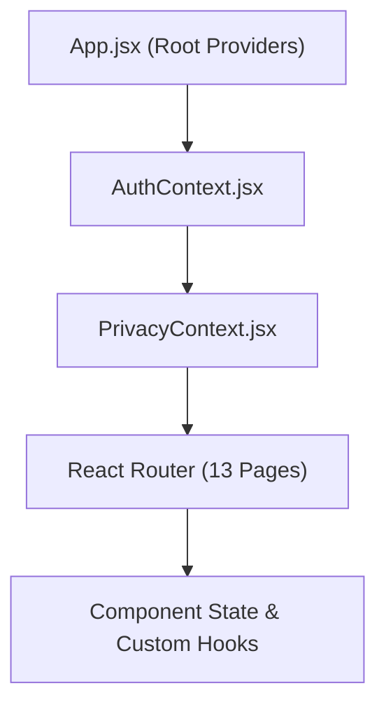

# ⚛️ Frontend State Management & Contexts

Located at: `client/src/context/`

---

## 1. Context Architecture

The application avoids Redux/Zustand boilerplate by utilizing modular, scoped React Contexts with zero unnecessary re-renders:

---

## 2. Context Catalog

### 1. `AuthContext.jsx` (`client/src/context/AuthContext.jsx`)
- **State Managed**:
  - `user`: `{ _id, name, email, currency, theme, preferences }`
  - `token`: Short-lived JWT access token in memory
  - `loading`: Boolean initialization state
  - `isAuthenticated`: Derived boolean
- **Functions Exposed**:
  - `login(email, password)`: Authenticates and sets token in memory + refreshToken in localStorage.
  - `register(userData)`: Creates account and logs in automatically.
  - `logout()`: Clears memory, removes tokens, and calls `/api/auth/logout`.
  - `updateUser(data)`: Mutates local user object after profile updates.

### 2. `PrivacyContext.jsx` (`client/src/context/PrivacyContext.jsx`)
- **State Managed**:
  - `isPrivacyMode`: Boolean flag toggled via `Alt+P` or UI toggle button.
- **Functions Exposed**:
  - `togglePrivacyMode()`: Toggles boolean state and applies/removes global CSS class `.privacy-active`.
  - **Effect**: Causes any element with `.privacy-blur` to apply `backdrop-filter: blur(8px)` masking sensitive currency amounts from bystanders.
