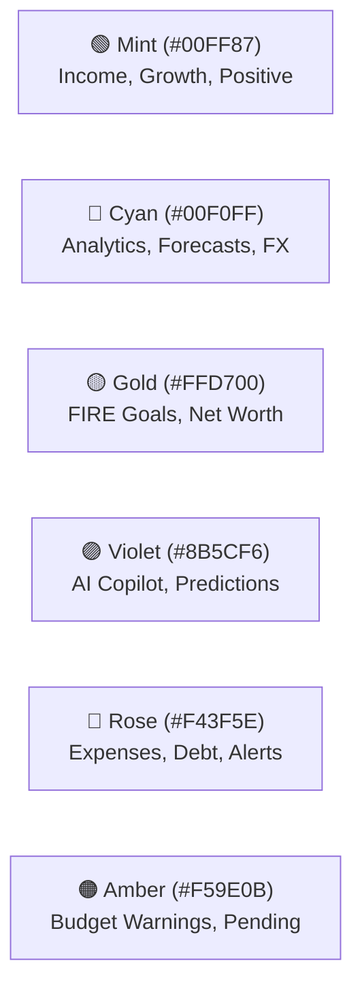

# 🎨 Richy Rich Luxury Fintech Design System Tokens

Located at: `client/src/index.css`  
Inspirations: *Linear, Stripe, Copilot Money, Monarch Money & Revolut*

---

## 1. Surface & Background Hierarchy

| Token Name | CSS Variable | Hex / RGBA Value | Usage |
| :--- | :--- | :--- | :--- |
| **Obsidian Base** | `--bg-obsidian` | `#080B11` | Root app background |
| **Obsidian Deep** | `--bg-obsidian-deep` | `#05070B` | Inputs, sub-panels, headers |
| **Obsidian Card** | `--bg-obsidian-card` | `rgba(13, 17, 28, 0.72)` | Glassmorphism cards |
| **Card Hover** | `--bg-obsidian-card-hover` | `rgba(18, 24, 38, 0.85)` | Interactive card hover states |
| **Elevated Layer**| `--bg-obsidian-elevated` | `rgba(20, 28, 44, 0.85)` | Dropdowns, popovers, tooltips |
| **Modal Backdrop**| `--bg-obsidian-modal` | `rgba(10, 13, 22, 0.95)` | Modal dialogue overlays |

---

## 2. Curated Semantic Accents

| Accent Role | Main Token | Glow Token (`rgba`) | Subtle BG Token |
| :--- | :--- | :--- | :--- |
| **Mint (Positive / Inflow)** | `--color-mint` (`#00FF87`) | `--color-mint-glow` | `--color-mint-subtle` |
| **Cyan (Intelligence / FX)** | `--color-cyan` (`#00F0FF`) | `--color-cyan-glow` | `--color-cyan-subtle` |
| **Gold (Wealth / Milestone)**| `--color-gold` (`#FFD700`) | `--color-gold-glow` | `--color-gold-subtle` |
| **Violet (AI / Automation)** | `--color-violet` (`#8B5CF6`)| `--color-violet-glow`| `--color-violet-subtle`|
| **Rose (Debt / Outflow)** | `--color-rose` (`#F43F5E`) | `--color-rose-glow` | `--color-rose-subtle` |
| **Amber (Warning)** | `--color-amber` (`#F59E0B`)| `--color-amber-glow`| - |

---

## 3. Typography Tokens

- **Headings & Badges**: `'Outfit', sans-serif` (Weights: `600`, `700`, `800`, `900`)
- **Body & UI Text**: `'Plus Jakarta Sans', sans-serif` (Weights: `400`, `500`, `600`)
- **Financial Figures & Code**: `'Fira Code', monospace` (Weights: `500`, `600`, `700`)

### Text Colors
| Variable | Value | Purpose |
| :--- | :--- | :--- |
| `--color-text-main` | `#F8FAFC` | Primary titles, active values |
| `--color-text-body` | `#E2E8F0` | Default body copy, labels |
| `--color-text-muted`| `#94A3B8` | Subtitles, helper text |
| `--color-text-subtle`| `#64748B` | Table headers, placeholders |

---

## 4. Glass Borders & Elevation Shadows

- `--border-glass`: `rgba(255, 255, 255, 0.07)`
- `--border-glass-bright`: `rgba(255, 255, 255, 0.12)`
- `--border-mint`: `rgba(0, 255, 135, 0.3)`
- `--shadow-card`: `0 8px 32px 0 rgba(0, 0, 0, 0.37)`
- `--backdrop-blur`: `blur(16px)`

---

## 5. Anti-Hallucination UI Rule
When writing React components:
- **NEVER** use generic arbitrary hex colors like `#ff0000` or `#00ff00`.
- **ALWAYS** use the design system tokens: `style={{ color: 'var(--color-mint)' }}` or className mappings.
