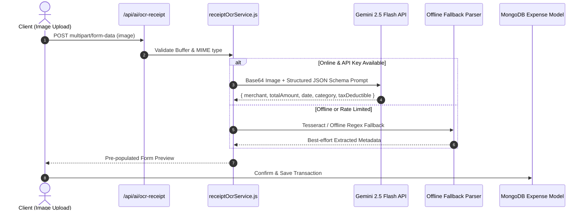

# 🤖 AI Copilot & Vision Receipt OCR Engine

Located at: `server/src/services/ai/`

---

## 1. Multimodal Receipt OCR Pipeline

---

## 2. Deterministic RAG Context Architecture (`contextBuilder.js`)
When user chats with the AI copilot:
1. `contextBuilder.js` queries MongoDB for high-level aggregate numbers:
   - Total income, monthly expense total, top 3 spending categories, active debt balances, health score.
2. Injects this numerical context directly into Gemini's system instructions.
3. Model is explicitly constrained:
   > *"You are Richy, a sovereign financial intelligence copilot. Use ONLY the user's verified metrics provided below. Never make up balances or calculate totals on your own."*
