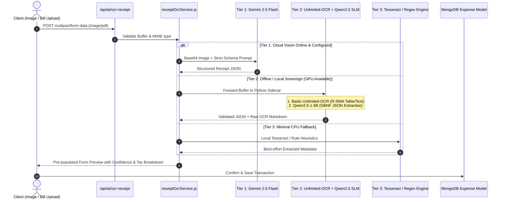

# 🤖 AI Copilot & Vision Receipt OCR Engine

Located at: `server/src/services/ai/`

---

## 1. 3-Tier Multimodal & Local Sovereign Receipt OCR Pipeline



### 1.1 Local Fallback Specifications (`[[ADR-006-Local-Unlimited-OCR-and-SLM-Fallback-Pipeline]]`)
* **Perceptual OCR Engine**: **Baidu Unlimited-OCR (3B MoE VLM)** with Reference Sliding Window Attention (R-SWA), eliminating $O(N)$ KV cache memory explosion on multi-page receipts and dense thermal bills.
* **Structuring & Reasoning SLM**: **Qwen2.5-1.5B-Instruct** running via `llama-cpp-python` with **GBNF Grammar Constraints** for 100% syntactically valid JSON output conforming to the `Expense` schema.
* **Research Reference**: Complete benchmark and architecture report in `[[LOCAL_UNLIMITED_OCR_AND_SLM_BILL_PARSING_RESEARCH]]`.

---

## 2. Deterministic RAG Context Architecture (`contextBuilder.js`)
When user chats with the AI copilot:
1. `contextBuilder.js` queries MongoDB for high-level aggregate numbers:
   - Total income, monthly expense total, top 3 spending categories, active debt balances, health score.
2. Injects this numerical context directly into the model's system instructions.
3. Model is explicitly constrained:
   > *"You are Richy, a sovereign financial intelligence copilot. Use ONLY the user's verified metrics provided below. Never make up balances or calculate totals on your own."*

### 2.1 3-Tier Copilot Fallback Cascade (`[[ADR-007-Local-Financial-SLM-Intelligence-and-Fallback-Architecture]]`)
```mermaid
graph LR
    UserQuery[User Query / Chat] --> CheckAPI{Cloud API Key Active?}
    CheckAPI -->|Yes| Gemini[Tier 1: Cloud Gemini / OpenAI]
    CheckAPI -->|No / 429 / Offline| CheckLocalSLM{Local SLM Available?}
    CheckLocalSLM -->|Yes (Ollama / Sidecar)| LocalSLM[Tier 2: Qwen2.5-1.5B-Instruct]
    CheckLocalSLM -->|No / Low CPU| LocalRAG[Tier 3: Deterministic Rule Templates]
    
    Gemini --> FinalAdvice[Natural Grounded Advice]
    LocalSLM --> FinalAdvice
    LocalRAG --> FinalAdvice
```
* **Tier 1 (Cloud Primary)**: Google Gemini 2.5 Flash / GPT-4o-mini (~600ms latency).
* **Tier 2 (Local Sovereign SLM)**: **Qwen2.5-1.5B-Instruct** running locally via Ollama or local Python sidecar (~800ms latency, zero cloud dependency, ~1.1GB RAM).
* **Tier 2B (In-Browser Client SLM)**: **Qwen2.5-0.5B-Instruct** running via WebGPU (`@mlc-ai/web-llm`) in modern browsers.
* **Tier 3 (Zero-AI Fallback)**: Deterministic template engine (`localRagEngine.js`).
* **Research Reference**: Complete benchmark and model evaluation in `[[LOCAL_FINANCIAL_SLM_INTELLIGENCE_AND_FALLBACK_RESEARCH]]`.
