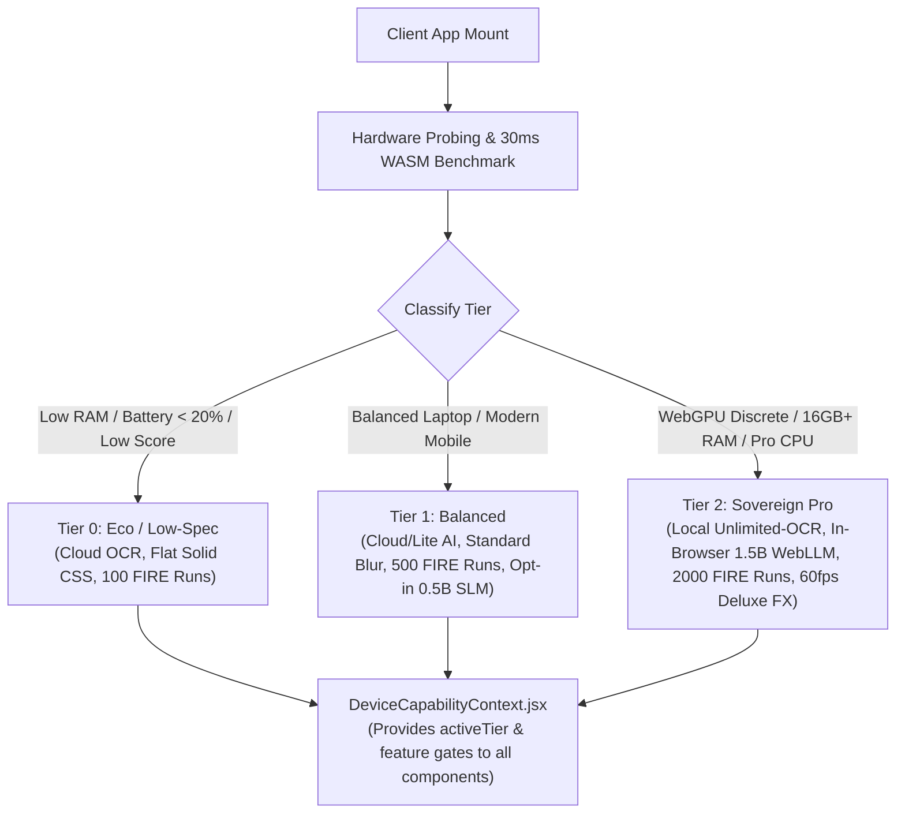

# ⚡ Adaptive Device Capability Profiler

Located at: `client/src/services/deviceCapabilityProfiler.js` & `client/src/context/DeviceCapabilityContext.jsx`

---

## 1. Overview & Objective
The **Adaptive Device Capability Profiler** inspects client-side hardware and runtime constraints (WebGPU adapter, RAM, CPU cores, battery level, network metering) and executes a 30ms micro-benchmark. It dynamically gates and configures heavy compute modules (local Unlimited-OCR, in-browser WebLLM SLMs, Monte Carlo iteration counts, and UI blur filters) so that **every device receives a buttery-smooth 60fps experience** while high-end devices unlock maximum sovereign AI power.

---

## 2. Feature Gating Matrix

| Subsystem / Feature | Tier 0 (Eco) | Tier 1 (Balanced) | Tier 2 (Sovereign Pro) |
| :--- | :--- | :--- | :--- |
| **In-Browser SLM (WebLLM)** | Disabled (Routes to Cloud/Templates) | Optional Opt-In (`Qwen2.5-0.5B`, ~380MB) | Enabled (`Qwen2.5-1.5B`, ~1.1GB) |
| **Receipt OCR Engine** | Cloud Gemini / OpenAI | Cloud Primary | Local Baidu Unlimited-OCR (3B Sidecar) |
| **Monte Carlo FIRE Simulation** | 100 Iterations (Chunked) | 500 Iterations (Web Worker) | 2,000–5,000 Iterations (Multi-Threaded) |
| **Glassmorphism & Blur** | Solid Semi-Opaque CSS | Standard Backdrop Blur | 60fps Deluxe Glassmorphism & Particles |
| **Storage Architecture** | IndexedDB (Dexie.js) | IndexedDB + Vector Store | OPFS (SQLite-WASM) + Full Vector DB |

---

## 3. User Calibration & Manual Override
Users can inspect their hardware scorecard and manually override the detected tier at any time via the **Device Performance Card** in `SettingsPage.jsx`.

* **Reference**: Complete research report in `[[ADAPTIVE_DEVICE_HARDWARE_PROFILING_AND_CAPABILITY_OPTIMIZATION_RESEARCH]]`.
