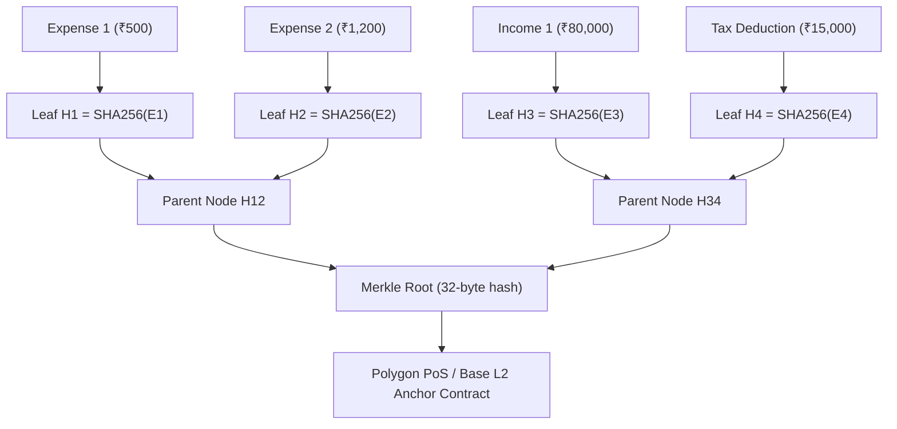

# ⛓️ Blockchain & Emerging Web3/Deep-Tech Ecosystem

Comprehensive Master Specification: [[BLOCKCHAIN_AND_FUTURE_TECH_FEATURE_PLAN]]

---

## 1. Cryptographic Merkle Audit Engine

### Mathematical Formula:
$$H_i = \text{SHA256}(\text{id} \,\|\, \text{amount} \,\|\, \text{category} \,\|\, \text{timestamp} \,\|\, \text{salt})$$
$$\text{Merkle Root} = \text{TreeRoot}(\{H_1, H_2, \dots, H_n\})$$

---

## 2. Core Pillars & System Capabilities

| Pillar | Technical Mechanism | User Value |
| :--- | :--- | :--- |
| **1. Merkle Audit Trails** | Daily SHA-256 Merkle trees anchored on Polygon/Base | 100% tamper-proof records for employer/tax audits. |
| **2. Multi-Chain Ingestion** | Ethers.js v6 / Alchemy indexers (EVM, Solana, BTC) | Real-time fiat valuation & capital gains PnL calculations. |
| **3. Trustless Group Escrow** | `GroupVault.sol` smart contract on L2 | 1-click on-chain settlement for trips & shared bills. |
| **4. Permanent Cold Storage** | IPFS (Pinata) + Arweave (Irys) | Permanent encrypted document & receipt retention. |
| **5. DeFi Goal Vaults** | Aave v3 / Compound v3 liquidity pool routing | 4%–9% real-time APY accumulation on goal savings. |
| **6. zk-SNARK Solvency** | Circom 2.1 + SnarkJS Groth16 proofs | Prove $\text{Net Worth} \ge \$X$ without exposing bank statements. |
| **7. Account Abstraction** | ERC-4337 + WebAuthn biometric passkeys | Gasless operations with FaceID / TouchID (zero seed phrase). |
| **8. Real-Time Streaming** | Superfluid / Sablier continuous money streaming | Millisecond-by-millisecond salary & subscription counters. |
| **9. Edge AI on WebGPU** | WebLLM / Transformers.js in-browser SLM | 100% private, zero-cloud local financial intelligence. |
| **10. Autonomous MCP Swarm** | Model Context Protocol AI financial agents | Autonomous subscription busters & budget rebalancers. |

---

## 3. Related Links & Grounding
- **Master Strategy**: [[BLOCKCHAIN_AND_FUTURE_TECH_FEATURE_PLAN]]
- **Data Models**: [[Database-Models]]
- **API Contracts**: [[API-Contracts]]
- **Mathematical Engines**: [[Cash-Flow-Velocity-Engine]], [[Monte-Carlo-and-FIRE-Simulator]]
- **Security Blueprint**: [[Security-and-Middleware]]
