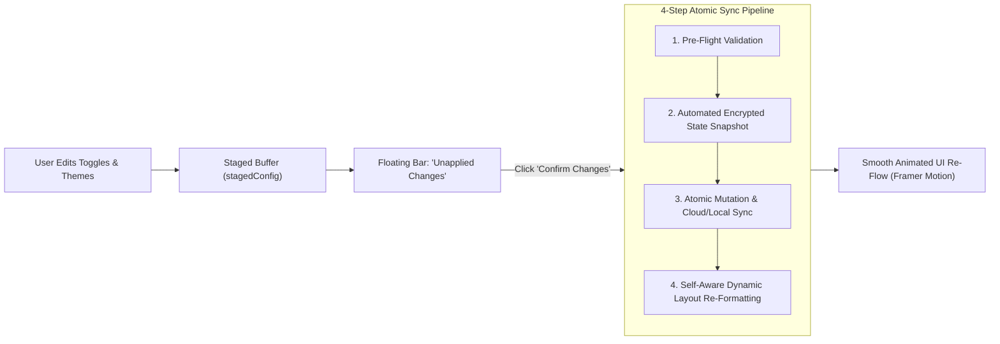

# 🎛️ Customization Hub & Modular Feature Flag Engine

Located at: `client/src/context/CustomizationContext.jsx`, `client/src/components/Customization/StagedConfirmationBar.jsx`, and `client/src/pages/CustomizationPage.jsx`

---

## 1. Overview & Core Mechanics
The **Customization Hub** allows users to enable/disable modular feature extensions, customize visual themes and HSL accents, reorganize dashboard widgets, adjust regional formatting, and manage automated cryptographic state backups.

---

## 2. Studio Tabs Breakdown

### 🧩 1. Feature Modules Suite
* Toggles for: AI Copilot, Vision OCR, FIRE Simulator, Debt Optimizer, Group Split, Travel FX, Lifestyle Habits, Voice Quick-Log, Bank CSV Importer, Advanced GST, and Deluxe 60fps Visuals.
* Locked Fundamental Features: Core Income/Expense Ledger, Category Management, Net Cash Flow Summary, JWT Auth.

### 🎨 2. Theme & Visual Studio
* **5 Curated Themes**: *Midnight Obsidian* (Default), *Cyber Gold*, *Emerald Sovereign*, *Neon Violet*, *Minimalist Snow*.
* Custom HSL Accent picker, Glassmorphism opacity slider (40% to 95%), and Font scaling (90% to 110%).

### 📊 3. Dashboard Layout Studio
* Widget visibility toggles and ordering for: Hero Net Worth Dial, Cash Flow Velocity, Trends Bar, Category Breakdown, Habit Nudges, FIRE Gauge, Debt Radar.
* Layout Density: *Compact Fintech* vs. *Spacious Airflow*.

### 🌍 4. Currency & Regional Engine
* Primary Currency (`₹`, `$`, `€`, `£`, `¥`, `AED`, etc.).
* Number System: *Indian Lakhs/Crores (`₹1,50,000`)* vs. *International Millions (`$150,000`)*.
* Fiscal Year: *April (India)* vs. *January (Global)*.

### 🛡️ 5. State Snapshots & Backup Vault
* Chronological history of automatic and manual Memento state snapshots.
* 1-Click snapshot restore, full JSON export, and encrypted backup file import.

---

## 3. Storage & Error Recovery
* **Snapshot Store**: Saved in `IndexedDB` (`richy_state_snapshots`, rolling 15 items).
* **Automatic Rollback**: If layout re-hydration or network sync throws an error, the system automatically reverts to the pre-sync snapshot without UI freezing.
* **Reference**: Complete research in `[[MODULAR_FEATURE_FLAG_ENGINE_AND_STATE_SNAPSHOT_CUSTOMIZATION_HUB_RESEARCH]]`.
