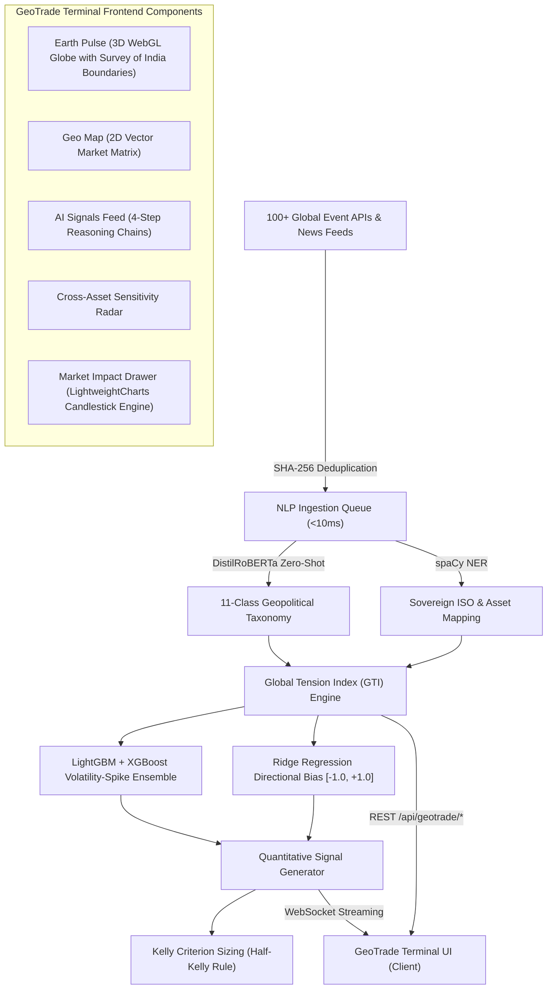

# 🌍 GeoTrade Geopolitical Alpha Terminal & 3D Earth Recon

> **Module Summary**: A sovereign institutional-grade macroeconomic intelligence terminal combining a 3D WebGL Earth Pulse visualization (with official Survey of India sovereign boundaries), 2D Geo Matrix, real-time Global Tension Index (GTI) computation, and AI-driven quantitative trade signals powered by 4-step transparent reasoning chains and Half-Kelly position sizing.

---

## 1. Architectural Overview

---

## 2. Core Mathematical Formulations

### 2.1. Global Tension Index (GTI)
The tension index for any sovereign entity $i$ at time $t$ decays exponentially based on event half-life $\tau$:

$$\text{GTI}_i(t) = \min\left(100, \sum_{j=1}^{k} S_j \cdot w_{\text{category}} \cdot \exp\left(-\frac{t - t_j}{\tau}\right) + \text{GTI}_{\text{baseline}, i}\right)$$

### 2.2. Half-Kelly Position Sizing
To compound capital while protecting against extreme tail risks and black-swan gap downs:

$$f^* = \frac{p \cdot b - q}{b}, \quad f_{\text{trade}} = 0.5 \cdot f^*$$

where:
- $p$: Empirical historical win-rate ($62\% - 71\%$)
- $q = 1 - p$: Loss probability
- $b$: Risk-to-reward ratio ($\ge 2.0$)
- Hard boundary constraint: $f_{\text{trade}} \le 3.5\%$ of total portfolio capital.

---

## 3. Sovereign Indian Boundary Compliance (Survey of India)

Unlike generic open-source datasets (e.g., Natural Earth 110m) which improperly fragment the Union Territories of **Jammu & Kashmir** and **Ladakh** or misalign boundaries in **Arunachal Pradesh**, GeoTrade V2 strictly incorporates the official **Survey of India** boundary specification:
- **Northern Reach:** Coordinates from Indira Col, Siachen Glacier, Gilgit-Baltistan, and Aksai Chin ($37.0^\circ\text{N}, 74.5^\circ\text{E}$ down to $31.0^\circ\text{N}, 80.1^\circ\text{E}$).
- **Eastern Reach:** Entire State of Arunachal Pradesh along the McMahon Line ($27.8^\circ\text{N}, 91.7^\circ\text{E}$ to $28.3^\circ\text{N}, 97.4^\circ\text{E}$).

---

## 4. UI Components & Visual Design Specs

| Component | Technology | Primary Function |
| :--- | :--- | :--- |
| **`EarthPulseGlobe.jsx`** | Canvas 3D / WebGL Spherical Projection | 3D interactive Earth, starfield, atmospheric glow, tension heatmaps, Great Circle Bezier conflict arcs, pulsing flashpoint rings |
| **`GeoMapMatrix.jsx`** | 2D Vector SVG Equirectangular Projection | Fast global scan, region filters, country hover cards |
| **`MarketImpactDrawer.jsx`** | High-Precision HTML5 Canvas Candlestick Engine | OHLC candlestick charts, volume histograms, crosshair inspection, sector exposure meters |
| **`AISignalsFeed.jsx`** | React + Framer Motion | 4-step reasoning chains, interactive Kelly position calculator |
| **`ImpactRadar.jsx`** | React Matrix View | Empirical asset beta ($\beta_{\text{geo}}$) against GTI shocks |
