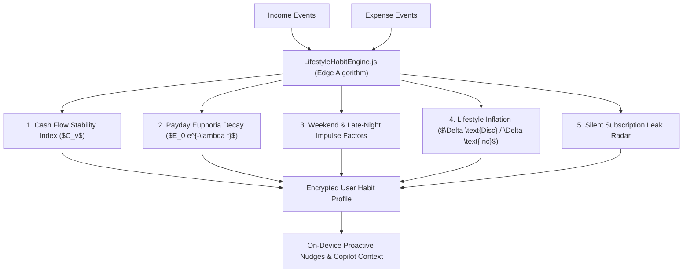

# 🧬 Lifestyle & Habit Learning Engine

Located at: `server/src/services/analytics/lifestyleHabitEngine.js` & `client/src/services/localHabitEngine.js`

---

## 1. Overview & Core Philosophy
The **Lifestyle & Habit Learning Engine** operates 100% on-device (zero cloud telemetry). It continuously analyzes the user's cash flow cadence, spending impulses, and behavioral triggers to build a private, encrypted **Sovereign Habit Fingerprint**.

---

## 2. Mathematical Indicators & Behavioral Triggers

### 2.1 Income Cadence & Stability ($C_v$)
$$C_v = \frac{\sigma_{\text{income}}}{\mu_{\text{income}}}$$
* **$C_v < 0.15$**: Salaried / Stable Income. Enables automatic sweep suggestions to recurring deposits/SIPs.
* **$C_v \ge 0.40$**: Freelance / Variable Income. Prompts dynamic 6-month buffer sizing and adaptive baseline budgeting.

### 2.2 Payday Euphoria Decay Rate ($\lambda$)
Measures the velocity of discretionary spending in the 72 hours following an income credit:
$$E(t) = E_0 \cdot e^{-\lambda t}$$
* Rapid decay ($\lambda > 0.15$) triggers empathetic, non-judgmental pacing alerts on days 1–3 post-payday.

### 2.3 Lifestyle Inflation Index ($\mathcal{L}_{\text{inf}}$)
$$\mathcal{L}_{\text{inf}} = \frac{\text{Discretionary Spend Growth}}{\text{Net Income Growth}} = \frac{\Delta \text{Disc}}{\Delta \text{Income}}$$
* Alert threshold: If $\mathcal{L}_{\text{inf}} > 0.65$, flags lifestyle creep where earnings growth is absorbed by lifestyle inflation.

### 2.4 Late-Night Impulse Ratio ($\mathcal{I}_{\text{night}}$)
Calculates proportion of non-essential orders between 11:00 PM and 4:30 AM (e.g. late-night food delivery, flash e-commerce sales).

---

## 3. Storage & Encryption
* **Client-Side Persistence**: Stored in `IndexedDB` / `OPFS` under `user_habit_profile`.
* **Zero-Knowledge Encryption**: Encrypted client-side using `SubtleCrypto` AES-GCM-256 with key derived from the user's password/passkey.
* **Reference**: Complete research and code blueprints in `[[LOCAL_LIFESTYLE_HABIT_LEARNING_AND_SOVEREIGN_WEBAPP_ARCHITECTURE]]`.
