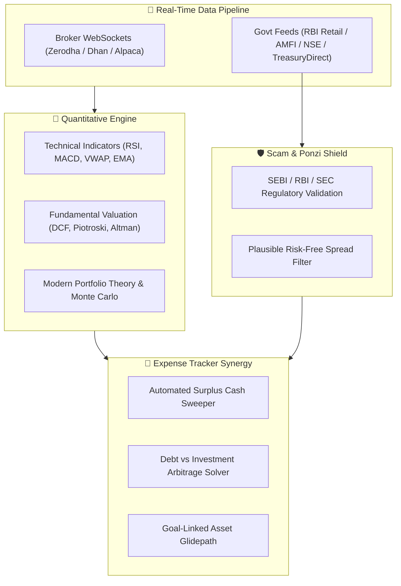

# 📈 Stock Market Trading, Quantitative Analysis & Genuine Schemes Ecosystem

Comprehensive Master Blueprint: [[STOCK_MARKET_TRADING_ANALYSIS_AND_GENUINE_SCHEMES_MASTER_PLAN]]

---

## 1. Executive Summary & Topology

Richy Rich unifies **Real-Time Stock Market Trading & Quantitative Analytics**, **Verified Government & Bank Scheme Radars**, and an **Autonomous Passive Income Compounding Engine** directly tied into personal cash flow tracking.

---

## 2. Seven Pillars of Ethical Passive Income

1. **Dividend Aristocrats & DRIP Engine**: Systematic dividend reinvestment into high-FCF, low-debt blue chips.
2. **Sovereign Fixed Income**: RBI Treasury Bills (T-Bills), Sovereign Gold Bonds (SGB - 2.5% p.a. + tax-free gold gains), PPF, and SSY.
3. **High-Yield Bank FDs**: DICGC-insured Small Finance Bank FD yield arbitrage (8.5% – 9.1%) with multi-bank ₹5L safety allocation.
4. **REITs & InvITs**: Commercial real estate and infrastructure trusts with mandatory 90%+ Net Distributable Cash Flow payouts.
5. **Ethical Covered Call Options (The Wheel Strategy)**: Monthly cash premium generation on high-conviction holdings.
6. **Automated Surplus Cash Sweeping**: Deploying idle checking balance into Overnight / Arbitrage funds with T+0 liquidity.
7. **Senior Secured Corporate Debt**: AAA / AA+ rated listed NCDs with monthly/quarterly coupon streams.

---

## 3. Real-Time Scam & Ponzi Detection Engine

The system computes an **Authenticity Score ($S_{\text{auth}}$)** to shield retail investors from unverified and fraudulent offers:

$$S_{\text{auth}} = 100 - \left( 35 \cdot \mathbf{1}_{\text{unregulated}} + 25 \cdot \mathbf{1}_{\text{unrealistic\_yield}} + 20 \cdot \mathbf{1}_{\text{mlm\_structure}} + 20 \cdot \mathbf{1}_{\text{credit\_drift}} \right)$$

- **Unrealistic Yield Alert**: Flags any scheme promising $> 15\%$ guaranteed fixed returns with "zero risk".
- **Regulatory License Cross-Referencing**: Validates RIA, RA, PMS, NBFC, and SEBI/RBI/SEC registrations.
- **MLM / Multi-Tier Referral Block**: Disqualifies any structure reliant on downline recruitment rather than underlying commercial asset cash flow.

---

## 4. Synergy with Existing Models

- **`Cash-Flow-Velocity-Engine`**: Auto-routes net positive monthly surplus to optimal yield schemes.
- **`Debt.js`**: Arbitrage solver compares debt APR against risk-adjusted investment yield.
- **`Goal.js`**: Automatically shifts asset allocation from equity to sovereign debt as target dates approach (glidepath).
- **`SecretVault.js`**: Client-side AES-256-GCM zero-knowledge encryption for broker API secret tokens.
- **`WealthSimulatorPage.jsx`**: Incorporates real-time dividend and coupon cash flows into 1,000-run Monte Carlo FIRE simulations with 1-click live macro calibration.

---

## 5. Live Dynamic Multi-Asset Feed & Auto-Update Engine

- **Universal Dynamic Quotes Pipeline**: `BrokerClient.js` dynamically pulls real-time market data across global exchanges without rigid symbol whitelisting, empowering users to search and add any equity ticker or cryptocurrency to their live watch radar.
- **Live Macroeconomic Strip**: Displays real-time RBI Repo Rate (6.50%), India CPI Inflation (5.40%), 10-Year Sovereign Benchmark Yield (7.12%), and real spread directly above the passive income radar.
- **Real Inflation-Adjusted Yield Calculation**:
  $$R_{\text{real}} = R_{\text{nominal}} - \text{CPI}_{\text{live}}$$
  Every T-Bill, Government Scheme, and Bank FD is dynamically tagged with its net real purchasing power yield.
- **Auto-Sync & Manual Refresh**: Embedded 30-second live polling loop with countdown UI, pulsating radar dot, tactile manual refresh button, and non-blocking in-memory caching.
- **ADR Reference**: `[[ADR-015-Live-Dynamic-Data-Pipelines-and-Resilient-Market-Sync]]`.
