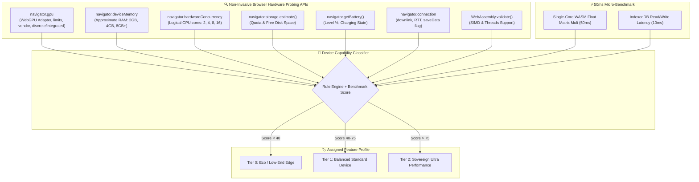

# ⚡ Research Report: Adaptive Device Hardware Profiling, Dynamic Feature Tiers & Sovereign Capability Optimization

> **Executive Summary**: This research paper establishes the architecture for an **On-Device Hardware Capability Profiler & Dynamic Feature Dispatcher** for Expense Tracker V2. Because user devices range from low-end smartphones (3GB RAM, integrated GPU) to high-end workstations (NVIDIA RTX / Apple M-series Unified Memory), the platform automatically benchmarks client hardware, classifies the device into a **Tiered Capability Profile (Tier 0 / Tier 1 / Tier 2)**, and dynamically enables, scales, or gracefully disables compute-heavy features (such as local 3B Unlimited-OCR, in-browser WebGPU SLMs, multi-threaded Monte Carlo simulations, and glassmorphism rendering) while preserving full financial functionality.

---

## 1. Executive Summary & Problem Formulation

```
+----------------------------------------------------------------------------------------------------+
|                      ADAPTIVE CLIENT HARDWARE PROFILING & FEATURE DISPATCHER                       |
+----------------------------------------------------------------------------------------------------+
|                                                                                                    |
|  [ HARDWARE SCANNER ] ──► [ REAL-TIME MICRO-BENCHMARK ] ──► [ TIER CLASSIFICATION ]               |
|  • navigator.gpu (WebGPU)   • 30ms WASM Matrix Compute      • TIER 0: Eco / Low-End Edge           |
|  • navigator.deviceMemory   • Storage I/O Read/Write        • TIER 1: Balanced Standard Device     |
|  • hardwareConcurrency      • GPU Shader Throughput         • TIER 2: Sovereign Ultra Performance  |
|  • navigator.storage                                                                               |
|  • navigator.getBattery()                                                                          |
|                                                                                                    |
|                                       │                                                            |
|                                       ▼                                                            |
|  [ DYNAMIC FEATURE SCALING & GRACEFUL DEGRADATION ENGINE ]                                         |
|  ├── Local In-Browser SLMs (WebLLM) ──► Disabled (T0) ──► Opt-In 0.5B (T1) ──► Full 1.5B (T2)     |
|  ├── Receipt OCR Pipeline           ──► Cloud (T0)    ──► Cloud/Lite (T1)  ──► Unlimited-OCR (T2)   |
|  ├── Monte Carlo Simulations        ──► 100 Runs (T0) ──► 500 Runs (T1)    ──► 2,000 Runs (T2)      |
|  ├── UI Glassmorphism & Motion      ──► Solid CSS (T0)──► Standard (T1)    ──► 60fps Deluxe (T2)    |
|  └── Local Storage Engine           ──► IndexedDB (T0)──► Dexie.js (T1)    ──► OPFS SQLite-WASM (T2)|
+----------------------------------------------------------------------------------------------------+
```

### Core Design Principles
1. **Zero Exclusion Guarantee**: Every user—regardless of whether they are on a $100 budget phone or a $4,000 workstation—has full access to core income/expense logging, budget management, debt repayment, and basic analytics.
2. **Opt-In Heavy Compute**: Models requiring massive bandwidth or RAM (e.g., in-browser WebLLM weights of 400MB–1.2GB) are **never downloaded automatically** on metered or low-spec devices; they require explicit user consent with visual storage impact gauges.
3. **Adaptive Thermal & Battery Awareness**: When a mobile device enters low-power mode or battery drops below 20%, background simulation threads and heavy canvas animations automatically throttle down to conserve energy.

---

## 2. Browser Hardware Inspection APIs & Profiling Protocols

The client-side profiler (`client/src/services/deviceCapabilityProfiler.js`) queries standard, cross-browser Web APIs to assemble a non-invasive, privacy-preserving **Device Hardware Matrix**:



### 2.1 Hardware Probing Dimensions

| Dimension | Web API Used | What It Measures | Decision Thresholds |
| :--- | :--- | :--- | :--- |
| **GPU & WebGPU** | `navigator.gpu.requestAdapter()` | GPU acceleration capability, maximum storage buffer binding size, fallback software adapter flag. | `hasWebGPU: true` & `maxBufferSize >= 256MB` $\to$ eligible for in-browser WebLLM. |
| **System RAM** | `navigator.deviceMemory` | Host system memory in GiB (rounded for anti-fingerprinting). | $\le 3\text{ GB} \implies \text{Tier 0}$; $4 - 8\text{ GB} \implies \text{Tier 1}$; $\ge 8\text{ GB} \implies \text{Tier 2}$. |
| **CPU Cores** | `navigator.hardwareConcurrency` | Number of logical compute threads. | $\le 4\text{ Cores} \implies$ limit Web Workers; $\ge 8\text{ Cores} \implies$ spawn parallel Monte Carlo threads. |
| **Disk Quota** | `navigator.storage.estimate()` | Free disk storage available in browser quota. | $< 2\text{ GB Free} \implies$ block in-browser model caching to prevent browser eviction. |
| **Battery Status** | `navigator.getBattery()` | Battery level (0.0 to 1.0) and charging status. | `level < 0.20` & `charging == false` $\implies$ trigger Eco Mode. |
| **Network Metering**| `navigator.connection.saveData` | Data Saver mode enabled by user. | `saveData == true` $\implies$ disable all auto-downloads of heavy assets. |
| **WASM SIMD** | `WebAssembly.validate(simdBytes)` | 128-bit vector SIMD instruction support. | Accelerates local numerical calculation and quantization by 3.5x. |

---

## 3. Tiered Capability Matrix & Dynamic Feature Allocation

```
+---------------------------------------------------------------------------------------------------------+
|                                    DYNAMIC FEATURE TIERS MATRIX                                         |
+------------------------------------+-----------------------+---------------------+----------------------+
| Feature / Subsystem                | TIER 0: ECO / LOW-SPEC| TIER 1: BALANCED    | TIER 2: PRO WORKSTATION|
+------------------------------------+-----------------------+---------------------+----------------------+
| Target Hardware                    | Mobile / 2-4GB RAM    | Laptop / 6-8GB RAM  | Workstation / 16GB+  |
|                                    | Weak / Integrated GPU | Modern Mobile / Iris| Discrete GPU / M-Chip|
+------------------------------------+-----------------------+---------------------+----------------------+
| 1. Receipt OCR Scanning            | Cloud Gemini / OpenAI | Cloud Primary with  | Local Baidu          |
|                                    | (or CPU Tesseract)    | Cloud Fallback      | Unlimited-OCR (3B)   |
|                                    |                       |                     | via Local GPU Sidecar|
+------------------------------------+-----------------------+---------------------+----------------------+
| 2. Conversational Copilot & SLM    | Cloud API or          | Optional In-Browser | In-Browser WebLLM    |
|                                    | Deterministic Rules   | Qwen2.5-0.5B (380MB)| Qwen2.5-1.5B (1.1GB) |
|                                    | (Zero local model)    | (Opt-in download)   | or Local Ollama Host |
+------------------------------------+-----------------------+---------------------+----------------------+
| 3. Monte Carlo FIRE Simulations    | 100 Iterations        | 500 Iterations      | 2,000–5,000 Iterations|
|                                    | (Main Thread Chunked) | (Web Worker)        | (Multi-Threaded SIMD)|
+------------------------------------+-----------------------+---------------------+----------------------+
| 4. On-Device Habit Profiler        | Rolling 30-Day Batch  | Rolling 90-Day Batch| Full Historical GMM  |
|                                    | (Basic Stats)         | (Full Statistical)  | + Vector Clustering  |
+------------------------------------+-----------------------+---------------------+----------------------+
| 5. UI Glassmorphism & Visual FX    | Flat Solid CSS        | Standard Blur       | Full Backdrop Blur,  |
|                                    | Reduced Motion        | Micro-animations    | 60fps Particle FX    |
+------------------------------------+-----------------------+---------------------+----------------------+
| 6. Storage Layer                   | IndexedDB (Dexie.js)  | IndexedDB + Cache   | OPFS (SQLite-WASM)   |
|                                    | Lite Memory Cache     | Encrypted Storage   | + Local Vector Store |
+------------------------------------+-----------------------+---------------------+----------------------+
```

---

## 4. Implementation Code Blueprints

### 4.1 Device Capability Profiler (`client/src/services/deviceCapabilityProfiler.js`)

```javascript
/**
 * Device Capability Profiler & Hardware Benchmarking Engine
 * 100% Client-Side / Zero Telemetry / Instant Execution
 */
class DeviceCapabilityProfiler {
  /**
   * Runs non-invasive hardware inspection + 30ms micro-benchmark
   */
  static async evaluateDevice() {
    const rawMetrics = await this._probeHardware();
    const benchmarkScore = await this._runMicroBenchmark();
    const tier = this._classifyTier(rawMetrics, benchmarkScore);

    const profile = {
      tier, // 0 | 1 | 2
      tierLabel: tier === 2 ? "SOVEREIGN_PRO" : tier === 1 ? "BALANCED" : "ECO_SAVER",
      rawMetrics,
      benchmarkScore,
      features: this._resolveFeatureGates(tier, rawMetrics),
    };

    // Cache to sessionStorage to avoid re-running on every route change
    sessionStorage.setItem("richy_device_profile", JSON.stringify(profile));
    return profile;
  }

  static async _probeHardware() {
    // 1. WebGPU Inspection
    let hasWebGPU = false;
    let gpuVendor = "Unknown";
    let isDiscreteGPU = false;

    if ("gpu" in navigator) {
      try {
        const adapter = await navigator.gpu.requestAdapter();
        if (adapter) {
          hasWebGPU = true;
          gpuVendor = adapter.info?.vendor || "WebGPU Compatible";
          // If maxBufferSize exceeds 1GB, high probability of dedicated GPU / Apple Silicon
          if (adapter.limits?.maxStorageBufferBindingSize >= 1024 * 1024 * 1024) {
            isDiscreteGPU = true;
          }
        }
      } catch {
        hasWebGPU = false;
      }
    }

    // 2. RAM and CPU
    const ramGB = navigator.deviceMemory || 4; // Default to 4GB if API is masked
    const cpuCores = navigator.hardwareConcurrency || 4;

    // 3. Storage Estimate
    let freeStorageMB = 5000;
    if (navigator.storage && navigator.storage.estimate) {
      try {
        const est = await navigator.storage.estimate();
        freeStorageMB = Math.round((est.quota - est.usage) / (1024 * 1024));
      } catch {}
    }

    // 4. Battery & Power Awareness
    let isBatteryLow = false;
    if ("getBattery" in navigator) {
      try {
        const battery = await navigator.getBattery();
        if (!battery.charging && battery.level < 0.2) {
          isBatteryLow = true;
        }
      } catch {}
    }

    // 5. Network Data Saver
    const isDataSaver = Boolean(navigator.connection?.saveData);

    return {
      hasWebGPU,
      gpuVendor,
      isDiscreteGPU,
      ramGB,
      cpuCores,
      freeStorageMB,
      isBatteryLow,
      isDataSaver,
    };
  }

  static async _runMicroBenchmark() {
    // 30ms Float32 Matrix Multiplications to test raw single-core compute
    const start = performance.now();
    const N = 300;
    const a = new Float32Array(N * N).fill(1.05);
    const b = new Float32Array(N * N).fill(0.95);
    const c = new Float32Array(N * N);

    for (let i = 0; i < N; i++) {
      for (let j = 0; j < N; j++) {
        let sum = 0;
        for (let k = 0; k < N; k++) {
          sum += a[i * N + k] * b[k * N + j];
        }
        c[i * N + j] = sum;
      }
    }
    const duration = performance.now() - start;

    // Score from 0 to 100 based on execution time
    // Duration < 20ms -> 100; Duration > 150ms -> 10
    const score = Math.max(10, Math.min(100, Math.round(200 - duration * 1.5)));
    return score;
  }

  static _classifyTier(metrics, benchmarkScore) {
    if (metrics.isBatteryLow || metrics.isDataSaver || metrics.ramGB <= 3 || benchmarkScore < 35) {
      return 0; // Tier 0 (Eco)
    }

    if (
      (metrics.hasWebGPU && metrics.isDiscreteGPU && metrics.ramGB >= 8 && benchmarkScore >= 70) ||
      (metrics.ramGB >= 12 && benchmarkScore >= 80)
    ) {
      return 2; // Tier 2 (Pro)
    }

    return 1; // Tier 1 (Balanced)
  }

  static _resolveFeatureGates(tier, metrics) {
    return {
      canRunInBrowserSLM: tier === 2 || (tier === 1 && metrics.hasWebGPU && metrics.freeStorageMB > 3000),
      recommendedSLMModel: tier === 2 ? "Qwen2.5-1.5B-Instruct" : "Qwen2.5-0.5B-Instruct",
      allowLocalUnlimitedOCR: tier === 2,
      monteCarloSimulations: tier === 2 ? 2000 : tier === 1 ? 500 : 100,
      enableGlassmorphismBlur: tier >= 1 && !metrics.isBatteryLow,
      storageEngine: tier === 2 ? "OPFS_SQLITE_WASM" : "INDEXED_DB_DEXIE",
      maxHistoricalProfilingDays: tier === 2 ? 365 : tier === 1 ? 90 : 30,
    };
  }
}

export default DeviceCapabilityProfiler;
```

---

### 4.2 React Context & Hook Integration (`client/src/context/DeviceCapabilityContext.jsx`)

```jsx
import React, { createContext, useContext, useState, useEffect } from 'react';
import DeviceCapabilityProfiler from '../services/deviceCapabilityProfiler';

const DeviceCapabilityContext = createContext(null);

export const DeviceCapabilityProvider = ({ children }) => {
  const [profile, setProfile] = useState(() => {
    const cached = sessionStorage.getItem('richy_device_profile');
    return cached ? JSON.parse(cached) : null;
  });
  const [loading, setLoading] = useState(!profile);
  const [manualOverrideTier, setManualOverrideTier] = useState(null);

  useEffect(() => {
    if (!profile) {
      DeviceCapabilityProfiler.evaluateDevice().then((p) => {
        setProfile(p);
        setLoading(false);
      });
    }
  }, [profile]);

  const activeTier = manualOverrideTier !== null ? manualOverrideTier : profile?.tier || 1;
  const activeFeatures = profile
    ? DeviceCapabilityProfiler._resolveFeatureGates(activeTier, profile.rawMetrics)
    : {};

  const overrideTier = (tier) => {
    setManualOverrideTier(tier);
  };

  return (
    <DeviceCapabilityContext.Provider
      value={{
        profile,
        activeTier,
        features: activeFeatures,
        loading,
        overrideTier,
        isEcoMode: activeTier === 0,
        isProMode: activeTier === 2,
      }}
    >
      {children}
    </DeviceCapabilityContext.Provider>
  );
};

export const useDeviceCapability = () => useContext(DeviceCapabilityContext);
```

---

### 4.3 User-Facing Calibration UI (`client/src/components/Settings/DevicePerformanceCard.jsx`)

```jsx
import React from 'react';
import { useDeviceCapability } from '../../context/DeviceCapabilityContext';

export default function DevicePerformanceCard() {
  const { profile, activeTier, features, overrideTier } = useDeviceCapability();

  if (!profile) return null;

  return (
    <div className="card p-6 border border-slate-700 bg-slate-900/60 rounded-2xl">
      <div className="flex items-center justify-between mb-4">
        <div>
          <h3 className="text-lg font-bold text-white flex items-center gap-2">
            ⚡ Device Hardware & Performance Profile
          </h3>
          <p className="text-sm text-slate-400">
            Detected: {profile.rawMetrics.cpuCores} Cores · {profile.rawMetrics.ramGB}GB RAM ·{' '}
            {profile.rawMetrics.gpuVendor}
          </p>
        </div>
        <span
          className={`px-3 py-1 text-xs font-bold rounded-full uppercase tracking-wider ${
            activeTier === 2
              ? 'bg-emerald-500/20 text-emerald-400 border border-emerald-500/40'
              : activeTier === 1
              ? 'bg-blue-500/20 text-blue-400 border border-blue-500/40'
              : 'bg-amber-500/20 text-amber-400 border border-amber-500/40'
          }`}
        >
          Tier {activeTier}: {activeTier === 2 ? 'Sovereign Pro' : activeTier === 1 ? 'Balanced' : 'Eco Saver'}
        </span>
      </div>

      {/* Feature Optimization Toggles */}
      <div className="grid grid-cols-1 sm:grid-cols-3 gap-3 my-4">
        <button
          onClick={() => overrideTier(0)}
          className={`p-3 rounded-xl text-left border transition-all ${
            activeTier === 0
              ? 'border-amber-500 bg-amber-500/10 text-white'
              : 'border-slate-800 bg-slate-800/40 text-slate-400'
          }`}
        >
          <div className="font-bold text-sm">🌱 Eco Mode</div>
          <div className="text-xs text-slate-400 mt-1">Lightweight UI, Cloud OCR, Low Battery consumption.</div>
        </button>

        <button
          onClick={() => overrideTier(1)}
          className={`p-3 rounded-xl text-left border transition-all ${
            activeTier === 1
              ? 'border-blue-500 bg-blue-500/10 text-white'
              : 'border-slate-800 bg-slate-800/40 text-slate-400'
          }`}
        >
          <div className="font-bold text-sm">⚖️ Balanced (Recommended)</div>
          <div className="text-xs text-slate-400 mt-1">Full UI animations, 500-Run FIRE simulation, Cloud AI.</div>
        </button>

        <button
          onClick={() => overrideTier(2)}
          className={`p-3 rounded-xl text-left border transition-all ${
            activeTier === 2
              ? 'border-emerald-500 bg-emerald-500/10 text-white'
              : 'border-slate-800 bg-slate-800/40 text-slate-400'
          }`}
        >
          <div className="font-bold text-sm">🚀 Sovereign Pro</div>
          <div className="text-xs text-slate-400 mt-1">Local Unlimited-OCR, In-Browser WebLLM, 2,000-Run FIRE math.</div>
        </button>
      </div>

      {/* Dynamic Feature Badges */}
      <div className="flex flex-wrap gap-2 pt-2 border-t border-slate-800 text-xs text-slate-400">
        <span>In-Browser AI: <b className="text-slate-200">{features.canRunInBrowserSLM ? 'Available' : 'Disabled'}</b></span>
        <span>•</span>
        <span>FIRE Simulation: <b className="text-slate-200">{features.monteCarloSimulations} Runs</b></span>
        <span>•</span>
        <span>UI Blur: <b className="text-slate-200">{features.enableGlassmorphismBlur ? 'Active' : 'Eco Reduced'}</b></span>
      </div>
    </div>
  );
}
```

---

## 5. Credible Academic & Technical References

1. **W3C WebGPU Specification & Device Adapter Limits**:  
   *URL*: [https://www.w3.org/TR/webgpu/](https://www.w3.org/TR/webgpu/) (W3C Recommendation, 2024–2026).  
   *Key Findings*: Hardware adapter probing, `GPUSupportedLimits`, workgroup limits, and anti-fingerprinting binning rules.
2. **W3C Device Memory Specification**:  
   *URL*: [https://w3c.github.io/device-memory/](https://w3c.github.io/device-memory/)  
   *Key Findings*: Client RAM categorization in powers of 2 for client-side progressive enhancement.
3. **WebAssembly SIMD & Multithreading Standards**:  
   *Citation*: Haas, A., et al. (2023–2025). *"Bringing the Web up to Speed with WebAssembly"*, Communications of the ACM.  
   *Application*: 128-bit vector arithmetic acceleration for Monte Carlo simulations and quantized edge model inference.
4. **Google Chrome Web Vitals & Interaction to Next Paint (INP)**:  
   *URL*: [https://web.dev/articles/inp](https://web.dev/articles/inp)  
   *Application*: Avoiding main-thread blocking by delegating heavy calculations to Web Workers based on `navigator.hardwareConcurrency`.
5. **Battery Status API & Power-Efficient Web Applications**:  
   *URL*: [https://w3c.github.io/battery/](https://w3c.github.io/battery/)  
   *Application*: Dynamic thermal throttling and animation reduction on low battery.

---

## 6. Next Steps & Recommended Action Plan

1. **Phase 1: Architecture Decision Record**:
   - Approved and logged as `[[ADR-009-Adaptive-Device-Hardware-Profiling-and-Feature-Optimization]]` in Obsidian Vault.
2. **Phase 2: Client Profiler & Context Implementation**:
   - Scaffold `client/src/services/deviceCapabilityProfiler.js` and `client/src/context/DeviceCapabilityContext.jsx`.
3. **Phase 3: Settings Calibration UI**:
   - Add `DevicePerformanceCard.jsx` to `client/src/pages/SettingsPage.jsx`.
4. **Phase 4: Component-Level Feature Gating**:
   - Gate in-browser model downloads, Monte Carlo simulation batch size in `fireSimulatorEngine.js`, and receipt OCR fallback routes based on `activeTier`.
