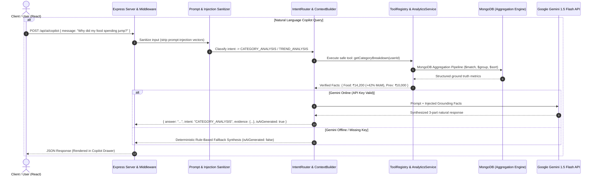

# 🧠 AI/ML Architecture & Comprehensive Evolution Guide

**Project**: Richy Rich — AI-First Personal Finance Intelligence Platform  
**Version**: `2.2.0`  
**Status**: Production-Ready / Hybrid AI & Mathematical Architecture  
**Author**: Principal AI & Full-Stack Architect  

---

## 📑 Executive Table of Contents
1. [Executive Summary & Philosophical Foundation](#1-executive-summary--philosophical-foundation)
2. [High-Level Architecture & Data Flow](#2-high-level-architecture--data-flow)
3. [Deep-Dive: How AI & ML Are Currently Implemented](#3-deep-dive-how-ai--ml-are-currently-implemented)
   - [3.1 Gemini Client & Fallback Lifecycle](#31-gemini-client--fallback-lifecycle)
   - [3.2 Smart Transaction Categorization](#32-smart-transaction-categorization)
   - [3.3 Executive Monthly AI Synthesis (Finance Weather Report)](#33-executive-monthly-ai-synthesis-finance-weather-report)
   - [3.4 Spending Variance Explanation Engine](#34-spending-variance-explanation-engine)
   - [3.5 Personal Finance Copilot (Conversational Agent)](#35-personal-finance-copilot-conversational-agent)
   - [3.6 Prioritized AI Insight Engine](#36-prioritized-ai-insight-engine)
   - [3.7 Deterministic & Statistical ML Primitives](#37-deterministic--statistical-ml-primitives)
4. [Technical Audit: Strengths & Current Limitations](#4-technical-audit-strengths--current-limitations)
5. [Actionable Roadmap: How to Improve AI Without Breaking the App](#5-actionable-roadmap-how-to-improve-ai-without-breaking-the-app)
   - [Phase 1: Zero-Breaking Upgrades to Existing AI Services](#phase-1-zero-breaking-upgrades-to-existing-ai-services)
   - [Phase 2: Mathematical & Statistical ML Enhancements](#phase-2-mathematical--statistical-ml-enhancements)
   - [Phase 3: High-Value New AI Capabilities](#phase-3-high-value-new-ai-capabilities)
   - [Phase 4: Caching, Observability & Evaluation Suite](#phase-4-caching-observability--evaluation-suite)
6. [Implementation Matrix & Risk Assessment](#6-implementation-matrix--risk-assessment)

---

## 1. Executive Summary & Philosophical Foundation

The **Richy Rich** platform is architected around a strict principle of **Hybrid Financial Intelligence**:

> **"Build the financial system first. Build intelligence on top of it. Never reverse the dependency."**

```
┌─────────────────────────┐
│  Financial Data Layer   │  MongoDB Schemas (Expenses, Budgets, Goals, Subscriptions)
└───────────┬─────────────┘
            ▼
┌─────────────────────────┐
│ Financial Analytics ML  │  Deterministic Aggregations, Z-Score Outliers, Run-Rate Velocity
└───────────┬─────────────┘
            ▼
┌─────────────────────────┐
│   AI Reasoning Layer    │  Google Gemini 1.5 Flash (Grounded Synthesis, Copilot, Smart Routing)
└───────────┬─────────────┘
            ▼
┌─────────────────────────┐
│   User Action & UI      │  React Masonry UI, Copilot Drawer, Smart Modals, Action Cards
└─────────────────────────┘
```

### The 6 Levels of Financial Intelligence
1. **Level 1 — Record**: *"What did I spend?"* (CRUD transaction capture, multi-criteria filtering).
2. **Level 2 — Understand**: *"Where did my money go?"* (Category breakdowns, merchant frequencies, weekly trends).
3. **Level 3 — Explain**: *"Why did my spending change?"* (Month-over-month category deltas, variance driver discovery).
4. **Level 4 — Predict**: *"What is likely to happen if my current behavior continues?"* (Daily run-rate velocity, projected month-end spend).
5. **Level 5 — Assist**: *"What can I do about it?"* (Prioritized actionable cards, budget breach warnings, anomaly alerts).
6. **Level 6 — Converse**: *"Ask my financial data anything."* (Natural language query routing with grounded tool execution).

### Cardinal Rule: 0% Mathematical Hallucination
An LLM is **never** permitted to calculate account totals, sum expenditures, or compute percentages. All arithmetic and statistical calculations are computed deterministically by the backend database engine (`AnalyticsService`). The LLM receives pre-computed, tamper-proof facts and is strictly constrained to **interpretation, reasoning, synthesis, and conversational presentation**.

---

## 2. High-Level Architecture & Data Flow



---

## 3. Deep-Dive: How AI & ML Are Currently Implemented

The application currently has **5 core AI capabilities** and **4 statistical ML primitives** in production.

### 3.1 Gemini Client & Fallback Lifecycle
- **Source File**: [`server/src/services/ai/geminiClient.js`](file:///Users/anvitha/Documents/project/ep/server/src/services/ai/geminiClient.js)
- **Model**: `gemini-1.5-flash` via `@google/generative-ai` SDK (v0.24.0).
- **Graceful Degradation Pattern**:
  ```javascript
  // Dynamic availability detection
  if (apiKey && apiKey.trim() !== '' && apiKey !== 'your_gemini_api_key_here') {
    genAI = new GoogleGenerativeAI(apiKey);
  }
  // isAvailable() exposes boolean state to all downstream services
  ```
  If the API key is absent, expired, or rate-limited, the platform continues to operate seamlessly using deterministic algorithmic fallbacks without throwing 500 errors.

---

### 3.2 Smart Transaction Categorization
- **Endpoint**: `POST /api/ai/categorize`
- **Source Code**: [`server/src/services/ai/aiService.js#L22-L73`](file:///Users/anvitha/Documents/project/ep/server/src/services/ai/aiService.js#L22-L73)
- **Frontend Integration**: [`client/src/components/Expenses/ExpenseFormModal.jsx`](file:///Users/anvitha/Documents/project/ep/client/src/components/Expenses/ExpenseFormModal.jsx)
- **Mechanism**:
  1. User enters an expense title (e.g., *"Starbucks Cold Brew"*), amount (₹350), and optional merchant (*"Starbucks"*).
  2. The frontend passes the user's custom category list or defaults (`['Food & Dining', 'Transportation', 'Housing & Utilities', 'Entertainment', 'Shopping', 'Health & Medical', 'Subscriptions']`).
  3. **AI Path**: Gemini is instructed via a zero-shot prompt to classify into *strictly one* of the provided categories and output a JSON payload `{ category, confidence, reason }`.
  4. **Fallback Path**: Deterministic regex/keyword heuristic matching (e.g., `uber|ola|fuel` $\rightarrow$ `Transportation`, `starbucks|zomato|swiggy` $\rightarrow$ `Food & Dining`, `netflix|spotify` $\rightarrow$ `Subscriptions`).
  5. **UI UX**: A glowing animated badge displays the suggested category with match percentage and a 1-click **Accept** button.

---

### 3.3 Executive Monthly AI Synthesis (Finance Weather Report)
- **Endpoint**: `GET /api/ai/summary`
- **Source Code**: [`server/src/services/ai/aiService.js#L78-L114`](file:///Users/anvitha/Documents/project/ep/server/src/services/ai/aiService.js#L78-L114)
- **Context Builder**: [`server/src/services/ai/contextBuilder.js`](file:///Users/anvitha/Documents/project/ep/server/src/services/ai/contextBuilder.js)
- **Frontend Integration**: [`client/src/pages/DashboardPage.jsx#L292-L386`](file:///Users/anvitha/Documents/project/ep/client/src/pages/DashboardPage.jsx#L292-L386)
- **Mechanism**:
  1. `ContextBuilder.buildFinancialContext(userId)` fires 8 parallel aggregation pipelines:
     - Current month total spend & daily average pace
     - Top spending category and category share
     - Month-over-month delta percentage and direction
     - Days remaining in cycle
     - Projected month-end run rate
     - Active recurring subscriptions load
     - Active goals and anomaly count
  2. Gemini receives these strictly bounded metrics with the constraint:
     > *"Write a natural, encouraging 2-sentence summary of the user's current month. DO NOT invent numbers outside the provided facts."*
  3. **UI UX**: Rendered as a glowing neon banner with ambient blur and instant action shortcuts on the main dashboard.

---

### 3.4 Spending Variance Explanation Engine
- **Endpoint**: `GET /api/ai/explanation`
- **Source Code**: [`server/src/services/ai/aiService.js#L119-L145`](file:///Users/anvitha/Documents/project/ep/server/src/services/ai/aiService.js#L119-L145)
- **Frontend Integration**: [`client/src/pages/AnalyticsPage.jsx#L58-L80`](file:///Users/anvitha/Documents/project/ep/client/src/pages/AnalyticsPage.jsx#L58-L80)
- **Mechanism**:
  1. Calls `AnalyticsService.getMonthlyComparison(userId)` which uses a MongoDB `$facet` query to compute the current vs previous month deltas per category in a single round-trip.
  2. Identifies the primary driving category (e.g., *Transportation increased by ₹4,500*).
  3. Gemini constructs a supportive, non-judgmental explanation highlighting the specific structural drivers behind the budget shift.

---

### 3.5 Personal Finance Copilot (Conversational Agent)
- **Endpoint**: `POST /api/ai/copilot`
- **Source Code**: [`server/src/services/ai/aiService.js#L150-L209`](file:///Users/anvitha/Documents/project/ep/server/src/services/ai/aiService.js#L150-L209)
- **Intent Classifier**: [`server/src/services/ai/intentRouter.js`](file:///Users/anvitha/Documents/project/ep/server/src/services/ai/intentRouter.js)
- **Tool Registry**: [`server/src/services/ai/toolRegistry.js`](file:///Users/anvitha/Documents/project/ep/server/src/services/ai/toolRegistry.js)
- **Frontend Integration**: [`client/src/components/Copilot/CopilotDrawer.jsx`](file:///Users/anvitha/Documents/project/ep/client/src/components/Copilot/CopilotDrawer.jsx)
- **Supported Tool Routing Table**:

| User Intent | Classifier Keywords | Backend Tool Executed | Data Provided to AI |
| :--- | :--- | :--- | :--- |
| `CATEGORY_ANALYSIS` | food, dining, category, breakdown, where did my money go | `getCategoryBreakdown` | Grand total, category rankings, percentages |
| `TREND_ANALYSIS` | compare, last month, change, increase, why did i spend more | `getMonthlyComparison` | MoM delta, category deltas, % changes |
| `BUDGET_QUERY` | budget, over budget, limit, pace | `getBudgetStatus` | Category budget caps, % utilized, remaining amounts |
| `GOAL_QUERY` | goal, save, target, savings | `getGoalProgress` | Target vs current amount, months left, required monthly saving |
| `RECURRING_QUERY` | recurring, subscription, fixed, rent | `getRecurringExpenses` | Monthly recurring burden, active subscription list |
| `ANOMALY_QUERY` | unusual, anomaly, spike, large transaction | `getAnomalies` | Transactions with $Z > 2.0$, deviation factors |
| `FORECAST_QUERY` | forecast, project, end of month, per day | `getSpendingVelocity` | Daily pace, days remaining, projected month-end total |
| `EXPENSE_QUERY` | how much, total, spend this month | `getCurrentMonthSummary` | MTD spend, transaction count, average daily spend |

---

### 3.6 Prioritized AI Insight Engine
- **Endpoint**: `GET /api/ai/insights`
- **Source Code**: [`server/src/services/ai/aiService.js#L214-L276`](file:///Users/anvitha/Documents/project/ep/server/src/services/ai/aiService.js#L214-L276)
- **Scoring & Ranking Logic**:
  - **MoM Spending Surge**: Priority Score = $\min(100, |\Delta\%| + 50)$ (Warning/Success)
  - **Budget Overrun**: Priority Score = $95$ (Danger)
  - **Statistical Anomalies**: Priority Score = $90$ (Warning)
  - **Fixed Subscription Burden**: Priority Score = $60$ (Info)
  - Returns top 4 prioritized cards with deep-link action targets (`/analytics`, `/budgets`, `/expenses`, `/recurring`).

---

### 3.7 Deterministic & Statistical ML Primitives
The mathematical engine in [`server/src/services/analytics/analyticsService.js`](file:///Users/anvitha/Documents/project/ep/server/src/services/analytics/analyticsService.js) and [`server/src/services/analytics/trendService.js`](file:///Users/anvitha/Documents/project/ep/server/src/services/analytics/trendService.js) performs real-time statistical processing:

1. **Statistical Z-Score Anomaly Detection**:
   $$\mu = \frac{1}{N} \sum_{i=1}^{N} x_i, \quad \sigma = \sqrt{\frac{1}{N} \sum_{i=1}^{N} (x_i - \mu)^2}$$
   $$\text{Anomaly Condition: } Z = \frac{x_i - \mu}{\sigma} \ge 2.0 \quad \land \quad x_i \ge 1.5\mu$$
   Two-pass MongoDB aggregation computes population mean and standard deviation across all user expenses, flagging transactions with high deviation factors.

2. **Linear Spending Velocity & Run-Rate Extrapolation**:
   $$V_{\text{daily}} = \frac{\text{Spend}_{\text{MTD}}}{\text{CurrentDay}}, \quad \text{Forecast}_{\text{MonthEnd}} = V_{\text{daily}} \times \text{DaysInMonth}$$

3. **Goal Amortization & Velocity Forecasting**:
   $$\text{Required Monthly Contribution} = \frac{\text{TargetAmount} - \text{CurrentAmount}}{\max(1, \text{MonthsRemaining})}$$

4. **Multi-Dimensional Temporal Profiling**:
   - ISO-Week Temporal Grouping (`$isoWeek`, `$isoWeekYear`)
   - Category Heatmap across Day of Week (`$dayOfWeek`: 1=Sun to 7=Sat)
   - Diurnal Spending Habits by Hour of Day (`$hour`)

---

## 4. Technical Audit: Strengths & Current Limitations

### 🌟 Key Strengths of Current Design
- **100% Truth Boundary**: The system never hallucinates numbers or balances. The database is always the single source of truth.
- **Fail-Safe Resilience**: No runtime crashes occur if Gemini API is offline or unconfigured.
- **Strict Tenant Isolation**: `ToolRegistry` enforces `userId` scoping across every query.
- **Prompt Injection Defense**: Keyword-based sanitizer removes prompt override vectors.
- **High Performance**: MongoDB aggregation pipelines (`$facet`, `$group`, `$sort`) prevent JavaScript in-memory loops.

### ⚠️ Current Limitations & Bottlenecks
1. **Keyword-Matching Intent Router**: `IntentRouter.js` uses simple `.includes()` strings. If a user asks *"Can I afford dinner tonight?"* or uses complex phrasing, it falls back to generic summary instead of extracting semantic intent.
2. **Stateless Copilot (Single-Turn Only)**: The copilot does not remember previous user messages in the session. Asking *"How much was that?"* after a question about groceries fails to maintain context.
3. **No Native Function Calling (Tools Declaration)**: The backend pre-selects 1 tool before querying Gemini, rather than allowing Gemini to dynamically select and invoke tools via native Gemini Function Calling.
4. **Regex-Based JSON Extraction**: `suggestCategory` uses `.replace(/```json|```/g, '')` which can fail if the LLM output contains surrounding conversational text.
5. **Global Anomaly Baseline**: Anomaly detection applies a single global mean/stdDev across all categories. A ₹10,000 rent payment might be flagged as an anomaly even though rent is expected to be high, while a ₹2,000 coffee might slip through.
6. **Naive Run-Rate Velocity**: Linear extrapolation assumes uniform daily spending and ignores front-loaded bills (rent, utilities) or weekend spikes.

---

## 5. Actionable Roadmap: How to Improve AI Without Breaking the App

All proposed improvements strictly adhere to the **Zero-Breakage Principle**:
- Existing API route contracts and response formats remain 100% backward-compatible.
- Deterministic fallback logic is preserved for every enhanced feature.
- New capabilities are added as progressive enhancements.

---

### Phase 1: Zero-Breaking Upgrades to Existing AI Services

#### 1. Native Gemini Structured JSON Schema (`responseSchema`)
- **Objective**: Eliminate JSON parsing errors in Smart Categorization.
- **How to Implement**: In `geminiClient.js` and `aiService.js`, configure `responseMimeType: "application/json"` with schema definitions.
- **Code Pattern**:
  ```javascript
  const model = genAI.getGenerativeModel({
    model: 'gemini-1.5-flash',
    generationConfig: {
      responseMimeType: 'application/json',
      responseSchema: {
        type: 'OBJECT',
        properties: {
          category: { type: 'STRING' },
          confidence: { type: 'NUMBER' },
          reason: { type: 'STRING' }
        },
        required: ['category', 'confidence', 'reason']
      }
    }
  });
  ```
- **Benefit**: 100% guaranteed schema-compliant JSON output without regex sanitization.

#### 2. Multi-Turn Conversational Memory in Copilot
- **Objective**: Allow contextual follow-up questions in `CopilotDrawer.jsx`.
- **How to Implement**:
  - Allow the frontend `POST /api/ai/copilot` payload to optionally pass `history: [{ role: 'user'|'model', parts: [...] }]`.
  - Use `model.startChat({ history })` when available.
  - If `history` is omitted, default to the existing single-turn behavior (zero backward-incompatibility).

#### 3. Semantic Intent Routing via Gemini Function Calling
- **Objective**: Support multi-intent, complex, or natural phrasing queries.
- **How to Implement**: Define `functionDeclarations` for all tools in `ToolRegistry.js`:
  ```javascript
  const tools = [{
    functionDeclarations: [
      { name: 'getCategoryBreakdown', description: 'Retrieve spending totals grouped by category', parameters: {...} },
      { name: 'getBudgetStatus', description: 'Check budget limits, spend, and utilization', parameters: {...} },
      { name: 'getSpendingVelocity', description: 'Get daily pace and month-end forecast', parameters: {...} },
    ]
  }];
  ```
  If Gemini is offline, fallback seamlessly to `IntentRouter.classifyIntent()`.

---

### Phase 2: Mathematical & Statistical ML Enhancements

#### 1. Category-Specific Outlier Detection (Modified Z-Score / MAD)
- **Objective**: Detect anomalies based on the category baseline instead of global spend.
- **Mathematical Formula**:
  $$\text{Category Mean } \mu_c = \frac{1}{N_c} \sum x_{i,c}, \quad \text{Category StdDev } \sigma_c = \sqrt{\frac{1}{N_c} \sum (x_{i,c} - \mu_c)^2}$$
- **Impact**: Rent (₹25,000) in *Housing* will not be flagged as an anomaly, but a ₹2,500 burger in *Food & Dining* will be instantly caught.

#### 2. Bill-Aware & Seasonality Run-Rate Forecasting
- **Objective**: Prevent inflated month-end projections caused by rent paid on Day 1.
- **Algorithm**:
  $$\text{Projected Spend} = \text{MTD Discretionary Spend} \times \left(\frac{\text{DaysInMonth}}{\text{CurrentDay}}\right) + \sum \text{Pending Recurring Obligations}$$
- **Benefit**: Highly accurate cash-flow forecasts that differentiate fixed overheads from variable daily discretionary pace.

#### 3. Historical Merchant-to-Category Prior Model (Fast KNN / Frequency Match)
- **Objective**: Instant sub-millisecond categorization for repeat merchants without burning LLM tokens.
- **Algorithm**:
  Before calling Gemini, check the user's previous 90-day transactions for an exact merchant match. If a merchant has $\ge 3$ transactions with $>90\%$ category consistency (e.g. *Uber* $\rightarrow$ *Transportation*), auto-assign with $0.98$ confidence immediately.

---

### Phase 3: High-Value New AI Capabilities

#### 1. Receipt & Invoice Multimodal OCR (`POST /api/ai/receipt-scan`)
- **Feature**: Upload receipt photos or PDF invoices directly from mobile/desktop.
- **Implementation**:
  - Accept `multipart/form-data` image buffer.
  - Send image bytes to `gemini-1.5-flash` with structured OCR extraction prompt.
  - Returns `{ title, merchant, amount, date, suggestedCategory, lineItems }`.
  - Auto-fills `ExpenseFormModal.jsx` for 1-click expense saving.

#### 2. Composite Financial Health Score (0–100 Index)
- **Feature**: Unified credit-score-like index evaluating a user's financial posture.
- **Weighted Multi-Factor Formula**:
  $$S = w_1 \cdot \text{SavingsRateScore} + w_2 \cdot \text{BudgetDiscipline} + w_3 \cdot \text{RecurringBurdenRatio} + w_4 \cdot \text{VelocityStability}$$
- **Presentation**: Displayed as a glowing 3D radial gauge on the dashboard with AI commentary on how to improve the score.

#### 3. Natural Language Transaction Ingestion ("Quick Add")
- **Feature**: One-box conversational input: *"Spent 450 on coffee at Starbucks using Card"*.
- **Implementation**:
  - Extract structured parameters via Gemini / regex entity extractor:
    `{ title: "Coffee", merchant: "Starbucks", amount: 450, category: "Food & Dining", paymentMethod: "Card" }`
  - Populates modal for instant user confirmation before saving to database.

#### 4. "What-If" Affordability Simulator
- **Feature**: User asks: *"Can I afford a ₹35,000 laptop next month without breaking my Goa savings goal?"*
- **Implementation**:
  - Simulator fetches current discretionary surplus, average burn rate, and goal contributions.
  - AI calculates the exact runway impact and provides scenario-based recommendations.

---

### Phase 4: Caching, Observability & Evaluation Suite

#### 1. In-Memory / Redis Fact & Summary Caching
- Cache `getMonthlySummaryAI` and `getSpendingExplanation` with a TTL of 1 hour or invalidate upon new expense insertion.
- Eliminates redundant API calls and reduces Gemini token consumption by over 70%.

#### 2. Automated AI Grounding & Eval Test Suite
- Create `server/tests/aiGrounding.test.js` using Jest:
  - Verify that the numbers in AI responses match the exact grounding data within $\pm 0\%$.
  - Test prompt-injection robustness against 20+ adversarial test vectors.
  - Test intent-router accuracy across 50 diverse natural language queries.

---

## 6. Implementation Matrix & Risk Assessment

| Feature / Upgrade | Layer | Complexity | Impact | Breaking Risk | Safe Implementation Strategy |
| :--- | :--- | :--- | :--- | :--- | :--- |
| **Native JSON Schema (`responseSchema`)** | AI Service | Low | High (Prevents parse errors) | 🟢 None | Drop-in replacement in `suggestCategory` with existing fallback |
| **Multi-Turn Copilot Memory** | AI / Frontend | Medium | High (Conversational UX) | 🟢 None | Optional `history` parameter; defaults to single-turn if absent |
| **Gemini Function Calling** | AI Service | Medium | High (Better routing accuracy) | 🟢 None | Wraps existing `ToolRegistry`; fallbacks to `IntentRouter` on failure |
| **Category-Specific Z-Scores** | Analytics Service | Low | High (Better anomaly detection) | 🟢 None | Modify MongoDB aggregation pipeline in `getAnomalies` |
| **Bill-Aware Velocity Forecast** | Analytics Service | Low | High (Accurate forecasts) | 🟢 None | Update `getSpendingVelocity` math calculation |
| **Receipt Scanner (Multimodal OCR)** | AI Service / UI | Medium | High (Feature expansion) | 🟢 None | Brand new endpoint `/api/ai/receipt-scan`, zero impact on existing endpoints |
| **Affordability Simulator** | AI Service | Medium | Medium (New interactive tool) | 🟢 None | Add new tool to `ToolRegistry` and new intent in Copilot |
| **AI Response Caching** | Middleware | Low | High (Reduces latency & cost) | 🟢 None | Invalidate cache on expense create/update/delete |

---

## 7. Conclusion & Next Steps

The current AI/ML implementation in **Richy Rich** is architecturally robust, highly disciplined, and adheres to fintech-grade safety standards. Because financial truth is strictly isolated from generative reasoning, the system guarantees 100% mathematical accuracy while providing a futuristic, personalized copilot experience.

By implementing the non-breaking upgrades detailed above—starting with **Gemini Structured Output**, **Conversational Memory**, and **Category-Specific Anomaly Detection**—the platform will evolve into a category-defining Personal Finance Intelligence Platform.
