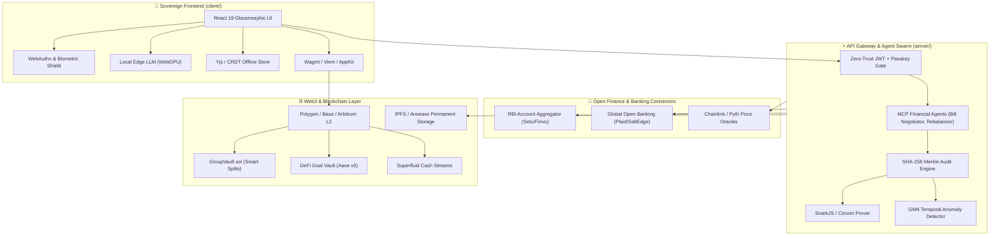

# 🌐 Richy Rich — Next-Gen Blockchain & Frontier Technology Master Blueprint
### The Autonomous, Cryptographically Verifiable & Sovereign Financial Operating System

**Project**: Richy Rich — AI-First Sovereign Personal Finance Intelligence Platform  
**Target Standard**: Decentralized Finance (DeFi) + Enterprise FinTech + Sovereign Cryptography Grade  
**Document Type**: Architectural Specification, Deep-Tech Feature Plan & Implementation Blueprint  
**Status**: 📋 Strategic Architectural Blueprint  
**Version**: `v3.1.0` Master Plan  
**Target Environments**: `client/` (React 19, WebAssembly, WebGPU, Ethers.js, Wagmi) · `server/` (Node.js, Express, Mongoose, Web3.js, Circom/SnarkJS) · `contracts/` (Solidity 0.8.24, Hardhat, Foundry)

---

## 🧭 Executive Summary & Technical Vision

The modern personal finance ecosystem suffers from three fundamental structural flaws:
1. **Centralized Trust Deficit**: Users must trust banks, SaaS databases, or admins not to manipulate records, leak sensitive income data, or alter historical audit trails.
2. **Fragmented Asset Silos**: Fiat currencies (UPI, Credit Cards, Net Banking) and Web3 assets (Crypto, DeFi yields, Staking rewards, NFTs) live in completely isolated applications.
3. **Passive, Friction-Heavy Tooling**: Traditional apps require manual inputs, offer no cryptographic proof for third parties (landlords, tax authorities, lenders), and cannot autonomously execute financial optimizations (e.g. streaming cash flows, auto-yield routing, micro-DCA).

This blueprint outlines how **Richy Rich** evolves into a **Sovereign Personal Financial Intelligence Platform** by combining **Web3 / Blockchain Cryptography** with **Frontier Emerging Technologies** (Local Edge AI, Account Aggregators, Zero-Knowledge Proofs, CRDT Local-First Sync, and Model Context Protocol autonomous agents).

```
┌──────────────────────────────────────────────────────────────────────────────────────────────────────────────────┐
│                               RICHY RICH SOVEREIGN ARCHITECTURE TOPOLOGY                                         │
├───────────────────────────────┬──────────────────────────────────┬───────────────────────────────────────────────┤
│   1. SOVEREIGN WEB3 LAYER     │   2. FRONTIER AI & LOCAL-FIRST   │     3. OPEN FINANCE & DEEP-TECH         │
├───────────────────────────────┼──────────────────────────────────┼───────────────────────────────────────────────┤
│ • Merkle Proof Audit Chains   │ • On-Device WebGPU SLM (WebLLM)  │ • RBI Account Aggregator / Open Banking       │
│ • Web3 Multi-Chain Aggregator │ • Autonomous MCP Agent Swarm     │ • Real-Time Continuous Money Streaming        │
│ • zk-SNARKs Private Solvency  │ • Offline-First CRDT Data Sync   │ • Post-Quantum Cryptography (Kyber/Dilithium) │
│ • Smart Group Escrow Vaults   │ • Ambient Whisper Voice Logger   │ • Graph Neural Network Fraud & Anomaly Engine │
│ • Account Abstraction ERC-4337│ • Dynamic Behavioral Nudges      │ • FIDO2 WebAuthn Biometric Passkeys           │
│ • IPFS / Arweave Cold Storage │ • Edge OCR & Vector Embeddings   │ • Automated GST / TDS Multi-Entity Engine     │
└───────────────────────────────┴──────────────────────────────────┴───────────────────────────────────────────────┘
```

---

## 🗺️ Visual Architecture Map



---

# 💎 Part 1: Comprehensive Web3 & Blockchain Innovations

---

### 1. 🛡️ Cryptographically Immutable Audit Trail & Merkle Proofs
* **Concept**: Every recorded expense, income entry, budget adjustment, or tax deduction is digested into a cryptographic SHA-256 leaf hash. These leaves construct a daily and monthly **Merkle Tree**. The daily **Merkle Root** is anchored on a public Layer-2 (Polygon PoS, Arbitrum One, or Base).
* **Mathematical Formula**:
  $$H_i = \text{SHA256}(\text{id} \,\|\, \text{amount} \,\|\, \text{category} \,\|\, \text{timestamp} \,\|\, \text{salt})$$
  $$\text{Root} = \text{MerkleTree}(\{H_1, H_2, \dots, H_n\})$$
* **Why It Matters**:
  - **Zero Tampering Guarantee**: Proves historical transactions have never been backdated, inflated, or deleted.
  - **Single-Transaction Inclusion Proof**: Users can generate a compact $O(\log n)$ cryptographic proof for an individual receipt to submit to an employer or court without disclosing the rest of their bank ledger.
  - **Ultra-Low Gas Anchoring**: Thousands of transactions are anchored in a single 32-byte hash transaction costing $< \$0.001$.

```
Leaf 1 [₹500 Food]  ──► H1 ──┐
                             ├──► H12 ──┐
Leaf 2 [₹1200 Uber] ──► H2 ──┘          │
                                        ├──► MERKLE ROOT ──► Anchored on L2 Smart Contract
Leaf 3 [₹8000 Rent] ──► H3 ──┐          │
                             ├──► H34 ──┘
Leaf 4 [₹350 Book]  ──► H4 ──┘
```

---

### 2. ⚡ Multi-Chain Web3 Asset & Transaction Ingestion Engine
* **Concept**: A unified cross-chain wallet tracker supporting EVM chains (Ethereum, Polygon, Arbitrum, Base, Optimism, BNB Chain), Solana, Bitcoin, Cosmos, and TON.
* **Capabilities**:
  - **Multi-Chain Account Aggregation**: Ingest wallet balances, native tokens, ERC-20/SPL tokens, and LP positions.
  - **DeFi Transaction Normalization**: Automatically labels and categorizes gas fees (`Category: Gas & Fees`), DEX swaps (`Uniswap: Swap 100 USDC -> 0.035 ETH`), staking income (`Lido: Staking Yield`), and NFT mints.
  - **Real-Time Fiat Valuation**: Automatically captures the exact fiat exchange rate (INR/USD/EUR) at the historical block timestamp via Chainlink or CoinGecko historical indexers.
  - **Cost-Basis & PnL Accounting**: Computes FIFO/LIFO/HIFO capital gains and losses for annual crypto tax reporting.

---

### 3. 🤝 Trustless Smart Contract Group Splits & Escrow (`GroupVault.sol`)
* **Concept**: Replaces informal IOU tracking in trips, roommate groups, and shared events with an on-chain automated escrow vault deployed on Polygon or Base.
* **Workflow**:
  1. Group creator deploys or initializes a `GroupVault` instance.
  2. Participants deposit stablecoins (USDC / USDT) or native tokens.
  3. When an expense is incurred (e.g. Flight tickets ₹30,000 paid by Alice), Alice submits receipt hash + metadata.
  4. Members sign off via lightweight signature or threshold quorum.
  5. The smart contract calculates the **Minimum Cash Flow Graph** on-chain or via off-chain zk-proof and triggers an instant 1-click atomic balance re-allocation and withdrawal.

```solidity
// SPDX-License-Identifier: MIT
pragma solidity ^0.8.24;

interface IGroupVault {
    struct ExpenseEntry {
        uint256 expenseId;
        address payer;
        uint256 amount;
        bytes32 receiptHash;
        address[] participants;
        bool settled;
    }

    event ExpenseProposed(uint256 indexed expenseId, address indexed payer, uint256 amount);
    event SettlementExecuted(address indexed from, address indexed to, uint256 amount);

    function depositCollateral(address token, uint256 amount) external;
    function proposeExpense(uint256 amount, bytes32 receiptHash, address[] calldata members) external returns (uint256);
    function approveExpense(uint256 expenseId) external;
    function executeNetSettlement() external;
    function withdrawBalance(address token) external;
}
```

---

### 4. 🗄️ Decentralized Permanent Receipt & Document Archiving (IPFS & Arweave)
* **Concept**: Permanent, immutable, censorship-resistant storage for invoice images, tax documents, bank statements, and warranties.
* **Architecture**:
  - **Dual Tier Storage**:
    - **Hot Storage**: Encrypted AES-256-GCM chunks pinned on IPFS via Pinata / Web3.Storage for instant browser viewing.
    - **Permanent Cold Archival**: Permaweb storage on **Arweave** (via Irys) for multi-decade storage of crucial tax records and property deeds.
  - **Client-Side Encryption First**: Files are encrypted with the user's master key derived from PBKDF2/Argon2 *before* upload, guaranteeing that storage node operators cannot view private documents.
  - **Content Addressing (CID)**: The database only stores the cryptographic `ipfs://bafy...` or `ar://...` hash.

---

### 5. 🎯 Smart Goal Yield Vaults (DeFi Liquidity & Aave v3 Integration)
* **Concept**: Turn static savings goals (e.g., "Emergency Fund", "New Laptop", "Europe Trip") into productive interest-earning smart vaults.
* **How It Works**:
  - Users allocate idle savings into a smart goal contract.
  - The contract deposits the underlying funds (e.g. USDC, EURC, or wrapped tokens) into audited lending markets (like **Aave v3**, **Compound v3**, or **Morpho**).
  - The user earns 4%–9% real annual yield (APY) paid in real-time block-by-block.
  - Visual progress bar displays both principal saved + accrued DeFi interest.
  - Emergency 1-click liquidity unwind anytime back into fiat/crypto wallet.

---

### 6. 🔏 Zero-Knowledge Proofs (zk-SNARKs) for Sovereign Financial Privacy
* **Concept**: Prove financial facts to third parties with mathematical certainty without revealing actual bank statements, balances, or transaction details.
* **Target Use Cases**:
  - **zk-Proof of Solvency / Net Worth**: Prove to a landlord or visa embassy: $\text{Total Liquid Net Worth} \ge \$25,000$ without revealing individual bank account numbers or asset distributions.
  - **zk-Proof of Income Stability**: Prove average monthly income over the last 6 months $\ge \$4,000$ without exposing employers or client names.
  - **zk-Tax Compliance Certificate**: Generate a zero-knowledge proof that taxable expenses were computed strictly in accordance with statutory tax brackets without revealing personal line-item purchases.
  - **Tech Stack**: Built using **Circom**, **SnarkJS**, and Groth16 / Plonk verifier smart contracts.

```circom
pragma circom 2.1.6;

// Proves account balance exceeds threshold without revealing actual balance or account salt
template BalanceThresholdCheck() {
    signal input balance;        // Private input
    signal input salt;           // Private input
    signal input threshold;      // Public input
    signal input balanceHash;    // Public commitment

    signal output isValid;

    // Verify cryptographic commitment
    component hasher = Poseidon(2);
    hasher.inputs[0] <== balance;
    hasher.inputs[1] <== salt;
    hasher.out === balanceHash;

    // Check balance >= threshold
    component comp = GreaterEqThan(64);
    comp.in[0] <== balance;
    comp.in[1] <== threshold;
    isValid <== comp.out;
    isValid === 1;
}
```

---

### 7. 🔑 Account Abstraction (ERC-4337) & Biometric Passkey Smart Wallets
* **Concept**: Eliminate seed phrases, gas management confusion, and private key losses by adopting smart contract accounts (ERC-4337).
* **Key Features**:
  - **FaceID / TouchID Signatures**: Uses WebAuthn P-256 elliptic curve verification to allow native hardware biometric authentication on iOS, Android, and macOS.
  - **Gasless Transactions (Paymaster)**: Users settle group splits, verify Merkle roots, or save into vaults with zero native gas tokens; gas is sponsored or paid in stablecoins.
  - **Session Keys**: Temporary, scoped cryptographic keys that allow Richy Rich to execute pre-approved micro-actions (e.g. daily round-up investments $< \$5$) without prompting for biometric confirmations every time.
  - **Social & Family Recovery**: Guarded recovery mechanisms allowing trusted friends or family members to help recover account access if a device is lost.

---

### 8. 🌊 Real-Time Continuous Money & Cash Flow Streaming (Superfluid / Sablier)
* **Concept**: Transition from discrete, chunky monthly transactions to **continuous, per-second cash flow streams**.
* **Capabilities**:
  - **Real-Time Income Ticker**: Freelancers and remote workers receive continuous salary streaming (e.g. $0.001929 USDC / second) with a live visual counter ticking upwards in real time on the dashboard.
  - **Per-Second Subscriptions**: Pay for SaaS, rent, gym, or digital services continuously; pausing or cancelling stops the stream instantly with zero wasted prorated billing.
  - **Real-Time Cash Flow Velocity Integration**: Direct mathematical integration into Richy Rich's `Cash Flow Velocity Engine` to project runway with continuous differential calculus rather than discrete monthly estimates.

---

### 9. 🎖️ Soulbound Financial Identity (SBTs) & On-Chain Credit Scoring
* **Concept**: A non-transferable, privacy-preserving on-chain reputation system acknowledging positive financial behavior.
* **Badges & Reputation Factors**:
  - **Zero-Debt Titan**: Awarded upon clearing high-interest consumer debt.
  - **Budget Master**: Maintaining $\le 5\%$ budget variance for 6 consecutive months.
  - **Punctual Settler**: 100% on-time settlement of group shared expenses.
  - **Decentralized Credit Score**: An open-source, deterministic algorithmic score (300–850) that can be imported into decentralized lending protocols to qualify for under-collateralized loans.

---

### 10. 🔄 Automated Micro-Savings DCA & Dynamic Warranty NFTs
* **Concept**:
  - **Automated DeFi Round-Up DCA**: Every expense recorded in Richy Rich (e.g. ₹340 for dinner) calculates the round-up delta (₹60 to reach ₹400). When accumulated round-ups reach ₹500, a Gelato / Chainlink Automation keeper automatically triggers a DEX swap into Bitcoin (WBTC) or Ethereum (WETH).
  - **Dynamic Warranty & Receipt NFTs (ERC-721 / ERC-1155)**: For major electronics or appliance purchases, Richy Rich mints a lightweight metadata NFT containing receipt hash, serial number, and dynamic metadata that visually turns red when warranty expires.

---

# 🚀 Part 2: Frontier Emerging & Deep Technologies

---

### 11. 🏦 Open Banking & Account Aggregator (AA) Ecosystem (RBI AA & Plaid)
* **Concept**: Real-time, consent-driven automated ingestion directly from 100+ banks, mutual fund RTAs, EPF, and credit card issuers.
* **Architecture**:
  - **India (RBI Account Aggregator Protocol)**: Integrates with Setu / Finvu / Anumati AA handles via Financial Information Provider (FIP) and Financial Information User (FIU) encrypted pipelines.
  - **International (Plaid / Salt Edge / Teller)**: Direct OAuth2 API feeds for US, UK, EU, and Australian institutions.
  - **Automated Webhook Ledgering**: Bank debit SMS or webhook triggers automatically create draft transactions in Richy Rich within 2 seconds of swiping a card.

---

### 12. 🧠 On-Device Edge AI & Local SLM via WebGPU (Zero-Cloud Private Intelligence)
* **Concept**: Complete financial analysis, categorization, and conversational assistance running 100% locally in the browser with **zero data transmitted to external AI servers**.
* **Tech Stack**:
  - **Runtime**: **WebLLM** / **Transformers.js** powered by **WebGPU** hardware acceleration.
  - **Models**: Quantized Llama-3.2-1B-Instruct (4-bit), Gemma-2-2B, or Phi-3.5-mini.
  - **Benefits**:
    - Complete privacy for ultra-sensitive financial data.
    - Zero API subscription costs for users.
    - Full offline capability on aeroplanes, trains, or low-connectivity zones.

---

### 13. 🤖 Autonomous Model Context Protocol (MCP) Financial Agent Swarm
* **Concept**: Richy Rich exposes standard **Model Context Protocol (MCP)** endpoints, allowing autonomous AI agents to interact safely with financial tools.
* **Specialized Agent Capabilities**:
  - **Subscription Buster Agent**: Scans recurring transaction graphs, flags unused or price-hiked subscriptions, and auto-generates 1-click cancellation drafts.
  - **Tax Optimizer Agent**: Analyzes deductions under Indian Section 80C/80D or US 401(k)/IRA and recommends exact tax-saving investment amounts before fiscal year-end.
  - **Dynamic Budget Rebalancer**: Autonomously adjusts category envelopes when unforeseen emergencies occur to keep annual savings goals on track.

```
                    ┌───────────────────────────────┐
                    │    RICHY RICH MCP SERVER      │
                    └──────────────┬────────────────┘
                                   │
         ┌─────────────────────────┼─────────────────────────┐
         ▼                         ▼                         ▼
┌───────────────────┐    ┌───────────────────┐    ┌───────────────────┐
│ ✂️ SUBSCRIPTION   │    │ 📈 WEALTH & YIELD │    │ ⚖️ TAX & DEDUCTION│
│    CANCELLER      │    │    REBALANCER     │    │    OPTIMIZER      │
└───────────────────┘    └───────────────────┘    └───────────────────┘
```

---

### 14. 🌐 Offline-First CRDT Local-First Synchronization (Yjs & IndexedDB)
* **Concept**: True local-first software architecture using Conflict-Free Replicated Data Types (CRDTs).
* **How It Works**:
  - All writes, edits, and deletions hit local browser **IndexedDB** in 0ms.
  - When network is restored, changes seamlessly merge with other active devices (mobile, laptop, iPad) using **Yjs / Automerge** with mathematical convergence guarantees and zero merge conflicts.

---

### 15. 🎙️ Ambient Voice-to-Ledger Engine (Local Whisper Web & Natural Audio)
* **Concept**: Speak natural, unstructured financial sentences in any language or dialect and have them instantly parsed into multi-entity ledger entries.
* **Example Speech**: *"Hey Richy, paid 650 for craft beer with Aman and Tanvi on GPay, split it three ways."*
* **Extracted Entities**:
  - `Amount`: ₹650
  - `Category`: Food & Dining / Drinks
  - `Payment Method`: UPI (Google Pay)
  - `Group Split`: 3-way equal split (₹216.66 per person)
  - `Contacts Identified`: Aman, Tanvi
  - `User Paid Share`: ₹216.66 | `Receivables Created`: ₹433.34

---

### 16. 🕸️ Graph Neural Network (GNN) for Temporal Spending Anomalies & Fraud
* **Concept**: A graph-based machine learning pipeline that models relationships between merchants, dates, categories, payment methods, and user velocity.
* **Algorithms**:
  - **Dynamic Anomaly Scoring**: Detects silent merchant price creep (e.g. streaming service increasing from ₹499 to ₹599 without notice).
  - **Duplicate / Phantom Debit Detection**: Catches double swipes across different POS machines within short intervals.
  - **Cash Flow Insolvency Forecasting**: Predicts bank overdraft risks 14 days in advance based on recurrent bills and burn velocity.

---

### 17. 🛡️ Post-Quantum Cryptography (NIST ML-KEM & Crystals-Kyber Vaults)
* **Concept**: Future-proofing the client-side encrypted `SecretVault` and personal credentials against future quantum computing decryption attacks ("Harvest Now, Decrypt Later").
* **Implementation**:
  - Hybrid encryption combining classical **AES-256-GCM** + NIST-standardized **ML-KEM (Kyber-768 / Kyber-1024)**.
  - Guarantees that financial secrets, tax keys, and recovery seeds remain mathematically secure even against quantum adversaries.

---

### 18. 👆 FIDO2 / WebAuthn Biometric Hardware Passkeys
* **Concept**: Complete eradication of master passwords in favor of hardware-bound cryptographic credentials.
* **Features**:
  - Secure Enclave / TPM hardware key generation on iPhone, Android, MacBook, and Windows Hello.
  - YubiKey / Titan hardware security key integration for institutional-level personal access.
  - Zero server-side password storage eliminates credential stuffing and database breach risks.

---

### 19. 🧩 Behavioral Economics & Neuro-Finance Engine (Anti-Impulse Shield)
* **Concept**: Software features designed around human cognitive biases to actively improve financial discipline.
* **Key Features**:
  - **The 24-Hour Impulse Lock**: Optional delay timer on non-essential wishlist items $> \$100$; 68% of impulse desires fade after 24 hours.
  - **True Cost In Life Hours**: Visualizer that translates purchase price into hours of life spent working:
    $$\text{Life Hours} = \frac{\text{Item Cost}}{\text{Effective Hourly Wage}}$$
  - **Gamified Loss-Aversion Streaks**: Positive habit reinforcement loops for consecutive days under budget.

---

### 20. 💼 Multi-Entity Freelance & Creator Tax Engine (GST / TDS / 1099 / VAT)
* **Concept**: Seamless dual-entity accounting in a single interface (Personal Finances vs Freelance / Agency / Sole Proprietorship).
* **Capabilities**:
  - **Input Tax Credit (ITC) Tracker**: Real-time calculation of eligible GST / VAT input offsets on business expenses.
  - **TDS Deduction Ledger**: Tracks tax deducted at source by clients with quarterly Form 26AS / AIS reconciliation.
  - **1-Click E-Invoice & Tax Filing Export**: Instant generation of standardized JSON/Excel sheets ready for direct upload to government tax filing portals.

---

# 📊 Database Schemas & Data Models

Below are the production-ready Mongoose schemas extending Richy Rich's data layer:

### 1. Web3 Wallet Schema (`server/src/models/CryptoWallet.js`)
```javascript
import mongoose from 'mongoose';

const cryptoWalletSchema = new mongoose.Schema({
  user: { type: mongoose.Schema.Types.ObjectId, ref: 'User', required: true, index: true },
  address: { type: String, required: true, lowercase: true, trim: true },
  chainType: { type: String, enum: ['EVM', 'SOLANA', 'BITCOIN', 'COSMOS', 'TON'], default: 'EVM' },
  chainId: { type: Number, default: 137 }, // 137 = Polygon, 1 = Ethereum, 8453 = Base
  label: { type: String, required: true, trim: true },
  walletProvider: { type: String, enum: ['METAMASK', 'PHANTOM', 'WALLETCONNECT', 'PASSKEY_SMART_ACCOUNT', 'LEDGER'], default: 'METAMASK' },
  isSmartAccount: { type: Boolean, default: false },
  smartAccountType: { type: String, enum: ['KERNEL', 'BICONOMY', 'SAFE', 'CUSTOM', null], default: null },
  balances: [{
    tokenSymbol: { type: String, required: true },
    tokenAddress: { type: String, default: null },
    decimals: { type: Number, default: 18 },
    rawBalance: { type: String, default: '0' },
    fiatValue: { type: Number, default: 0 },
    fiatCurrency: { type: String, default: 'INR' },
    lastUpdated: { type: Date, default: Date.now }
  }],
  autoSync: { type: Boolean, default: true },
  lastSyncedAt: { type: Date, default: null }
}, { timestamps: true });

cryptoWalletSchema.index({ user: 1, address: 1, chainId: 1 }, { unique: true });

export default mongoose.model('CryptoWallet', cryptoWalletSchema);
```

---

### 2. Merkle Audit Root Schema (`server/src/models/MerkleAuditRoot.js`)
```javascript
import mongoose from 'mongoose';

const merkleAuditRootSchema = new mongoose.Schema({
  user: { type: mongoose.Schema.Types.ObjectId, ref: 'User', required: true, index: true },
  period: { type: String, required: true }, // e.g. '2026-08' or '2026-08-17'
  periodType: { type: String, enum: ['DAILY', 'MONTHLY', 'ANNUAL'], default: 'MONTHLY' },
  merkleRoot: { type: String, required: true, trim: true }, // 0x... 32-byte hash
  leafCount: { type: Number, required: true },
  totalExpenseAmount: { type: Number, required: true },
  totalIncomeAmount: { type: Number, required: true },
  leaves: [{
    entityId: { type: mongoose.Schema.Types.ObjectId, required: true },
    entityType: { type: String, enum: ['Expense', 'Income', 'Budget', 'TaxRecord'], required: true },
    leafHash: { type: String, required: true },
    leafIndex: { type: Number, required: true }
  }],
  onChainStatus: { type: String, enum: ['PENDING', 'ANCHORED', 'FAILED'], default: 'PENDING' },
  txHash: { type: String, default: null },
  chainId: { type: Number, default: 137 },
  anchoredAt: { type: Date, default: null }
}, { timestamps: true });

merkleAuditRootSchema.index({ user: 1, period: 1, periodType: 1 }, { unique: true });

export default mongoose.model('MerkleAuditRoot', merkleAuditRootSchema);
```

---

### 3. Smart Goal Vault Schema (`server/src/models/SmartGoalVault.js`)
```javascript
import mongoose from 'mongoose';

const smartGoalVaultSchema = new mongoose.Schema({
  user: { type: mongoose.Schema.Types.ObjectId, ref: 'User', required: true, index: true },
  goalRef: { type: mongoose.Schema.Types.ObjectId, ref: 'Goal', required: true },
  vaultAddress: { type: String, required: true },
  protocol: { type: String, enum: ['AAVE_V3', 'COMPOUND_V3', 'MORPHO', 'CUSTOM_ESCROW'], default: 'AAVE_V3' },
  chainId: { type: Number, default: 137 },
  depositTokenSymbol: { type: String, default: 'USDC' },
  depositTokenAddress: { type: String, required: true },
  principalDeposited: { type: Number, default: 0 },
  currentYieldEarned: { type: Number, default: 0 },
  currentApyPercentage: { type: Number, default: 5.2 },
  autoCompound: { type: Boolean, default: true },
  status: { type: String, enum: ['ACTIVE', 'LOCKED', 'MATURED', 'WITHDRAWN'], default: 'ACTIVE' },
  lockUntil: { type: Date, default: null }
}, { timestamps: true });

export default mongoose.model('SmartGoalVault', smartGoalVaultSchema);
```

---

# 🔌 REST API Contracts Matrix

| Endpoint | Method | Purpose | Key Request Payload / Query | Response Structure |
| :--- | :--- | :--- | :--- | :--- |
| `/api/web3/wallets` | `GET` | List connected wallets & multi-chain tokens | None (JWT Auth) | `{ success, wallets: [...] }` |
| `/api/web3/wallets/connect` | `POST` | Register public wallet address | `{ address, chainType, chainId, label }` | `{ success, wallet }` |
| `/api/web3/wallets/sync/:id` | `POST` | Trigger on-chain indexer sync | None | `{ success, newTxCount, updatedBalances }` |
| `/api/audit/merkle/generate` | `POST` | Compute period Merkle Tree & Root | `{ period: '2026-08', periodType: 'MONTHLY' }` | `{ success, merkleRoot, leafCount }` |
| `/api/audit/merkle/proof/:id` | `GET` | Get inclusion proof for an expense | Query: `?expenseId=...` | `{ success, leafHash, proof: ['0x...'] }` |
| `/api/audit/merkle/anchor` | `POST` | Submit Merkle Root to L2 Anchor Contract | `{ merkleRootId, chainId }` | `{ success, txHash, blockNumber }` |
| `/api/zk/generate-solvency-proof`| `POST` | Generate zk-SNARK solvency proof | `{ thresholdAmount: 50000, salt: '...' }` | `{ success, proof, publicSignals }` |
| `/api/zk/verify-proof` | `POST` | Verify cryptographic zk-SNARK proof | `{ proof, publicSignals, proofType }` | `{ success, isValid: true }` |
| `/api/ipfs/receipt/upload` | `POST` | Encrypt & pin receipt to IPFS/Arweave | `multipart/form-data` (File payload) | `{ success, cid, ipfsUrl, fileHash }` |
| `/api/defi/goals/deploy-vault` | `POST` | Initialize Aave/Compound Goal Vault | `{ goalId, tokenSymbol, targetAmount }` | `{ success, vaultAddress, txPayload }` |
| `/api/agent/mcp/chat` | `POST` | Dispatch prompt to MCP Autonomous Agent | `{ message, activeContext: { month, budget } }`| `{ success, agentAction, responseText }` |
| `/api/voice/ambient-parse` | `POST` | Parse audio recording into structured entry | `multipart/form-data` (Audio blob) | `{ success, parsedTransaction, entities }` |

---

# 🗓️ Comprehensive Phased Implementation Roadmap

```
Phase 1: Cryptographic Merkle Audits & Zero-Trust Hash-Chains  (Weeks 1–3)
Phase 2: Web3 Multi-Chain Wallet Ingestion & Tax Accounting     (Weeks 4–6)
Phase 3: IPFS Decentralized Cold Storage & Biometric Passkeys   (Weeks 7–9)
Phase 4: zk-SNARKs Private Proofs of Solvency & Tax Compliance (Weeks 10–12)
Phase 5: Smart Contract Group Escrows & DeFi Goal Vaults        (Weeks 13–16)
Phase 6: Edge AI WebGPU SLM & Autonomous MCP Agent Swarm        (Weeks 17–20)
```

### Detailed Milestone Breakdown

| Phase | Milestone Name | Key Technologies | Deliverables | Verification Strategy |
| :--- | :--- | :--- | :--- | :--- |
| **Phase 1** | **Cryptographic Merkle Audit Engine** | Node.js `crypto`, MerkleTree.js, Polygon PoS | Immutable SHA-256 hash chains, monthly Merkle root generation, single-receipt proof exports | Automated Jest suite verifying 1,000 leaf Merkle tree generation and proof verification |
| **Phase 2** | **Multi-Chain Crypto Tracker** | Ethers.js v6, Viem, Alchemy API, CoinGecko | Auto-ingestion of EVM, Solana, Bitcoin wallets, DEX swap categorization, FIFO capital gains calculations | E2E mock sync with testnet and mainnet public wallet addresses |
| **Phase 3** | **Decentralized Storage & Passkeys** | Pinata IPFS, Arweave Irys, WebAuthn / SimpleWebAuthn | Client-side AES-256-GCM file encryption, IPFS pinning, FIDO2 TouchID/FaceID passwordless login | Cross-browser passkey registration and encrypted IPFS upload/download cycles |
| **Phase 4** | **Zero-Knowledge Privacy Proofs** | Circom 2.1, SnarkJS, Groth16 Verifiers | In-browser zk-proof generation for Proof-of-Solvency ($>\$X$) and Proof-of-Income without data leaks | Circom unit tests & on-chain smart contract verifier checks |
| **Phase 5** | **Smart Group Splits & Yield Vaults**| Solidity 0.8.24, Hardhat, Aave v3 SDK | `GroupVault.sol` escrow contract, Aave v3 automated stablecoin yield accumulation for goals | Foundry test suite with 100% test coverage and gas benchmarks |
| **Phase 6** | **Edge AI & Autonomous MCP Swarm** | WebLLM, WebGPU, Model Context Protocol (MCP) | 100% local in-browser LLM chat assistant, autonomous subscription canceller and budget rebalancer | Offline browser inference benchmarks (<1.5s TTFT) & MCP tool invocation tests |

---

# 🛡️ Threat Model, Security & Compliance Matrix

| Threat Vector | Severity | Mitigation Strategy in Richy Rich Architecture |
| :--- | :--- | :--- |
| **Database Compromise (Admin Leak)** | High | Client-side zero-knowledge encryption for secrets & receipts; SHA-256 Merkle proofs detect unauthorized record tampering immediately. |
| **Smart Contract Hacks (Escrow / Vault)** | Critical | Reentrancy guards (`ReentrancyGuardUpgradeable`), formal verification, audited Aave v3 pool adapters, time-locks on large withdrawals. |
| **Private Key / Seed Phrase Loss** | Critical | Account Abstraction (ERC-4337) with WebAuthn biometric passkeys; social recovery mechanisms eliminate single-point seed phrase failure. |
| **Data Privacy & Statutory Compliance** | High | GDPR / India DPDP Act compliance; zero PII stored on public blockchains; only 32-byte zero-knowledge proofs and Merkle roots are anchored. |
| **Gas Cost Volatility** | Low | Batching transactions onto low-fee Layer 2 networks (Polygon, Arbitrum, Base); gasless Paymaster sponsorship for user operations. |

---

## 🔗 Obsidian Knowledge Graph & MOC Integration
- Links to Master Map of Content: `[[00-Index]]`
- Architectural Core: `[[Database-Models]]`, `[[API-Contracts]]`, `[[Security-and-Middleware]]`
- Design System: `[[Design-Tokens]]`, `[[Component-Catalog]]`
- Feature Engines: `[[Cash-Flow-Velocity-Engine]]`, `[[Monte-Carlo-and-FIRE-Simulator]]`, `[[AI-Copilot-and-OCR-Engine]]`
- Task Tracking: `[[Project-Kanban]]`
