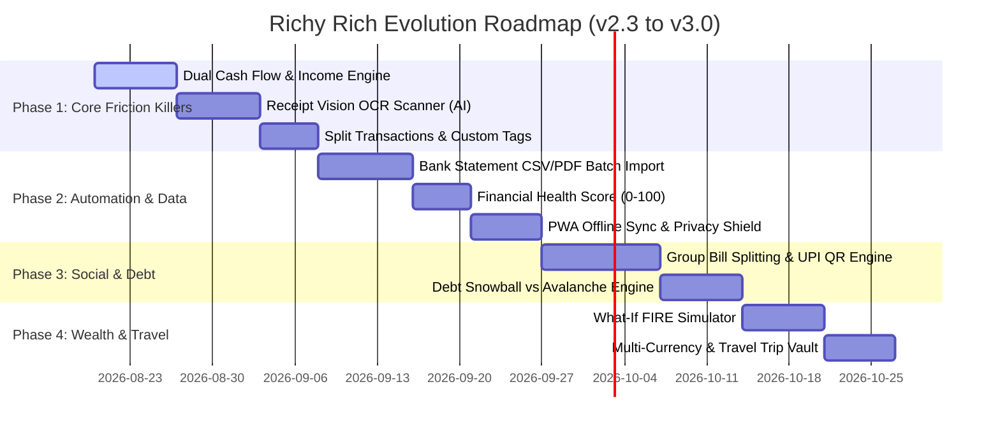

# 🚀 Richy Rich — Strategic Feature Roadmap & Productivity Innovations
### High-Impact, Genuine & Transformative Financial Features for Next-Gen Personal Wealth Management

**Project**: Richy Rich — AI-First Personal Finance Intelligence Platform  
**Target Standard**: Fintech Grade (Stripe, Monzo, Splitwise, Copilot Money & YNAB Caliber)  
**Document Type**: Architectural Feature Specification & Product Strategy  
**Status**: Ready for Implementation Planning  
**Target Version**: `v2.3.0` – `v3.0.0`

---

## 🧭 Executive Summary & Product Vision

While **Richy Rich v2.2.0** establishes a strong foundation with deterministic analytics, responsive Pinterest-style cards, multi-LLM configuration, and sub-second categorizations, personal finance applications succeed or fail based on **friction reduction, actionable intelligence, and real-life utility**.

A user does not just want to look at graphs of money they have already spent; they want a system that:
1. **Eliminates Manual Data Entry Friction**: Automated receipt scanning, bank statement batch imports, and instant voice/shortcut logging.
2. **Covers Both Sides of the Ledger**: Complete cash flow tracking (Income + Expenses + Net Savings Rate) rather than one-sided spend tracking.
3. **Solves Real-World Human Finance**: Splitting group bills, managing loans/EMIs, preparing taxes, and managing multi-currency travel.
4. **Delivers Forward-Looking Strategy**: Debt payoff planners (Snowball vs Avalanche), FIRE (Financial Independence) simulations, and predictive budget warnings before breaches happen.
5. **Guarantees Extreme Privacy & Accessibility**: Offline-first PWA sync, PIN/biometric privacy shielding, and zero-lock-in encrypted vault exports.

```
┌──────────────────────────────────────────────────────────────────────────────────────────────────┐
│                               RICHY RICH WEALTH ECOSYSTEM ARCHITECTURE                          │
├──────────────────────────────┬───────────────────────────────────┬───────────────────────────────┤
│    1. DATA ACQUISITION       │     2. COMPUTATION & REASONING    │      3. HUMAN ACTION          │
├──────────────────────────────┼───────────────────────────────────┼───────────────────────────────┤
│ • Multimodal Receipt OCR     │ • Dual-Entry Net Cash Flow        │ • 1-Click UPI Settlement QR   │
│ • Bank Statement CSV/PDF     │ • Debt Snowball/Avalanche Engine  │ • Proactive Push Warnings     │
│ • Instant Voice Quick-Log    │ • Composite Health Score (0-100)  │ • Tax Filing Prep Sheets      │
│ • Offline IndexedDB Queue    │ • What-If & FIRE Monte Carlo      │ • Splitwise Group Sharing     │
└──────────────────────────────┴───────────────────────────────────┴───────────────────────────────┘
```

---

## 💎 High-Impact Feature Pillars

Below is the structured breakdown of **10 strategic feature categories**, detailing user value, technical architecture, database schema extensions, and UI/UX integration.

---

## 1. 📸 Multimodal Receipt & Invoice Scanner (Vision OCR)

### The Problem
Manual transaction entry is the **#1 reason users abandon expense trackers**. Typing store names, calculating item totals, and finding dates on physical slips or PDF invoices is tedious and error-prone.

### The Feature
Allow users to **drag and drop receipt images / PDF invoices** or take a photo on mobile. The system uses Gemini 1.5 Flash Vision (or OpenAI GPT-4o-mini / Local Tesseract OCR) to instantly extract:
- Merchant / Store Name
- Total Amount & Currency
- Transaction Date & Time
- Tax & Tip breakdowns
- Individual Line Items (e.g. "Milk ₹60", "Bread ₹45")
- Automatic Category Suggestion

### User Flow
1. User clicks **"Scan Receipt"** or drops an image onto the Dashboard / Expense Modal.
2. An animated scanner effect previews the receipt with extracted bounding boxes.
3. Form fields auto-populate in < 800ms with a side-by-side verification preview.
4. User clicks **"Confirm & Save"** with 1 tap.

### Technical Specification
- **Backend Route**: `POST /api/ai/receipt-scan` (accepts `multipart/form-data` or Base64 payload).
- **Gemini Structured Output Schema**:
```json
{
  "merchant": "Blue Tokai Coffee Roasters",
  "amount": 420.00,
  "currency": "₹",
  "date": "2026-08-16",
  "category": "Food & Dining",
  "paymentMethod": "UPI",
  "confidence": 0.98,
  "lineItems": [
    { "name": "Sea Salt Mocha", "price": 280.00 },
    { "name": "Croissant", "price": 140.00 }
  ]
}
```

---

## 2. 🏦 Bank Statement CSV / PDF Batch Importer with Smart Reconciliation

### The Problem
Users frequently download monthly PDF/CSV statements from banks (HDFC, SBI, ICICI, Axis, Chase, Amex, Revolut) containing 50–200 transactions. Entering these one-by-one is impossible.

### The Feature
A universal statement importer that:
- **Auto-Detects Bank Formats**: Automatically identifies column layouts (Date, Narration/Description, Debit, Credit, Balance).
- **Fuzzy Duplicate Detection**: Prevents double-counting by checking `date ± 2 days`, `exact amount`, and `normalized merchant`.
- **Batch AI Normalization**: Cleans cryptic bank descriptions (e.g. `POS 4012891782 SWIGGY BLR` $\rightarrow$ `Swiggy`, Category: `Food & Dining`).
- **Interactive Review Table**: Allows batch categorization, bulk selecting, and 1-click importing.

### Database Schema Extension (`models/Expense.js`):
```javascript
importId: { type: String, default: null, index: true },
rawDescription: { type: String, default: '' },
isReconciled: { type: Boolean, default: true },
duplicateHash: { type: String, index: true } // md5(userId + date + amount + merchant)
```

---

## 3. 💵 Comprehensive Cash Flow, Income Tracking & True Savings Rate

### The Problem
Currently, the system only records *Expenses*. True financial health requires knowing **Income vs. Expense**, **Net Cash Flow**, and **Savings Rate %**. Without income, users cannot know if their ₹50,000 spend is frugal or disastrous.

### The Feature
- **Dual-Mode Transactions**: Toggle between `Expense` (Outflow) and `Income` (Inflow).
- **Income Sources Management**: Salary, Freelancing, Dividends, Rental, Staking, Reimbursements.
- **Net Cash Flow KPI**: `Monthly Net Cash Flow = Total Inflows - Total Outflows`.
- **True Savings Rate %**: `(Income - Expenses) / Income * 100` displayed with target thresholds (e.g., 20% Rule, 50/30/20 Rule).
- **Sankey Flow Chart**: Visual interactive diagram showing money flowing from Income Sources $\rightarrow$ Fixed Needs $\rightarrow$ Variable Wants $\rightarrow$ Savings & Investments.

```
┌──────────────────┐       ┌──────────────────────┐       ┌────────────────────┐
│  Salary (₹120k)  │──────▶│ Housing & EMI (₹40k) │       │   Savings (₹35k)   │
├──────────────────┤       ├──────────────────────┤       ├────────────────────┤
│ Freelance (₹25k) │──────▶│ Food & Dining (₹20k) │──────▶│ Emergency Fund     │
├──────────────────┤       ├──────────────────────┤       ├────────────────────┤
│ Dividend (₹5k)   │──────▶│ Shopping/Ent (₹15k)  │       │ Index Fund SIP     │
└──────────────────┘       └──────────────────────┘       └────────────────────┘
```

---

## 4. 👥 Shared Expenses & Group Bill Splitting (Integrated P2P Ledger)

### The Problem
Users live with flatmates, go on vacations with friends, or share household bills with partners. Currently, they must switch between Splitwise and Richy Rich, leading to fragmented records.

### The Feature
- **Group & Trip Ledgers**: Create a group (e.g. "Goa Trip 2026", "Apartment 402").
- **Custom Split Rules**:
  - Split Equally ($\div N$)
  - Exact Amounts (₹1200 / ₹800)
  - Percentage Split (60% / 40%)
  - By Item / Shares
- **"Who Owes Whom" Settlement Engine**: Minimizes transactions across all members (Graph simplification algorithm).
- **Instant Settlement via UPI QR Code**: Generates a dynamic UPI QR Code (`upi://pay?pa=...&am=...`) so friends can pay on the spot with Google Pay, PhonePe, or Paytm.
- **Auto-Sync to Personal Expenses**: The user's own share automatically records into their personal expense log.

### Schema (`models/GroupExpense.js`):
```javascript
const groupSchema = new mongoose.Schema({
  name: { type: String, required: true },
  currency: { type: String, default: '₹' },
  members: [{
    userId: { type: mongoose.Schema.Types.ObjectId, ref: 'User' },
    name: { type: String, required: true },
    upiId: { type: String, default: '' },
    avatar: { type: String }
  }],
  expenses: [{
    description: { type: String, required: true },
    totalAmount: { type: Number, required: true },
    paidBy: { type: String, required: true }, // member name or userId
    splitType: { type: String, enum: ['equal', 'exact', 'percentage'], default: 'equal' },
    splits: [{ memberName: String, amount: Number, isSettled: Boolean }],
    date: { type: Date, default: Date.now }
  }]
}, { timestamps: true });
```

---

## 5. 📉 Debt Payoff Planner & Loan/EMI Management (Snowball vs. Avalanche)

### The Problem
Debt (Credit cards, personal loans, car loans, mortgages) causes immense anxiety. Users lack clear visibility into total interest costs and optimal payoff schedules.

### The Feature
- **Debt Registry**: Track outstanding balances, interest rates (APR %), minimum monthly payments, and due dates.
- **Payoff Strategy Simulator**:
  - **Debt Avalanche** (Mathematically Optimal): Targets highest interest rate first, saving the most money.
  - **Debt Snowball** (Psychologically Powerful): Targets smallest balance first for quick motivational wins.
- **Interactive Payoff Timeline & Comparison**: Visual chart showing exact debt-free date and total interest saved when contributing an extra ₹2,000/month.
- **Auto-Generated Monthly Payoff Checklist**: Guides the user on exactly where to allocate surplus funds each month.

---

## 6. 🛡️ Composite Financial Health Index (Fintech Score 0–100)

### The Problem
Raw numbers (e.g. "Spent ₹42,000") don't tell the user if they are thriving or risking financial instability.

### The Feature
A real-time **Financial Health Score (0–100)** calculated deterministically from 5 weighted pillars:

| Pillar | Weight | Metric Measured | Target Benchmark |
| :--- | :--- | :--- | :--- |
| **Savings Velocity** | 25% | Savings Rate % of Inflows | $\ge 25\%$ |
| **Budget Discipline** | 25% | Category limits compliance | 0 categories breached |
| **Emergency Runway** | 20% | Liquid savings $\div$ Monthly expenses | 3–6 months |
| **Debt-to-Income** | 15% | Fixed debt obligations $\div$ Total income | $< 30\%$ |
| **Spending Volatility** | 15% | Month-over-month standard deviation | $< 15\%$ variance |

### Output Tiers:
- **85–100 (S-Tier)**: *Financial Fortress* 🏰
- **70–84 (A-Tier)**: *Wealth Builder* 🚀
- **50–69 (B-Tier)**: *Balanced Path* ⚖️
- **< 50 (C-Tier)**: *High Vulnerability* ⚠️ (With actionable 30-day AI remediation checklist)

---

## 7. 🔮 What-If Scenario Simulator & FIRE Retirement Forecaster

### The Problem
Users struggle to visualize how small daily choices impact their long-term future: *"If I stop ordering delivery and invest ₹4,000/month, what does my net worth look like in 10 years?"*

### The Feature
- **Interactive Sliders**: Adjust Monthly Investment, Expected Return (CAGR %), Inflation Rate %, and Target Retirement Age.
- **Direct Link with Real Spend**: Live button: *"Simulate reducing 'Food & Dining' by 20%"* pulls directly from actual user data.
- **FIRE Milestone Milestones**:
  - **Lean FIRE**: Covers essential survival expenses.
  - **Standard FIRE**: Maintains current lifestyle perpetually (using 4% Safe Withdrawal Rule).
  - **Fat FIRE**: Luxurious retirement with generous discretionary buffers.
- **Monte Carlo Probability Curve**: Shows 10th, 50th, and 90th percentile probability outcomes across market market cycles.

---

## 8. 🏷️ Multi-Tagging, Split Transactions & Tax Prep Assistant

### The Problem
1. A single shopping receipt often covers multiple categories (e.g., ₹6,000 supermarket bill = ₹4,000 Groceries + ₹2,000 Electronics).
2. Users struggle at tax filing time to find work-reimbursable expenses, charitable donations (80G), or business-related deductibles.

### The Feature
- **Split Transactions**: Split any single expense into multiple line items with different categories and notes.
- **Multi-Tagging System**: Add freeform tags like `#TaxDeductible`, `#WorkReimbursable`, `#Trip2026`, `#Medical80D`.
- **1-Click Tax Preparation Export**: Generates a pre-formatted Tax Summary PDF / Excel sheet grouped by deduction categories for accountants and CA filings.
- **Reimbursement Status Tracker**: Track corporate claims (`Pending Submission` $\rightarrow$ `Submitted` $\rightarrow$ `Reimbursed`).

---

## 9. 🌍 Multi-Currency Support & Travel Mode

### The Problem
Users travel internationally or make online purchases in foreign currencies (USD, EUR, GBP, AED, SGD, JPY). They want to record the actual amount paid in foreign currency while keeping their dashboard in their native base currency (INR).

### The Feature
- **Live FX Rate Integration**: Auto-fetches real-time exchange rates via lightweight currency API with cached fallbacks.
- **Travel Trip Vault**: Create a dedicated trip container (e.g. "Tokyo Vacation 2026"):
  - Shows localized spend in JPY with live INR conversion.
  - Displays daily vacation budget pace (e.g. "¥15,000/day limit").
  - Isolates trip costs from regular monthly living expense baselines so standard budget analytics remain clean.

---

## 10. ⚡ Offline-First PWA, Voice Quick-Log & Privacy Vault

### The Problem
- Expense trackers are needed on-the-go (subways, remote stores, parking lots) where internet is spotty.
- Users hesitate to open financial apps in public if nosy onlookers can see their account balance.

### The Feature
- **Full Progressive Web App (PWA) with Service Worker**: Installable on iOS & Android home screens with zero app store friction.
- **IndexedDB Background Sync**: Log expenses completely offline. Transactions queue locally and auto-sync immediately when connectivity resumes.
- **Voice Quick-Log**: Tap microphone and say *"Spent 350 rupees on Uber to airport"*; AI parses and logs the expense hands-free in 1 second.
- **Privacy Shield & Biometric/PIN Lock**:
  - Quick Privacy Mode toggle (Cmd+Shift+H) to blur all monetary values on screen.
  - Optional 4-digit PIN or WebAuthn (Touch ID / Face ID) lock screen after 5 minutes of inactivity.
- **Encrypted Complete Vault Backup**: 1-click encrypted JSON backup and restore with full zero-knowledge local password encryption.

---

## 📊 Feature Impact & Feasibility Matrix

| Feature | User Value | Productivity Gain | Dev Complexity | Priority |
| :--- | :--- | :--- | :--- | :--- |
| **1. Multimodal Receipt Vision OCR** | ⭐⭐⭐⭐⭐ (Extreme) | 90% faster logging | Medium (Gemini Vision) | **P0 (Immediate)** |
| **2. Dual Cash Flow & Income Tracking** | ⭐⭐⭐⭐⭐ (Essential) | Complete financial picture | Low / Medium | **P0 (Immediate)** |
| **3. Bank Statement CSV/PDF Importer** | ⭐⭐⭐⭐⭐ (Extreme) | Saves hours of backfilling | Medium | **P0 (Immediate)** |
| **4. Group Bill Splitting & UPI QR** | ⭐⭐⭐⭐⭐ (High Stickiness) | Replaces Splitwise | Medium | **P1 (High)** |
| **5. Financial Health Index (0-100)** | ⭐⭐⭐⭐ (High) | Daily motivation score | Low (Deterministic) | **P1 (High)** |
| **6. Debt Snowball / Avalanche Planner** | ⭐⭐⭐⭐ (High) | Clear payoff roadmap | Medium | **P1 (High)** |
| **7. Multi-Tagging & Split Transactions**| ⭐⭐⭐⭐ (High) | Clean categorization & Tax | Low | **P1 (High)** |
| **8. What-If & FIRE Simulator** | ⭐⭐⭐⭐ (High) | Long-term planning | Medium | **P2 (Medium)** |
| **9. Multi-Currency & Travel Vault** | ⭐⭐⭐ (Good) | Hassle-free travel logging | Low / Medium | **P2 (Medium)** |
| **10. PWA Offline Sync & Privacy Lock** | ⭐⭐⭐⭐⭐ (High Delight) | 100% reliable anywhere | Medium | **P1 (High)** |

---

## 🛠️ Step-by-Step Implementation Roadmap



---

## 📐 Detailed API & Database Blueprints for Phase 1 & 2

### 1. Income & Cash Flow Model (`server/src/models/Income.js`)
```javascript
const mongoose = require('mongoose');

const incomeSchema = new mongoose.Schema({
  userId: { type: mongoose.Schema.Types.ObjectId, ref: 'User', required: true, index: true },
  title: { type: String, required: true, trim: true },
  amount: { type: Number, required: true, min: 0 },
  category: { 
    type: String, 
    enum: ['Salary', 'Freelance', 'Investments', 'Rental', 'Dividends', 'Gift', 'Refund', 'Other'],
    default: 'Salary',
    index: true
  },
  date: { type: Date, default: Date.now, index: true },
  source: { type: String, default: '' }, // e.g. Employer Name, Client, Bank
  isRecurring: { type: Boolean, default: false },
  recurringFrequency: { type: String, enum: ['monthly', 'bi-weekly', 'weekly', 'one-time'], default: 'one-time' },
  currency: { type: String, default: '₹' },
  note: { type: String, default: '' },
  tags: [{ type: String, trim: true }]
}, { timestamps: true });

incomeSchema.index({ userId: 1, date: -1 });

module.exports = mongoose.model('Income', incomeSchema);
```

### 2. Cash Flow Analytics Extension (`server/src/services/analytics/analyticsService.js`)
```javascript
static async getCashFlowSummary(userId, year, month) {
  const startDate = new Date(year, month, 1);
  const endDate = new Date(year, month + 1, 0, 23, 59, 59, 999);
  const userObjId = new mongoose.Types.ObjectId(userId);

  const [incomeResult, expenseResult] = await Promise.all([
    Income.aggregate([
      { $match: { userId: userObjId, date: { $gte: startDate, $lte: endDate } } },
      { $group: { _id: null, totalIncome: { $sum: '$amount' }, count: { $sum: 1 } } }
    ]),
    Expense.aggregate([
      { $match: { userId: userObjId, date: { $gte: startDate, $lte: endDate } } },
      { $group: { _id: null, totalExpense: { $sum: '$amount' }, count: { $sum: 1 } } }
    ])
  ]);

  const totalIncome = incomeResult.length > 0 ? incomeResult[0].totalIncome : 0;
  const totalExpense = expenseResult.length > 0 ? expenseResult[0].totalExpense : 0;
  const netSavings = totalIncome - totalExpense;
  const savingsRate = totalIncome > 0 ? parseFloat(((netSavings / totalIncome) * 100).toFixed(1)) : 0;

  return {
    year,
    month: month + 1,
    totalIncome,
    totalExpense,
    netSavings,
    savingsRate,
    status: netSavings >= 0 ? 'SURPLUS' : 'DEFICIT'
  };
}
```

### 3. Receipt OCR AI Controller (`server/src/controllers/aiController.js`)
```javascript
const scanReceipt = asyncHandler(async (req, res) => {
  const { imageBase64, mimeType = 'image/jpeg' } = req.body;
  if (!imageBase64) {
    throw new BadRequestError('Receipt image payload is required');
  }

  const model = getGeminiModel();
  const prompt = `You are a financial receipt parser. Extract data accurately from this receipt image.
  Return valid JSON adhering strictly to this schema:
  {
    "merchant": string,
    "amount": number,
    "currency": string,
    "date": "YYYY-MM-DD",
    "category": string (one of: Food & Dining, Transportation, Housing & Utilities, Entertainment, Shopping, Health & Medical, Subscriptions),
    "paymentMethod": string (Card, Cash, UPI, Bank Transfer, Other),
    "confidence": number (0.0 to 1.0),
    "lineItems": [{"name": string, "price": number}]
  }`;

  const result = await model.generateContent([
    prompt,
    {
      inlineData: {
        data: imageBase64.replace(/^data:image\/\w+;base64,/, ''),
        mimeType: mimeType
      }
    }
  ]);

  const responseText = result.response.text();
  const parsedData = JSON.parse(responseText);

  res.json(ApiResponse.success(parsedData, 'Receipt parsed successfully'));
});
```

---

## 🎨 UI/UX Design Recommendations

1. **Dashboard Top Metric Hero Pill**:
   - Instead of showing only *Total Spent*, present a 3-way balance pill:
     `🟢 Income: ₹1,20,000` | `🔴 Spent: ₹48,500` | `⭐ Net Surplus: +₹71,500 (60% Saved)`
2. **Interactive Cash Flow Gauge**:
   - A dynamic gradient ring around the user avatar showing real-time budget and savings velocity.
3. **Quick-Action Floating Bar (Desktop & Mobile)**:
   - Floating glass dock with 4 quick buttons: `[+ Expense]`, `[+ Income]`, `[📸 Scan Receipt]`, `[⚡ Copilot]`.
4. **Receipt Drag-and-Drop Dropzone**:
   - Dropping any image onto the window opens the Receipt Preview modal with confetti particle animation upon successful extraction.

---

## 🏁 Summary & Recommended Next Steps

This roadmap equips **Richy Rich** with features that directly eliminate daily user friction, provide genuine financial utility, and create high long-term retention.

### Immediate Action Plan:
1. **Approve Phase 1 Implementation**: Dual-Mode Cash Flow (Income Tracking) + Receipt Vision OCR.
2. **Review Database Additions**: Integrate `Income` model and update `AnalyticsService`.
3. **Build Frontend Components**: Floating Action Dock, Income Page, and Vision Upload Modal.
