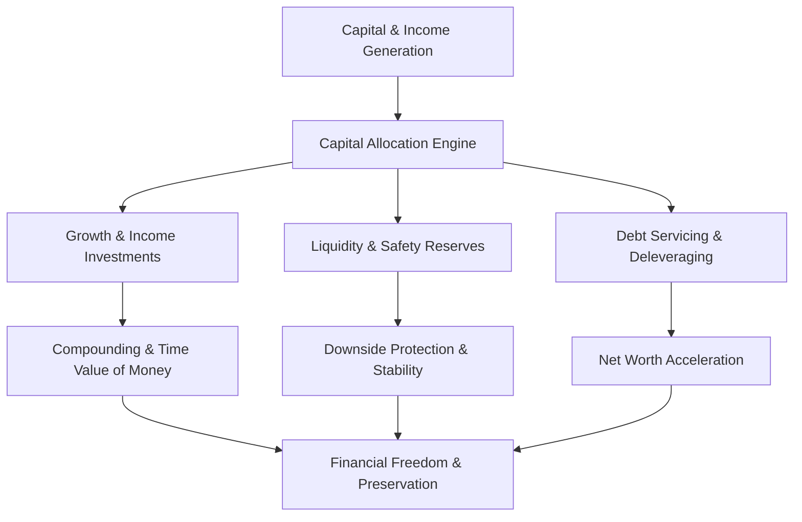
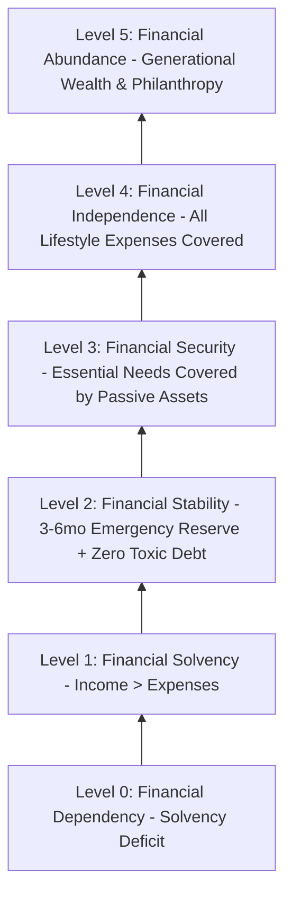
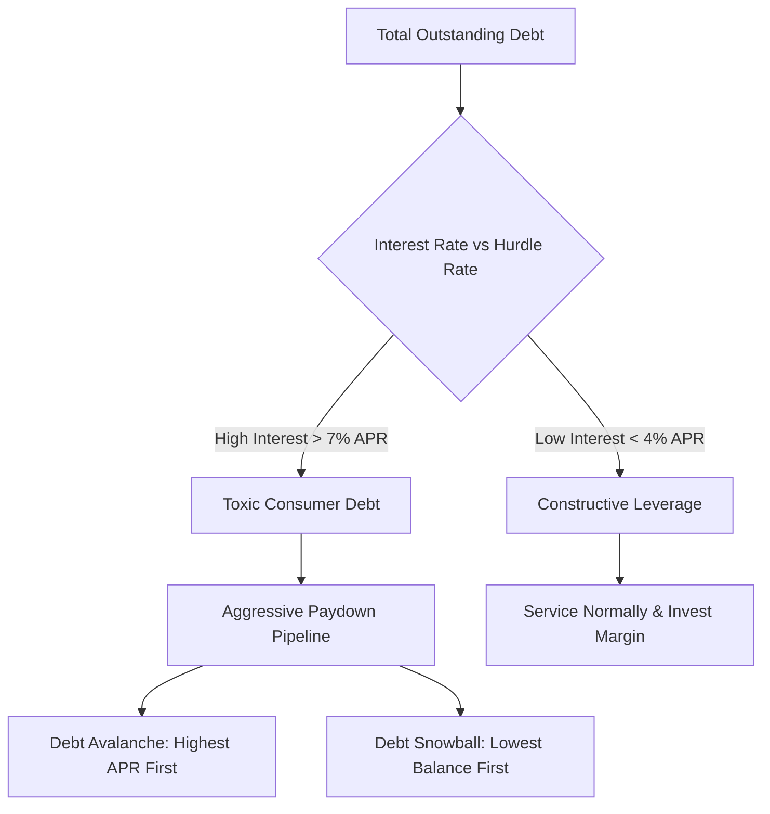
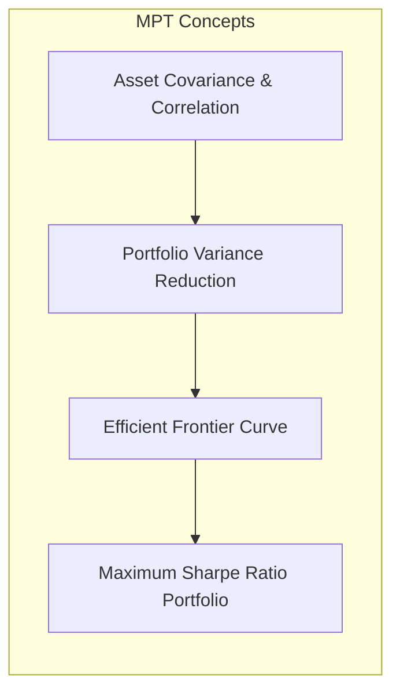
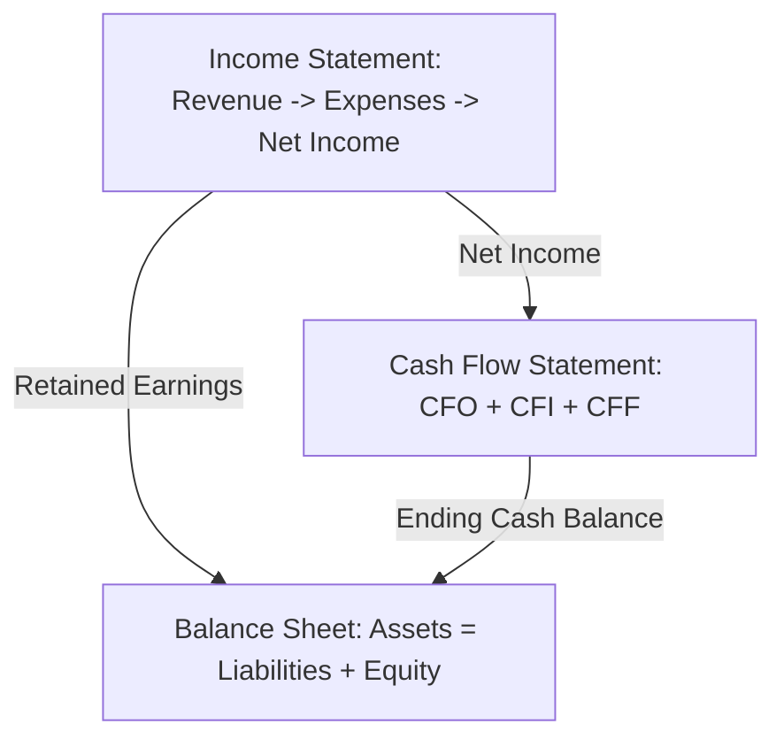
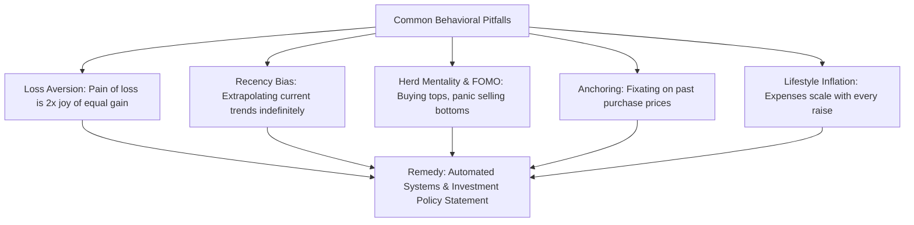
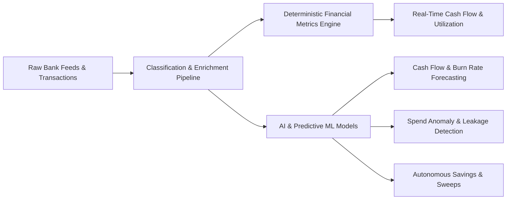

# The Comprehensive Guide to Modern Finance: Principles, Systems & Practice

> **A Master Reference on Personal Finance, Corporate Accounting, Investment Engineering, Behavioral Economics, and FinTech Systems.**

---

## Table of Contents

1. [Introduction & Foundations of Finance](#1-introduction--foundations-of-finance)
2. [The Time Value of Money (TVM) & Mathematical Mechanics](#2-the-time-value-of-money-tvm--mathematical-mechanics)
3. [Personal Financial Architecture & Wealth Lifecycle](#3-personal-financial-architecture--wealth-lifecycle)
4. [Cash Flow Engineering & Budgeting Methodologies](#4-cash-flow-engineering--budgeting-methodologies)
5. [Debt Strategy, Credit Dynamics & Leverage](#5-debt-strategy-credit-dynamics--leverage)
6. [Investment Theory, Asset Allocation & Portfolio Management](#6-investment-theory-asset-allocation--portfolio-management)
7. [Corporate Finance & Financial Statement Analysis](#7-corporate-finance--financial-statement-analysis)
8. [Tax Optimization, Retirement Modeling & Asset Preservation](#8-tax-optimization-retirement-modeling--asset-preservation)
9. [Behavioral Finance & Psychological Dynamics of Capital](#9-behavioral-finance--psychological-dynamics-of-capital)
10. [FinTech, Quantitative Analytics & AI in Modern Finance](#10-fintech-quantitative-analytics--ai-in-modern-finance)
11. [Master Financial Formulas & Metrics Cheat Sheet](#11-master-financial-formulas--metrics-cheat-sheet)

---

## 1. Introduction & Foundations of Finance

Finance is the science and art of **value creation, resource allocation, and risk management across time and under uncertainty**. At its core, finance provides a deterministic and probabilistic framework for answering four fundamental questions:

1. **Capital Acquisition**: How should capital (money, credit, equity) be raised or earned?
2. **Capital Allocation**: Where should capital be deployed to maximize utility, yield, or growth?
3. **Risk Management**: What uncertainties exist, and how can downside exposure be hedged or diversified?
4. **Liquidity Optimization**: How can cash flows be structured so that solvency is guaranteed at every time interval?



### The Three Branches of Finance

- **Personal Finance**: Managing individual and household financial resources (income, budgeting, saving, investing, tax planning, retirement, and estate planning).
- **Corporate Finance**: Managing a business organization's capital structure, working capital, funding sources, capital budgeting (CAPEX), and shareholder value creation.
- **Public / Macro Finance**: Managing state, national, and global economic mechanisms, fiscal policy, taxation, sovereign debt, central banking, and money supply dynamics.

---

## 2. The Time Value of Money (TVM) & Mathematical Mechanics

The foundational axiom of all finance is that **a dollar today is worth more than a dollar tomorrow**. This disparity is driven by three deterministic drivers:
- **Opportunity Cost**: Capital held today can be deployed into productive assets to generate return.
- **Inflation**: The steady erosion of purchasing power over time.
- **Credit / Counterparty Risk**: The probability that future promised cash flows may not materialize.

### 2.1 Future Value (FV) & Present Value (PV)

The formula for compound growth over discrete periods is:

$$FV = PV \times (1 + r)^n$$

Where:
- $PV$ = Present Value (initial capital)
- $FV$ = Future Value
- $r$ = Nominal interest rate / expected annual return per period
- $n$ = Number of compounding periods

For intra-year compounding (e.g., monthly, quarterly, daily):

$$FV = PV \times \left(1 + \frac{r}{m}\right)^{m \times t}$$

Where $m$ is the compounding frequency per year and $t$ is time in years.

#### Continuous Compounding
When compounding frequency approaches infinity:

$$FV = PV \times e^{r \times t}$$

```
Compounding Growth Visualizer ($10,000 invested at 8% CAGR):
Year  0: $10,000  [====================]
Year 10: $21,589  [===========================================]
Year 20: $46,610  [=============================================================================]
Year 30: $100,627 [====================================================================================================]
```

### 2.2 The Rule of 72

A fast heuristic to estimate how many years ($T$) it takes for an investment to double at an annual growth rate $r\%$:

$$T \approx \frac{72}{r}$$

- At **6% return**: Doubles in $\approx 12$ years.
- At **8% return**: Doubles in $\approx 9$ years.
- At **12% return**: Doubles in $\approx 6$ years.

### 2.3 Discounting and Net Present Value (NPV)

To determine whether a future cash stream is worth pursuing today, we discount all expected cash flows $CF_t$ at discount rate $r$:

$$NPV = \sum_{t=1}^{n} \frac{CF_t}{(1 + r)^t} - C_0$$

Where $C_0$ is the initial cash outlay.
- If **$NPV > 0$**: The investment generates value above the required hurdle rate.
- If **$NPV < 0$**: The investment erodes purchasing power or underperforms the hurdle rate.

### 2.4 Real vs. Nominal Rates (The Fisher Equation)

Nominal returns ignore inflation. The exact Fisher relation adjusts for the inflation rate $\pi$:

$$(1 + r_{\text{real}}) = \frac{1 + r_{\text{nominal}}}{1 + \pi}$$

Approximation: $r_{\text{real}} \approx r_{\text{nominal}} - \pi$.

---

## 3. Personal Financial Architecture & Wealth Lifecycle

Financial maturity is not an event; it is an evolutionary pipeline. Individuals advance through distinct stages of financial security:



### 3.1 The Wealth Equation

Net worth is the ultimate scorecard of cumulative financial health:

$$\text{Net Worth} = \sum \text{Assets} - \sum \text{Liabilities}$$

$$\Delta \text{Net Worth} = (\text{Income} - \text{Expenses}) + \Delta \text{Asset Market Valuation} - \text{Depreciation}$$

### 3.2 Asset Classification by Liquidity and Risk

| Asset Class | Liquidity Tier | Volatility Profile | Purpose | Typical Holdings |
| :--- | :--- | :--- | :--- | :--- |
| **Cash & Cash Equivalents** | Instant (T+0) | None / Minimal | Immediate liquidity, emergency reserve | Checking, HYSA, MMF, Treasury Bills |
| **Fixed Income** | Moderate (T+1 to T+2) | Low to Medium | Capital preservation, yield generation | Sovereign bonds, investment-grade corporate bonds |
| **Public Equities** | High (T+1) | Moderate to High | Long-term capital growth, inflation hedge | Broad-market index funds, ETFs, blue-chip stocks |
| **Real Estate** | Low (Months) | Low (Illiquidity premium) | Cash flow, tax depreciation, equity buildup | Primary residence, rental properties, REITs |
| **Alternative Assets** | Illiquid to High | High to Extreme | Asymmetric returns, uncorrelated alpha | Private equity, venture capital, commodities, crypto |

---

## 4. Cash Flow Engineering & Budgeting Methodologies

Cash flow is the lifeblood of any financial system. Without surplus cash flow, investing and wealth accumulation cannot take place.

```
       +---------------------------------------------+
       |             Gross Inflow (Income)           |
       +---------------------------------------------+
                              |
                              v
       +---------------------------------------------+
       |             Taxes (Federal/State/Local)     |
       +---------------------------------------------+
                              |
                              v
       +---------------------------------------------+
       |             Net Disposable Income           |
       +---------------------------------------------+
           /                 |                   \
          v                  v                    v
+-------------------+ +------------------+ +-------------------+
|  Essential Needs  | | Optional Wants   | | Savings & Invest  |
|  (Fixed Costs)    | | (Discretionary)  | | (Future Wealth)   |
+-------------------+ +------------------+ +-------------------+
```

### 4.1 Comparison of Proven Budgeting Frameworks

#### 1. The 50/30/20 Rule
- **50% Needs**: Housing, utilities, groceries, healthcare, mandatory minimum debt payments, transportation.
- **30% Wants**: Dining out, entertainment, vacations, luxury purchases, subscriptions.
- **20% Savings & Debt Acceleration**: Retirement contributions, emergency reserve, principal paydown on high-interest loans.

#### 2. Zero-Based Budgeting (ZBB)
- **Axiom**: $\text{Income} - \text{Allocations} = 0$.
- Every single dollar earned is deliberately assigned a specific job (expense, sinking fund, investment, or emergency allocation) before the month begins.
- Eliminates mystery spending and leakage.

#### 3. Pay Yourself First (Reverse Budgeting)
- Automatically routing savings and investment contributions directly from your paycheck into investment accounts *before* discretionary cash reaches your spending account.
- Forces spending habits to naturally adjust to the remaining disposable balance.

#### 4. The Envelope / Sub-Account System
- Partitioning funds into isolated physical or digital envelopes (e.g., Rent Envelope, Travel Sinking Fund, Car Maintenance).
- Once an envelope balance reaches zero, spending in that category ceases until the next funding cycle.

---

## 5. Debt Strategy, Credit Dynamics & Leverage

Debt is a double-edged financial instrument. When used constructively, it acts as leverage to acquire income-generating assets; when used destructively, high-interest consumer debt creates compound interest working in reverse.



### 5.1 Good Debt vs. Bad Debt

- **Constructive / Good Debt**: 
  - Low interest rates (typically fixed).
  - Backed by appreciating assets or cash-flow generation (e.g., residential mortgages, commercial real estate loans, student loans for high-ROI careers).
  - Tax-deductible interest in certain jurisdictions.
- **Destructive / Toxic Debt**:
  - High APR ($>15\%-30\%$).
  - Backed by depreciating assets or consumption (e.g., credit card revolving balances, payday loans, high-interest auto loans).
  - Rapidly erodes net worth through negative compounding.

### 5.2 Mathematical vs. Psychological Paydown Models

| Dimension | **Debt Avalanche** (Mathematical Optimum) | **Debt Snowball** (Psychological Optimum) |
| :--- | :--- | :--- |
| **Execution Order** | Rank debts from **Highest Interest Rate** to lowest. | Rank debts from **Lowest Balance** to highest. |
| **Total Interest Paid** | Lowest possible total interest cost. | Slightly higher total interest cost. |
| **Time to Debt-Free** | Mathematically fastest route. | Slightly longer, but higher adherence rate. |
| **Behavioral Impact** | Slower initial wins; requires analytical discipline. | Quick early psychological victories build momentum. |

### 5.3 Credit Score Dynamics (FICO Model Breakdown)

```
+-----------------------------------------------------------+
| FICO Score Composition:                                   |
| [35%] Payment History (On-time record, zero defaults)     |
| [30%] Credit Utilization (Credit balance / Credit limit)  |
| [15%] Length of Credit History (Average age of accounts)   |
| [10%] Credit Mix (Revolving credit, installment loans)    |
| [10%] New Credit Inquiries (Hard inquiries in last 12mo)  |
+-----------------------------------------------------------+
```

> **Target Guideline**: Maintain overall credit utilization under **10%** (and strictly under 30%) across all revolving lines to optimize underwriting tier eligibility.

---

## 6. Investment Theory, Asset Allocation & Portfolio Management

Investing is the process of committing capital today to generate cash flow and capital appreciation in the future.

### 6.1 Modern Portfolio Theory (MPT) & The Efficient Frontier

Developed by Nobel laureate Harry Markowitz, MPT demonstrates that **an asset's risk and return should not be assessed in isolation, but by how it contributes to an overall portfolio**.



- **Portfolio Variance Formula**:
  
  $$\sigma_p^2 = w_A^2 \sigma_A^2 + w_B^2 \sigma_B^2 + 2 w_A w_B \text{Cov}(A,B)$$

- Combining assets with low or negative correlation ($\rho < 1.0$) reduces total portfolio risk without sacrificing expected return. This is known as the **"only free lunch in finance"**.

### 6.2 The Capital Asset Pricing Model (CAPM) & Risk Metrics

$$\mathbb{E}(R_i) = R_f + \beta_i \left(\mathbb{E}(R_m) - R_f\right)$$

Where:
- $\mathbb{E}(R_i)$ = Expected return on asset $i$
- $R_f$ = Risk-free rate (e.g., US 10-Year Treasury Yield)
- $\beta_i$ = Asset sensitivity to market movements ($\beta = 1.0$ mirrors market volatility)
- $\mathbb{E}(R_m) - R_f$ = Equity Risk Premium (ERP)

#### Key Performance Ratios:

- **Sharpe Ratio** (Excess return per unit of total risk):
  
  $$\text{Sharpe} = \frac{R_p - R_f}{\sigma_p}$$

- **Sortino Ratio** (Excess return per unit of *downside* risk):
  
  $$\text{Sortino} = \frac{R_p - R_f}{\sigma_d}$$

- **Max Drawdown (MDD)**: The peak-to-trough drop in portfolio value before a new peak is attained.

### 6.3 Asset Allocation Archetypes

```
1. Aggressive Growth (Ages 20-35):
   [ 80%-90% Public & Private Equities | 10% Bonds / Real Estate / Crypto ]

2. Balanced Moderate (Ages 35-50):
   [ 60% Global Equities | 30% Fixed Income | 10% Real Estate / Alternatives ]

3. Capital Preservation (Ages 50+ / Retirement):
   [ 40% Equities | 50% Fixed Income / TIPS | 10% Cash Equivalents ]
```

### 6.4 Dollar-Cost Averaging (DCA) vs. Lump-Sum Investing

- **DCA**: Investing a fixed monetary amount at regular intervals regardless of asset price. Smooths out sequence-of-returns risk and mitigates emotional market timing.
- **Lump-Sum**: Statistically outperforms DCA ~66% of the time over 10+ year horizons due to the historical upward drift of equities, but incurs higher short-term psychological volatility.

---

## 7. Corporate Finance & Financial Statement Analysis

Understanding corporate finance is critical for business management, entrepreneurial ventures, and equity investing.

### 7.1 The Three Core Financial Statements



#### 1. The Income Statement (P&L)
Measures financial performance over a given accounting period:

$$\text{Revenue} - \text{Cost of Goods Sold (COGS)} = \text{Gross Profit}$$
$$\text{Gross Profit} - \text{Operating Expenses (OpEx)} = \text{Operating Income (EBIT)}$$
$$\text{EBIT} - \text{Interest} - \text{Taxes} = \text{Net Income}$$

#### 2. The Balance Sheet
A snapshot of financial position at a precise point in time:

$$\text{Assets} \equiv \text{Liabilities} + \text{Shareholders' Equity}$$

- **Current Assets**: Cash, accounts receivable, inventory (convertible within 12 months).
- **Non-Current Assets**: Property, plant, equipment (PP&E), intangible assets, goodwill.
- **Current Liabilities**: Accounts payable, short-term debt, accrued expenses.
- **Long-Term Debt**: Bonds payable, long-term lease obligations.

#### 3. The Statement of Cash Flows
Reconciles accrual accounting to physical cash movements:
- **Cash Flow from Operations (CFO)**: Core cash generated from day-to-day business operations.
- **Cash Flow from Investing (CFI)**: Capital expenditures (CAPEX), acquisitions, asset sales.
- **Cash Flow from Financing (CFF)**: Issuing/repurchasing stock, dividend payouts, debt issuances/repayments.

$$\text{Free Cash Flow (FCF)} = \text{CFO} - \text{CAPEX}$$

### 7.2 Core Financial Ratios Matrix

| Category | Ratio | Formula | Healthy Benchmark |
| :--- | :--- | :--- | :--- |
| **Liquidity** | Current Ratio | $\frac{\text{Current Assets}}{\text{Current Liabilities}}$ | $1.5 - 3.0$ |
| | Quick Ratio (Acid Test) | $\frac{\text{Cash} + \text{Marketable Securities} + \text{Receivables}}{\text{Current Liabilities}}$ | $> 1.0$ |
| **Profitability** | Gross Margin | $\frac{\text{Gross Profit}}{\text{Revenue}} \times 100$ | Industry dependent ($>40\%$ SaaS, $>20\%$ Mfg) |
| | Return on Equity (ROE) | $\frac{\text{Net Income}}{\text{Shareholders' Equity}}$ | $> 15\%$ |
| | Return on Invested Capital (ROIC) | $\frac{\text{NOPAT}}{\text{Total Invested Capital}}$ | $> \text{WACC}$ (Cost of Capital) |
| **Solvency** | Debt-to-Equity (D/E) | $\frac{\text{Total Debt}}{\text{Total Shareholders' Equity}}$ | $< 1.5$ (Low leverage) |
| | Interest Coverage Ratio | $\frac{\text{EBIT}}{\text{Interest Expense}}$ | $> 3.0\times$ |
| **Valuation** | Price-to-Earnings (P/E) | $\frac{\text{Market Price per Share}}{\text{Earnings per Share (EPS)}}$ | Historical S&P avg $\approx 15-22\times$ |
| | EV / EBITDA | $\frac{\text{Enterprise Value}}{\text{EBITDA}}$ | Normalized $\approx 8-14\times$ |

---

## 8. Tax Optimization, Retirement Modeling & Asset Preservation

Wealth retention is governed as much by tax efficiency as by gross investment yield.

```
       TAX VEHICLE COMPARISON MATRIX
+------------------+-----------------------+-----------------------+-----------------------+
| Account Type     | Contributions         | Growth                | Withdrawals           |
+------------------+-----------------------+-----------------------+-----------------------+
| Taxable Account  | Post-tax dollars      | Taxed on div/gains    | Capital gains tax     |
| Traditional IRA/ | Pre-tax (Deductible)  | Tax-Deferred          | Taxed as Ordinary Inc |
| 401(k)           |                       |                       |                       |
| Roth IRA/401(k)  | Post-tax dollars      | Tax-Free Growth       | 100% Tax-Free         |
| HSA (Health Sav) | Pre-tax dollars       | Tax-Free Growth       | Tax-Free (Qualified)  |
+------------------+-----------------------+-----------------------+-----------------------+
```

### 8.1 The Triple Tax Advantage of HSAs
1. **Tax-Deductible Contributions**: Reduces taxable gross income today.
2. **Tax-Free Investment Growth**: Interest and capital gains compound without tax drag.
3. **Tax-Free Withdrawals**: Zero tax when spent on qualified healthcare expenses (and acts like a traditional retirement account after age 65 for general expenses).

### 8.2 Safe Withdrawal Rates & The Trinity Study

The **4% Rule** provides a historical baseline for retirement portfolio longevity over a 30-year horizon:

$$\text{Target Retirement Nest Egg} = \text{Annual Retirement Expenses} \times 25$$

- For \$80,000 annual expenses: $\$80,000 \times 25 = \$2,000,000$ target portfolio.
- **Dynamic Withdrawal Strategies** (e.g., Guyton-Klinger Guardrails) adjust withdrawal rates dynamically based on market downturns, increasing safe capital longevity beyond 40+ years.

---

## 9. Behavioral Finance & Psychological Dynamics of Capital

Traditional economic theory presumes rational actors (*Homo Economicus*). Behavioral finance demonstrates that humans are systematically biased by emotional and cognitive heuristics.



### 9.1 Core Cognitive Biases in Finance

1. **Prospect Theory & Loss Aversion**: Kahneman & Tversky demonstrated that the psychological pain of losing \$1,000 is approximately twice as intense as the pleasure of gaining \$1,000. This leads investors to sell winners prematurely and hold losers indefinitely.
2. **Mental Accounting**: Treating money differently depending on its source (e.g., spending tax refunds carelessly while guarding standard salary rigidly).
3. **The Hedonic Treadmill & Lifestyle Creep**: The psychological tendency to elevate consumption expectations as earnings rise, keeping savings rates stagnant regardless of income growth.

### 9.2 The Investment Policy Statement (IPS)

An IPS is a personal constitution that governs all investment decisions during market extremes:
- Mandated target asset allocation (e.g., 70% Equities / 30% Fixed Income).
- Clear rebalancing corridors (e.g., rebalance when an asset deviates $\pm 5\%$ from target).
- Explicit rules prohibiting impulsive selling during market drawdowns.

---

## 10. FinTech, Quantitative Analytics & AI in Modern Finance

Modern finance merges software engineering, machine learning, and deterministic algorithmic models to manage liquidity and optimize returns.



### 10.1 Key Algorithmic Components in FinTech Systems

1. **Transaction Classification & Categorization**:
   - Natural Language Processing (NLP) and embedding models (e.g., TF-IDF, Transformer-based encoders) to clean merchant strings (`"SQ *COFFEE SHOP SAN FR"` $\to$ `"Dining / Coffee"`).
2. **Deterministic Financial Analytics**:
   - Real-time computing of burn rates, runway, savings velocity, and category velocity.
3. **Predictive Cash Flow Modeling**:
   - Time-series algorithms (ARIMA, Prophet, LSTM networks) forecasting upcoming balance trajectories and predicting overdraft risks before they occur.
4. **Automated Liquidity Sweeps**:
   - Rule-based execution engines automatically moving surplus cash above a predetermined checking threshold into high-yield savings or investment accounts.

---

## 11. Master Financial Formulas & Metrics Cheat Sheet

### Time Value of Money & Valuation
$$\text{Future Value (Discrete): } FV = PV(1 + r)^n$$
$$\text{Future Value (Continuous): } FV = PV \cdot e^{rt}$$
$$\text{Net Present Value: } NPV = \sum_{t=1}^{T} \frac{CF_t}{(1 + r)^t} - C_0$$
$$\text{Gordon Growth Model (Stock Valuation): } P_0 = \frac{D_1}{r - g}$$

### Portfolio & Risk Metrics
$$\text{Capital Asset Pricing Model: } \mathbb{E}(R_i) = R_f + \beta_i (\mathbb{E}(R_m) - R_f)$$
$$\text{Sharpe Ratio: } \text{Sharpe} = \frac{R_p - R_f}{\sigma_p}$$
$$\text{Beta: } \beta_i = \frac{\text{Cov}(R_i, R_m)}{\text{Var}(R_m)}$$

### Corporate Performance & Returns
$$\text{Return on Investment: } ROI = \frac{\text{Gain from Investment} - \text{Cost}}{\text{Cost}} \times 100$$
$$\text{Return on Equity: } ROE = \frac{\text{Net Income}}{\text{Shareholders' Equity}}$$
$$\text{Cash Conversion Cycle: } CCC = \text{DIO} + \text{DSO} - \text{DPO}$$

### Personal Finance Benchmarks
$$\text{Savings Rate: } \frac{\text{Monthly Savings + Investments}}{\text{Gross Income}} \times 100 \quad (\text{Target } \ge 20\%)$$
$$\text{Emergency Fund Adequacy: } \frac{\text{Liquid Cash Assets}}{\text{Monthly Essential Living Expenses}} \quad (\text{Target } 3-6 \text{ Months})$$
$$\text{Debt-to-Income (DTI) Ratio: } \frac{\text{Monthly Debt Payments}}{\text{Gross Monthly Income}} \times 100 \quad (\text{Target } \le 36\%)$$
$$\text{Retirement Freedom Number: } \text{Annual Expenses} \times 25$$

---

## Summary & Action Checklist

```
+-------------------------------------------------------------------------------+
|                      PERSONAL FINANCE ACTION CHECKLIST                        |
+-------------------------------------------------------------------------------+
| [ ] 1. Establish 1-month liquid cash buffer in checking account.              |
| [ ] 2. Eliminate all toxic, high-interest consumer debt (>7% APR).            |
| [ ] 3. Build a fully funded 3-6 month emergency reserve in a HYSA/MMF.        |
| [ ] 4. Capture full employer retirement match (100% instant ROI).             |
| [ ] 5. Maximize tax-advantaged accounts (HSA, Roth IRA, 401(k)).              |
| [ ] 6. Automate Dollar-Cost Averaged investments into diversified index funds.|
| [ ] 7. Conduct quarterly portfolio rebalancing and net worth audits.          |
+-------------------------------------------------------------------------------+
```
