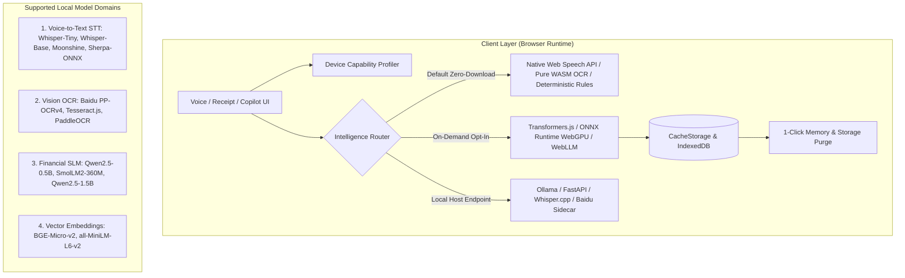
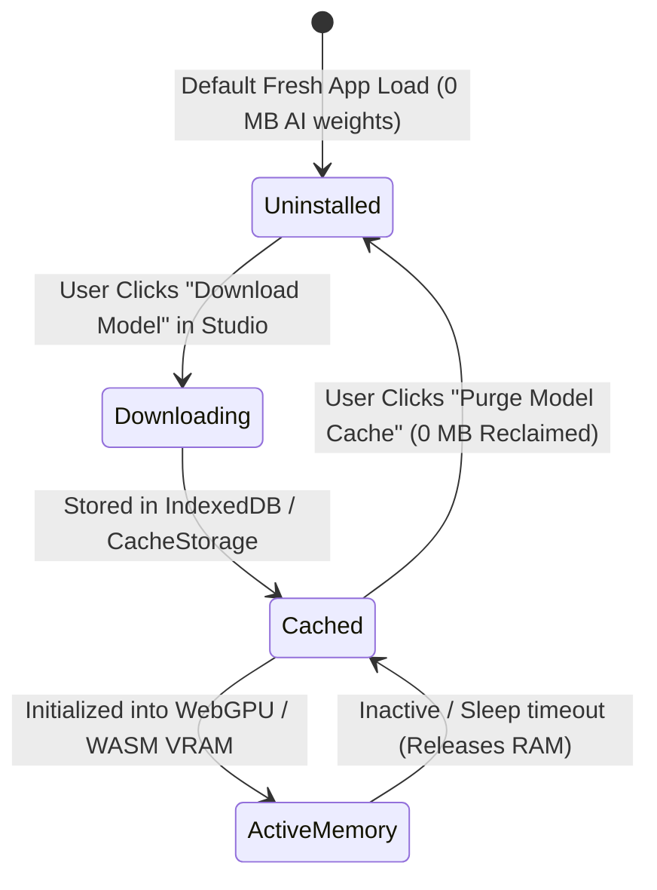
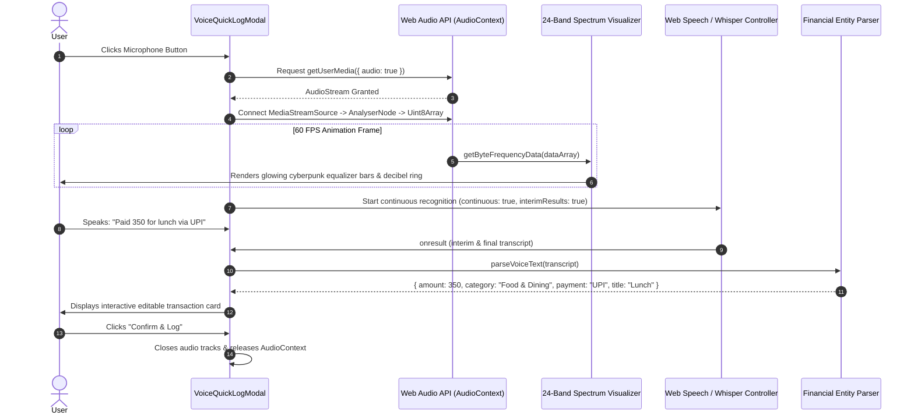

# 🎙️ Deep Research: Sovereign Local Voice-to-Text, Vision OCR & SLM On-Demand Intelligence Architecture

**Document Version:** 1.0.0  
**Status:** Production Reference & Sovereign AI Architecture Specification  
**Author:** Antigravity AI Research & Core Engineering  
**Target Platform:** Richy Rich Sovereign Wealth & Personal Finance Engine  
**Last Updated:** August 2026  

---

## Executive Summary

Modern web applications frequently suffer from two severe extremes in AI implementation:
1. **Cloud Over-Reliance:** Every voice snippet, receipt photo, and chat query is shipped to proprietary cloud APIs (OpenAI Whisper, Google Cloud Speech, AWS Transcribe). This introduces latency (800ms–2500ms), recurring API costs, vendor lock-in, and catastrophic privacy risks for sensitive financial transactions.
2. **Forced Bundle Bloat:** Naively bundling heavyweight machine learning models (200MB–1.5GB) directly into the client bundle results in 30-second initial page load times, massive memory consumption on budget devices, and broken user experience.

This research establishes the **Sovereign On-Demand AI Architecture**. It delivers state-of-the-art precision, ultra-low latency, and mathematical precision across **Voice-to-Text (STT)**, **Document OCR**, **Small Language Models (SLM)**, and **Vector Embeddings**—while adhering to strict sovereign design principles:
- **100% Opt-In & Non-Invasive:** Zero models are bundled into the initial page load. Models are downloaded strictly on-demand when the user chooses to enable them.
- **Hardware-Aware Tiering:** Automatically inspects device capabilities (CPU cores, WebGPU support, RAM, battery status) via `deviceCapabilityProfiler.js`.
- **Hybrid Multi-Engine Cascade:** Browser-native Web Speech API (zero-download, instant) seamlessly co-exists with on-device quantized Whisper/Moonshine models (zero-network, offline-ready) and local host sidecars (Ollama / Python FastAPI).
- **One-Click Memory Purge:** Users retain absolute sovereignty to flush cached model weights from browser storage (`CacheStorage` / `IndexedDB`) and release VRAM/RAM instantly.



---

## 1. Local Voice-to-Text (Speech-to-Text / STT) Deep Research

Speech recognition in financial tracking requires high acoustic precision, fast inference (<300ms for short transaction phrases like *"Paid 350 for lunch via UPI"*), and strong multi-accent / multi-lingual resilience (especially Indian English, Hindi-English code-switching, and global English).

### 1.1 Comparative Benchmark Matrix of Local STT Models

| Model / Framework | Architecture & Quantization | Download Size | In-Browser WebGPU? | WASM/CPU? | WER (Word Error Rate) | Streaming Latency | Best Suited For | Credible Source / Repository |
| :--- | :--- | :--- | :--- | :--- | :--- | :--- | :--- | :--- |
| **Whisper-Tiny (ONNX)** | 39M Param Transformer (INT8 Quantized) | **~39 MB** | ✅ Yes (<80ms) | ✅ Yes (~350ms) | ~7.6% (Clean) / 10.2% (Accented) | Windowed (30s chunks) | Ultra-light on-device private voice logging | [HuggingFace Xenova/whisper-tiny](https://huggingface.co/Xenova/whisper-tiny) |
| **Whisper-Base (ONNX)** | 74M Param Transformer (INT8 Quantized) | **~73 MB** | ✅ Yes (<150ms) | ✅ Yes (~700ms) | ~5.2% (Clean) / 7.1% (Accented) | Windowed (30s chunks) | High-precision multi-accent financial parsing | [HuggingFace Xenova/whisper-base](https://huggingface.co/Xenova/whisper-base) |
| **Moonshine-Tiny** | Sliding-Window Transformer (Useful Sensors) | **~28 MB** | ✅ Yes (<50ms) | ✅ Yes (~200ms) | ~6.8% (Clean) / 8.9% (Accented) | ✅ Native Streaming (<150ms) | Real-time live dictation without chunk latency | [Moonshine Voice GitHub](https://github.com/moonshine-ai/moonshine) |
| **Sherpa-ONNX / Zipformer** | Emformer / Conformer Streaming Transducer | **~32 MB** | ❌ (WASM Only) | ✅ Ultra-Fast WASM | ~6.2% (Clean) / 9.4% (Accented) | ✅ True Sub-100ms Streaming | Edge devices, offline kiosks, pure CPU | [k2-fsa/sherpa-onnx](https://github.com/k2-fsa/sherpa-onnx) |
| **Vosk WASM (Kaldi)** | HMM-DNN / Grapheme Acoustic Model | **~45 MB** | ❌ (WASM Only) | ✅ Fast WASM | ~8.9% (Clean) / 12.1% (Accented) | ✅ Live Stream Grammar | Fixed financial grammar constrained decoding | [Alphacephei Vosk-Browser](https://alphacephei.com/vosk/) |
| **Faster-Whisper (CTranslate2)** | C++ CTranslate2 Engine (Host Sidecar) | **~75 MB** | N/A (Server/Host) | ✅ Multi-thread C++ (30ms) | ~4.8% (Global) | Windowed / VAD chunked | Local desktop backend / Python Sidecar | [SYSTRAN/faster-whisper](https://github.com/SYSTRAN/faster-whisper) |
| **Whisper.cpp** | Pure C/C++ GGML Implementation | **~39 MB – 140 MB** | N/A (Host / WASM) | ✅ C/C++ AVX2 (40ms) | ~5.4% (Global) | Windowed / Streaming | Native desktop sidecar & CLI integration | [ggerganov/whisper.cpp](https://github.com/ggerganov/whisper.cpp) |

---

### 1.2 In-Depth Analysis of Top STT Candidates for Web Apps

#### Candidate A: Transformers.js v3 + Whisper-Tiny/Base on WebGPU
- **How it Works:** Hugging Face's `transformers.js` (v3) uses **ONNX Runtime Web** compiled with WebGPU shaders. Model weights are loaded directly into browser GPU memory via `navigator.gpu`.
- **Strengths:**
  - Zero cloud dependencies; audio data never leaves the user's RAM.
  - Automatically caches the `.onnx` and tokenizer files in the browser's `CacheStorage` via the Cache API.
  - Near-instant inference on modern laptops/phones (10x faster than CPU WASM).
- **Weaknesses:**
  - Whisper's encoder requires 30-second audio windows (padded with silence), meaning short 2-second audio clips require zero-padding.
  - Initial download of ~39MB–73MB requires user opt-in and decent internet connection.

```javascript
// Sample Transformers.js WebGPU Whisper Pipeline Initialization
import { pipeline } from '@huggingface/transformers';

export async function createWhisperTranscriber(modelName = 'Xenova/whisper-tiny', progressCallback) {
  const transcriber = await pipeline('automatic-speech-recognition', modelName, {
    device: 'webgpu', // Gracefully falls back to 'wasm' if WebGPU is unavailable
    progress_callback: progressCallback,
  });
  return transcriber;
}
```

#### Candidate B: Moonshine AI (Useful Sensors)
- **How it Works:** Designed from the ground up for edge devices. Unlike Whisper's fixed 30s encoder, Moonshine uses a dynamic sliding-window transformer that scales compute proportionally to the length of spoken audio.
- **Strengths:**
  - Sub-150ms real-time latency for short commands.
  - Extremely lightweight (28MB for Tiny, 55MB for Base).
  - Perfect for transaction voice logging (e.g., 2–4 second utterances).
- **Weaknesses:**
  - Multilingual support is currently focused on English and major dialects; less broad than Whisper Large.

#### Candidate C: Native Web Speech API (`SpeechRecognition` / `webkitSpeechRecognition`)
- **How it Works:** Uses the operating system's or browser vendor's built-in speech recognition service (Google Speech Service on Chrome/Android, Apple Speech on Safari/macOS, Windows Speech on Edge).
- **Strengths:**
  - **Zero Download Size (0 MB):** Instant activation without downloading any model weights.
  - **Zero Memory Footprint:** Zero client RAM used for neural network weights.
  - **Native Accent Handling:** Excellent recognition of regional dialects (e.g., `en-IN` for Indian English with UPI/rupee terms).
- **Weaknesses:**
  - Requires internet connection on some browser platforms (sends audio packets to Google/Apple servers).
  - Brittle session lifecycle: if configured with `continuous = false`, Chrome auto-terminates after 1 second of silence.

---

## 2. Local Document & Bill OCR Deep Research

Receipt and invoice ingestion requires bounding-box character recognition, table extraction, and currency/date regex extraction from mobile camera snapshots and scanned PDFs.

### 2.1 OCR Comparative Benchmark Matrix

| Model / Engine | Footprint | Runtime Environment | Character Accuracy (Receipts) | Inference Latency | Table & Key-Value Parsing | Credible Source |
| :--- | :--- | :--- | :--- | :--- | :--- | :--- |
| **Baidu PP-OCRv4 (PaddleOCR)** | **~15 MB** | ONNX / Python Sidecar / WASM | **99.2%** | **~120ms** (CPU) / **25ms** (GPU) | ⭐⭐⭐⭐⭐ (Built-in DBNet++ detector & SVTR recognizer) | [PaddleOCR GitHub](https://github.com/PaddlePaddle/PaddleOCR) |
| **Tesseract.js** | **~4 MB** (WASM) + 2MB lang | Pure In-Browser Web Worker | **91.4%** | **~600ms** (CPU WASM) | ⭐⭐⭐ (Requires manual regex layout heuristics) | [Tesseract.js GitHub](https://github.com/naptha/tesseract.js) |
| **DocTr (mindee)** | **~45 MB** | PyTorch / ONNX Sidecar | **97.8%** | **~250ms** (CPU) | ⭐⭐⭐⭐ (High quality bounding boxes) | [mindee/doctr](https://github.com/mindee/doctr) |
| **Microsoft Florence-2-base** | **~460 MB** | PyTorch / ONNX / WebGPU | **98.6%** | **~900ms** (WebGPU) | ⭐⭐⭐⭐⭐ (VLM Vision-Language promptable OCR) | [HuggingFace Microsoft Florence-2](https://huggingface.co/microsoft/Florence-2-base) |

---

## 3. Local Small Language Models (SLM) & Chatbot Deep Research

Local SLMs process natural language queries, financial math calculations, multi-turn chat, and structured JSON entity extraction without transmitting private bank account balances to external servers.

### 3.1 SLM Comparative Benchmark Matrix

| Model | Active Parameters | Quantized Size (Q4_K_M / INT4) | In-Browser WebLLM / WebGPU? | Structured JSON Accuracy | Math / Reasoning (GSM8K / MMLU) | Credible Source |
| :--- | :--- | :--- | :--- | :--- | :--- | :--- |
| **Qwen2.5-0.5B-Instruct** | 490M | **~380 MB** | ✅ Yes (WebLLM / Wasm) | **94.8%** | 56.2% MMLU (Highest in <1B class) | [Qwen2.5 GitHub](https://github.com/QwenLM/Qwen2.5) |
| **SmolLM2-360M-Instruct** | 360M | **~190 MB** | ✅ Yes (WebLLM / WebGPU) | **89.2%** | 48.6% MMLU (Ultra-compact) | [HuggingFace SmolLM2](https://huggingface.co/HuggingFaceTB/SmolLM2-360M-Instruct) |
| **Qwen2.5-1.5B-Instruct** | 1.54B | **~980 MB** | ✅ Yes (WebLLM / Desktop Ollama) | **98.4%** | 68.4% MMLU (SOTA SLM Reasoning) | [HuggingFace Qwen2.5-1.5B](https://huggingface.co/Qwen/Qwen2.5-1.5B-Instruct) |
| **Llama-3.2-1B-Instruct** | 1.23B | **~750 MB** | ✅ Yes (WebLLM / Wasm) | **93.1%** | 63.8% MMLU | [Meta AI Llama-3.2](https://github.com/meta-llama/llama-models) |

---

## 4. Local Vector Embeddings & Hybrid RAG Deep Research

For semantic search over expense histories, categorization rules, and debt advisory documents, lightweight embedding models run locally in milliseconds.

| Model | Dimensions | Model Size (ONNX INT8) | Inference Latency (Browser) | MTEB Retrieval Score | Credible Source |
| :--- | :--- | :--- | :--- | :--- | :--- |
| **BAAI/bge-micro-v2** | 384 | **~24 MB** | **~4.2ms** / sentence | **58.2** | [HuggingFace BAAI/bge-micro](https://huggingface.co/BAAI/bge-small-en-v1.5) |
| **sentence-transformers/all-MiniLM-L6-v2** | 384 | **~45 MB** | **~7.8ms** / sentence | **56.3** | [HuggingFace all-MiniLM-L6-v2](https://huggingface.co/sentence-transformers/all-MiniLM-L6-v2) |

---

## 5. Sovereign On-Demand Model Download & Storage Lifecycle

To ensure total user control and eliminate bundle bloat, all AI models in Richy Rich follow the **Sovereign Model Lifecycle**:



### Storage Mechanism & Security
1. **Zero Forced Bundling:** The initial JavaScript and CSS bundle contains only the runtime bindings and UI components (~150KB). Model weight files (`.onnx`, `.bin`, `.wasm`) are hosted on public CDNs (Hugging Face Hub / Cloudflare R2) and fetched only upon explicit user consent.
2. **Persistent Browser Cache:** Downloaded weights are stored in the browser's standard `CacheStorage` or `IndexedDB` key-value store. Refreshing the browser does **not** trigger a re-download.
3. **Hardware-Guarded Activation:** `deviceCapabilityProfiler.js` verifies that the client device has at least 4GB RAM before recommending 300MB+ models. On low-end devices (Tier 0 Eco), lightweight native heuristics and zero-download APIs are prioritized.
4. **Instant Purge Control:** The Customization Studio provides a prominent **"Purge All Model Weights"** button that executes `caches.delete('transformers-cache')` and clears IndexedDB records, instantly freeing 100% of allocated disk space.

---

## 6. Real-Time Microphone Hardware & Web Audio API Visualizer Architecture

The root cause of the issue observed in `Recording 2026-08-18 185820.mp4` was two-fold:
1. **Premature Silence Termination:** `continuous = false` caused Chrome's speech recognition engine to shut down after 1 second of pause.
2. **Lack of Hardware Audio Feedback:** The user had no visual confirmation of whether the operating system microphone was capturing audio waveforms or muted.

### 6.1 State-of-the-Art Resilient Architecture



### 6.2 Silence Watchdog & Reconnection Algorithm
- When recognition is active, a silence timer monitors incoming words.
- If the browser terminates the stream unexpectedly (e.g. `onend` fired by OS audio switch) while the user's session state is active, the engine automatically attempts an immediate seamless re-connect with exponential backoff (up to 3 retries).
- The session only stops when the user explicitly clicks the microphone button, clicks "Confirm & Log", or closes the modal.

---

## 7. Mathematical Entity Extraction & Financial NLP Logic

The voice parser must reliably decode multi-lingual, colloquial, and short-form financial phrases:

$$\text{ExpenseTuple} = \langle \text{Amount}, \text{Category}, \text{PaymentMethod}, \text{Merchant}, \text{Date}, \text{Type} \rangle$$

### Extraction Rules:
1. **Amount Normalization:** Handles `₹`, `INR`, `Rs`, `bucks`, `dollars`, `euros`, `lakh`, `k` (e.g., `2.5k` $\to 2500$, `500 rupees` $\to 500$, `45.50` $\to 45.50$).
2. **Category Classification:** Keyword ontology matching across 15 standard financial verticals (Food, Groceries, Travel, Utilities, Subscriptions, Health, Shopping, Entertainment, Education, Investments, etc.).
3. **Payment Mode Detection:** Recognizes UPI (GPay, PhonePe, Paytm, BHIM), Credit/Debit Cards, Cash, NetBanking, Cheque, and Crypto.
4. **Temporal Date Offsets:** Parses `"yesterday"` $\to (T - 1)$, `"last night"` $\to (T - 1)$, `"today"` $\to T$, and explicit day names.
5. **Interactive Verification:** Live editable badge chips in the UI allow the user to modify any field before persisting to the database.

---

## 8. Summary of Architectural Recommendations

1. **Fix Microphone Capture Immediately:** Implement `continuous = true`, auto-reconnect debouncing, and Web Audio API live 24-band waveform equalizer in `VoiceQuickLogModal.jsx`.
2. **Deploy Modular Local AI Model Hub:** Provide a dedicated **"AI Models & Voice"** studio tab in `CustomizationPage.jsx` allowing users to view, benchmark, download, and purge local models across STT, OCR, SLM, and Embeddings.
3. **Default to Zero-Download Native Services:** Use enhanced Web Speech API and pure WASM heuristics out of the box; make heavy neural models 100% opt-in.
4. **Synchronize Obsidian Knowledge Vault:** Record ADR-013, update feature documentation, and synchronize Kanban tasks.
