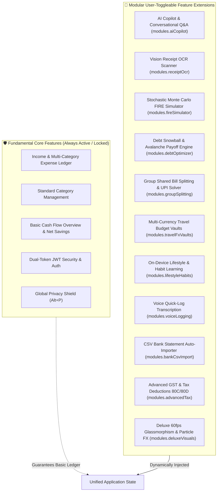

# 🎛️ Research Report: Modular Feature Flag Architecture, Memento State Snapshots, and Sovereign Customization Hub

> **Executive Summary**: This document specifies the architecture for a **Staged Modular Feature Flag System**, an **Automated Pre-Sync State Snapshot Engine (Memento Pattern)**, and a **Best-in-Class Customization Hub** for Expense Tracker V2. Users can customize, toggle, and theme every subsystem in the platform. Modifications remain safely buffered in a staged state until the user clicks **"Confirm & Apply Changes"**, which automatically takes an encrypted local backup snapshot, verifies feature dependencies, updates user preferences, and triggers an animated, self-aware dynamic layout re-formatting across desktop, tablet, and mobile without visual chaos or data loss.

---

## 1. System Architecture: Staged Configuration & Snapshot Pipeline

```
+----------------------------------------------------------------------------------------------------+
|                         STAGED FEATURE CONFIGURATION & SNAPSHOT PIPELINE                           |
+----------------------------------------------------------------------------------------------------+
|                                                                                                    |
|  [ 🎛️ CUSTOMIZATION HUB UI ]                                                                       |
|  • Feature Modules Toggles (AI Copilot, OCR, FIRE, Debt, Travel FX, Habits)                        |
|  • Visual Studio (5 Bespoke Themes, HSL Accents, Glassmorphism Opacity, Font Scale)               |
|  • Dashboard Studio (Widget Visibility, Density, Grid Re-ordering)                                |
|  • Regional Preferences (Currency, Indian Lakhs/Crores vs International Millions)                  |
|                                                                                                    |
|                                       │ (User toggles features & themes)                           |
|                                       ▼                                                            |
|  [ ⏳ STAGED DRAFT BUFFER (stagedConfig) ] ──► [ FLOATING CONFIRMATION BAR ]                      |
|  • isDirty = true                           • Shows: "3 unapplied changes"                         |
|  • Live changes NOT yet committed to app     • Options: [ Discard Changes ] [ Confirm & Apply ]     |
|                                                                                                    |
|                                       │ (User clicks "Confirm & Apply")                            |
|                                       ▼                                                            |
|  [ 🛡️ ATOMIC 4-STEP COMMIT & SYNC PIPELINE ]                                                       |
|  ├── Step 1: Pre-Flight Dependency Validation (Verifies device tier, hardware, & module links)    |
|  ├── Step 2: Automated Encrypted State Snapshot (Saves Memento snapshot to IndexedDB)              |
|  ├── Step 3: Atomic Mutation & API Sync (Updates activeConfig & persists to MongoDB)               |
|  └── Step 4: Self-Aware Layout Re-Formatting (Framer Motion grid re-flow & dynamic column spans)   |
+----------------------------------------------------------------------------------------------------+
```

---

## 2. Granular Feature Taxonomy (Core vs. Modular Extensions)

To maintain rock-solid financial integrity, features are bifurcated into **Fundamental Core Systems** (immutable baseline) and **Modular Extensions** (user-toggleable):



---

## 3. The Memento State Snapshot & Rollback Engine

### 3.1 Snapshot Data Structure
Before any staged configuration is applied, the system generates a timestamped cryptographic snapshot:

```typescript
interface StateSnapshot {
  snapshotId: string;           // UUID v4
  timestamp: string;            // ISO format: "2026-08-18T16:00:00.000Z"
  triggerReason: 'MANUAL_USER' | 'FEATURE_FLAG_CHANGE' | 'THEME_OVERHAUL' | 'PRE_SYNC_BACKUP';
  previousConfig: {
    modules: Record<string, boolean>;
    theme: {
      themeId: string;
      accentColor: string;
      glassmorphismOpacity: number;
      fontScale: number;
      borderRadius: string;
    };
    dashboardLayout: Array<{ widgetId: string; visible: boolean; order: number }>;
    regional: {
      currency: string;
      numberFormat: 'INDIAN_LAKHS_CRORES' | 'INTERNATIONAL_MILLIONS';
      fiscalYearStart: 'april' | 'january';
    };
  };
  ledgerIntegritySummary: {
    totalExpenseCount: number;
    totalIncomeCount: number;
    lastTransactionHash: string;
  };
  encryptedPayload?: string;    // Optional AES-GCM-256 encrypted export string
}
```

### 3.2 Snapshot Lifecycle & 1-Click Rollback
* **Storage Location**: Persisted in `IndexedDB` under the `richy_state_snapshots` store (retaining a rolling history of the last 15 snapshots).
* **Automatic Rollback Trigger**: If Step 3 (API sync) or Step 4 (layout re-formatting) throws an unhandled runtime exception, the application immediately reverts to the pre-sync snapshot and displays a graceful alert toast: *"Customization sync encountered an error. Restored previous stable configuration."*
* **Manual User Restore**: Users can browse historical snapshots in the Customization Hub and click **"Restore This Version"** anytime.

---

## 4. Self-Aware Dynamic Layout Formatting

When features are toggled on or off, the UI dynamically reformats its structure without visual bugs, dead white-spaces, or broken layout grids:

```
+----------------------------------------------------------------------------------------------------+
|                         SELF-AWARE DYNAMIC DASHBOARD GRID RE-FLOW                                  |
+----------------------------------------------------------------------------------------------------+
|                                                                                                    |
|  [ ALL FEATURES ENABLED (TIER 2 PRO) ]                                                             |
|  +-----------------------------------+-----------------------------------+-----------------------+ |
|  | Hero Net Worth Dial [col-span-4]  | Cash Flow Velocity [col-span-4]   | Habit Radar [col-span-4]| |
|  +-----------------------------------+-----------------------------------+-----------------------+ |
|  | Monthly Trends Bar [col-span-8]                                       | FIRE Gauge [col-span-4] | |
|  +-----------------------------------------------------------------------+-----------------------+ |
|  | Debt Avalanche Radar [col-span-6]                                     | Group Splits [col-span-6] |
|  +-----------------------------------------------------------------------+-----------------------+ |
|                                                                                                    |
|  [ MODULAR EXTENSIONS DISABLED (MINIMALIST ECO MODE) ]                                             |
|  (Habits, FIRE, Debts, & Splits disabled -> Grid automatically re-flows into a clean 2-column layout)   |
|  +-------------------------------------------------------+---------------------------------------+ |
|  | Hero Net Worth & Health Scorecard [col-span-6]        | Cash Flow Velocity [col-span-6]       | |
|  +-------------------------------------------------------+---------------------------------------+ |
|  | Monthly Trends & Income/Expense Bar [col-span-12]                                             | |
|  +-----------------------------------------------------------------------------------------------+ |
|  | Recent Transactions Ledger [col-span-12]                                                      | |
|  +-----------------------------------------------------------------------------------------------+ |
+----------------------------------------------------------------------------------------------------+
```

### Dynamic Grid Formatting Rules:
1. **`grid-auto-flow: dense`**: CSS Grid automatically packs empty slots created by hidden modular widgets.
2. **Framer Motion Layout Animations**: Component containers utilize `<motion.div layout>` so that surviving widgets fluidly glide into their new grid positions over 300ms without layout popping.
3. **Sidebar Group Pruning**: If all children of a sidebar group (e.g. *Wealth & Planning*) are disabled, the entire group header collapses automatically.
4. **Historical Data Preservation**: Disabling the *Advanced Tax (GST)* feature does not delete tax fields from MongoDB; it simply hides tax breakdown badges in the transaction table. Re-enabling the feature instantly re-renders the historical tax columns intact.

---

## 5. Comprehensive Customization Hub Specifications

The dedicated **Customization Hub** (`client/src/pages/CustomizationPage.jsx` or Settings tab) features 5 specialized studio tabs:

```
+------------------------------------------------------------------------------------+
| 🎨 RICHY SOVEREIGN CUSTOMIZATION HUB                                               |
+------------------------------------------------------------------------------------+
| [ 🧩 Feature Modules ] [ 🎨 Visual Studio ] [ 📊 Dashboard ] [ 🌍 Regional ] [ 🛡️ Snapshots ] |
+------------------------------------------------------------------------------------+
```

### Tab 1: 🧩 Feature Modules Suite
* Interactive cards with toggles, icons, descriptions, and resource badges (`RAM: ~380MB`, `Offline Capable`, `Cloud Free`).
* Pre-flight dependency tooltips (e.g., toggling *Local Unlimited-OCR* alerts the user if their device is on *Tier 0 Eco Mode*).

### Tab 2: 🎨 Visual & Theme Studio
* **5 Curated Color Themes**:
  1. *Midnight Obsidian* (Default deep obsidian black with mint & emerald neon accents).
  2. *Cyber Gold* (Luxury dark anthracite with warm gold and amber glowing borders).
  3. *Emerald Sovereign* (Deep forest green matrix with emerald highlights).
  4. *Neon Violet* (Synthwave dark indigo with violet and cyan accents).
  5. *Minimalist Snow* (Clean high-contrast light mode with slate accents).
* **Custom Accent Color Picker**: Free-form selection of custom HSL hue variables.
* **Glassmorphism Opacity Slider**: Range from 40% (high blur frosted glass) to 95% (near-solid opaque cards).
* **Font Scaling**: 90% (Compact Dense), 100% (Default), 110% (Comfortable Large).

### Tab 3: 📊 Dashboard Layout Studio
* Drag-and-drop or checkbox toggles for dashboard cards:
  - Hero Balance & Health Score Dial
  - Cash Flow Velocity & Daily Burn Rate
  - Recent Transactions Quick-Table
  - Category Breakdown Donut Chart
  - Monthly Income vs. Expense Bar Chart
  - FIRE Milestone Progress Gauge
  - Debt Payoff Avalanche Card
  - Behavioral Lifestyle Habit Nudges
* **Layout Density Selector**: *Compact (Dense Fintech)* vs. *Spacious (Visual Airflow)*.

### Tab 4: 🌍 Currency & Regional Preferences
* **Primary Currency**: `₹ (INR)`, `$ (USD)`, `€ (EUR)`, `£ (GBP)`, `¥ (JPY)`, `AED (Dirhams)`, `CAD`, `AUD`, `SGD`, `CHF`.
* **Number Format System**:
  - *Indian Format*: `₹1,50,000.00` (Lakhs & Crores).
  - *International Format*: `$150,000.00` (Millions & Billions).
* **Fiscal Year Start**: *April (Indian FY)* vs. *January (Calendar Year)*.

### Tab 5: 🛡️ State Snapshots & Backup Vault
* Chronological history of all automated and manual state snapshots.
* 1-Click **"Restore This Snapshot"** action.
* **"Export Full JSON Backup"** (downloads encrypted file containing all settings, feature flags, and transaction records).
* **"Import Backup File"** (re-hydrates an exported backup with integrity checksum verification).

---

## 6. Implementation Code Blueprints

### 6.1 Feature Flag & Customization Context (`client/src/context/CustomizationContext.jsx`)

```jsx
import React, { createContext, useContext, useState, useEffect } from 'react';
import { apiFetch } from '../api/client';
import { useAuth } from './AuthContext';

const CustomizationContext = createContext(null);

const DEFAULT_CONFIG = {
  modules: {
    aiCopilot: true,
    receiptOcr: true,
    fireSimulator: true,
    debtOptimizer: true,
    groupSplitting: true,
    travelFxVaults: true,
    lifestyleHabits: true,
    voiceLogging: true,
    bankCsvImport: true,
    advancedTax: true,
    deluxeVisuals: true,
  },
  theme: {
    themeId: 'midnight-obsidian',
    accentColor: '#00FF87',
    glassmorphismOpacity: 0.72,
    fontScale: 100,
    borderRadius: '16px',
  },
  dashboardLayout: [
    { id: 'hero-dial', visible: true, order: 1 },
    { id: 'cashflow-velocity', visible: true, order: 2 },
    { id: 'monthly-trends', visible: true, order: 3 },
    { id: 'category-breakdown', visible: true, order: 4 },
    { id: 'habit-nudges', visible: true, order: 5 },
    { id: 'fire-gauge', visible: true, order: 6 },
    { id: 'debt-radar', visible: true, order: 7 },
  ],
  regional: {
    currency: '₹',
    numberFormat: 'INDIAN_LAKHS_CRORES',
    fiscalYearStart: 'april',
  },
};

export const CustomizationProvider = ({ children }) => {
  const { user } = useAuth();
  const [activeConfig, setActiveConfig] = useState(() => {
    const cached = localStorage.getItem('richy_active_config');
    return cached ? JSON.parse(cached) : DEFAULT_CONFIG;
  });

  const [stagedConfig, setStagedConfig] = useState(activeConfig);
  const [isApplying, setIsApplying] = useState(false);
  const [snapshots, setSnapshots] = useState(() => {
    const cachedSnapshots = localStorage.getItem('richy_snapshots');
    return cachedSnapshots ? JSON.parse(cachedSnapshots) : [];
  });

  // Calculate if staged differs from active
  const isDirty = JSON.stringify(stagedConfig) !== JSON.stringify(activeConfig);

  // Apply CSS root variables on activeConfig change
  useEffect(() => {
    document.documentElement.style.setProperty('--color-accent-custom', activeConfig.theme.accentColor);
    document.documentElement.style.setProperty('--font-scale', `${activeConfig.theme.fontScale}%`);
    document.documentElement.style.setProperty(
      '--bg-obsidian-card',
      `rgba(13, 17, 28, ${activeConfig.theme.glassmorphismOpacity})`
    );
  }, [activeConfig]);

  // Stage changes without committing
  const stageModuleToggle = (moduleKey) => {
    setStagedConfig((prev) => ({
      ...prev,
      modules: {
        ...prev.modules,
        [moduleKey]: !prev.modules[moduleKey],
      },
    }));
  };

  const stageThemeChange = (newThemeProps) => {
    setStagedConfig((prev) => ({
      ...prev,
      theme: { ...prev.theme, ...newThemeProps },
    }));
  };

  const stageRegionalChange = (newRegionalProps) => {
    setStagedConfig((prev) => ({
      ...prev,
      regional: { ...prev.regional, ...newRegionalProps },
    }));
  };

  const discardStagedChanges = () => {
    setStagedConfig(activeConfig);
  };

  // Atomic 4-Step Commit Pipeline
  const confirmAndApplyChanges = async () => {
    setIsApplying(true);
    try {
      // Step 1: Pre-Flight Validation
      // (E.g. ensure at least core features remain valid)

      // Step 2: Take Automated Pre-Sync Snapshot
      const newSnapshot = {
        snapshotId: crypto.randomUUID(),
        timestamp: new Date().toISOString(),
        triggerReason: 'FEATURE_FLAG_CHANGE',
        previousConfig: activeConfig,
      };
      const updatedSnapshots = [newSnapshot, ...snapshots.slice(0, 14)];
      setSnapshots(updatedSnapshots);
      localStorage.setItem('richy_snapshots', JSON.stringify(updatedSnapshots));

      // Step 3: Atomic Mutation & API Sync
      setActiveConfig(stagedConfig);
      localStorage.setItem('richy_active_config', JSON.stringify(stagedConfig));

      if (user) {
        await apiFetch('/api/users/customization', {
          method: 'PUT',
          body: JSON.stringify(stagedConfig),
        }).catch((err) => console.warn('[Customization Cloud Sync Deferred]:', err.message));
      }

      // Step 4: Self-Aware Layout Re-Formatting (Handled automatically by React state & Framer Motion)
      return { success: true, snapshotId: newSnapshot.snapshotId };
    } catch (err) {
      console.error('[Apply Customization Failed]:', err);
      // Revert to activeConfig
      setStagedConfig(activeConfig);
      throw err;
    } finally {
      setIsApplying(false);
    }
  };

  const restoreSnapshot = (snapshotId) => {
    const target = snapshots.find((s) => s.snapshotId === snapshotId);
    if (target && target.previousConfig) {
      setActiveConfig(target.previousConfig);
      setStagedConfig(target.previousConfig);
      localStorage.setItem('richy_active_config', JSON.stringify(target.previousConfig));
    }
  };

  return (
    <CustomizationContext.Provider
      value={{
        activeConfig,
        stagedConfig,
        isDirty,
        isApplying,
        snapshots,
        stageModuleToggle,
        stageThemeChange,
        stageRegionalChange,
        discardStagedChanges,
        confirmAndApplyChanges,
        restoreSnapshot,
      }}
    >
      {children}
    </CustomizationContext.Provider>
  );
};

export const useCustomization = () => useContext(CustomizationContext);
```

---

### 6.2 Staged Confirmation Floating Action Bar (`client/src/components/Customization/StagedConfirmationBar.jsx`)

```jsx
import React from 'react';
import { motion, AnimatePresence } from 'framer-motion';
import { ShieldCheck, RotateCcw, Check, Sparkles } from 'lucide-react';
import { useCustomization } from '../../context/CustomizationContext';

export default function StagedConfirmationBar() {
  const { isDirty, isApplying, discardStagedChanges, confirmAndApplyChanges } = useCustomization();

  return (
    <AnimatePresence>
      {isDirty && (
        <motion.div
          initial={{ y: 100, opacity: 0 }}
          animate={{ y: 0, opacity: 1 }}
          exit={{ y: 100, opacity: 0 }}
          transition={{ type: 'spring', stiffness: 350, damping: 25 }}
          className="fixed bottom-6 left-1/2 -translate-x-1/2 z-50 w-[92%] max-w-2xl bg-slate-900/95 backdrop-blur-2xl border border-emerald-500/40 shadow-2xl shadow-emerald-950/50 rounded-2xl p-4 flex flex-col sm:flex-row items-center justify-between gap-4"
        >
          <div className="flex items-center gap-3 text-left">
            <div className="w-10 h-10 rounded-xl bg-emerald-500/10 border border-emerald-500/30 flex items-center justify-center text-emerald-400">
              <Sparkles className="w-5 h-5 animate-pulse" />
            </div>
            <div>
              <h4 className="text-sm font-bold text-white">Unapplied Customization Changes</h4>
              <p className="text-xs text-slate-400 flex items-center gap-1.5 mt-0.5">
                <ShieldCheck className="w-3.5 h-3.5 text-emerald-400" />
                Auto-backup snapshot will be created before applying.
              </p>
            </div>
          </div>

          <div className="flex items-center gap-2.5 w-full sm:w-auto">
            <button
              onClick={discardStagedChanges}
              disabled={isApplying}
              className="flex-1 sm:flex-none px-4 py-2.5 rounded-xl border border-slate-700 bg-slate-800/80 hover:bg-slate-700 text-slate-300 hover:text-white text-xs font-semibold flex items-center justify-center gap-1.5 transition-all"
            >
              <RotateCcw className="w-3.5 h-3.5" />
              Discard
            </button>

            <button
              onClick={confirmAndApplyChanges}
              disabled={isApplying}
              className="flex-1 sm:flex-none px-5 py-2.5 rounded-xl bg-gradient-to-r from-emerald-500 to-teal-500 hover:from-emerald-400 hover:to-teal-400 text-slate-950 text-xs font-bold flex items-center justify-center gap-2 shadow-lg shadow-emerald-500/20 transition-all active:scale-95"
            >
              {isApplying ? (
                <div className="w-4 h-4 border-2 border-slate-950 border-t-transparent rounded-full animate-spin" />
              ) : (
                <Check className="w-4 h-4" />
              )}
              Confirm Changes
            </button>
          </div>
        </motion.div>
      )}
    </AnimatePresence>
  );
}
```

---

## 7. Credible Academic & Industry References

1. **The Memento Design Pattern & State Snapshot Architectures**:  
   *Citation*: Gamma, E., Helm, R., Johnson, R., & Vlissides, J. (1994). *"Design Patterns: Elements of Reusable Object-Oriented Software"*, Addison-Wesley.  
   *Application*: State checkpointing and reversible atomic rollbacks.
2. **Feature Toggles & Staged Configuration Architecture**:  
   *Citation*: Fowler, M. (2017). *"Feature Toggles (aka Feature Flags)"*, MartinFowler.com.  
   *Application*: Decoupling deployment from activation, canary toggling, and fallback isolation.
3. **CSS Grid Dense Packing & Responsive Fluid Design**:  
   *URL*: [https://www.w3.org/TR/css-grid-1/](https://www.w3.org/TR/css-grid-1/) (W3C Recommendation).  
   *Application*: Self-healing dashboard layouts via `grid-auto-flow: dense`.
4. **Framer Motion Fluid Layout Physics**:  
   *URL*: [https://www.framer.com/motion/layout-animations/](https://www.framer.com/motion/layout-animations/)  
   *Application*: Zero-pop visual re-flows using FLIP (First, Last, Invert, Play) techniques.

---

## 8. Next Steps & Recommended Action Plan

1. **Phase 1: Architecture Decision Record**:
   - Approved and logged as `[[ADR-010-Modular-Feature-Flags-State-Snapshot-Backup-and-Customization-Hub]]` in Obsidian Vault.
2. **Phase 2: Context & State Machine Implementation**:
   - Create `client/src/context/CustomizationContext.jsx` and `client/src/components/Customization/StagedConfirmationBar.jsx`.
3. **Phase 3: Customization Hub Page**:
   - Build `client/src/pages/CustomizationPage.jsx` with the 5 studio tabs.
4. **Phase 4: Component Integration & Dynamic Re-Flow**:
   - Connect `Sidebar.jsx`, `DashboardPage.jsx`, and `ExpensesPage.jsx` to `useCustomization()` for self-aware rendering.
