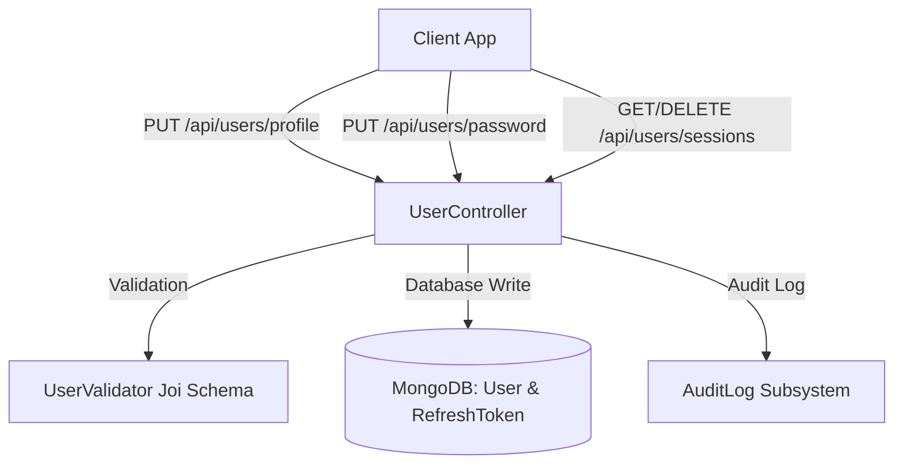

# Profile Page & Sovereign Account Hub — Master Implementation Plan

**Project**: Richy Rich — AI-First Sovereign Personal Finance Intelligence Platform  
**Target Milestone**: `v3.1.0` (Enterprise Profile & Account Subsystem)  
**Author**: Antigravity AI  
**Design Inspiration**: Apple ID × Stripe Dashboard × Linear Settings × Revolut Ultra  

---

## 1. Executive Summary & Goals

The goal of this initiative is to develop an enterprise-grade **Profile & Sovereign Account Hub** for the Richy Rich personal finance platform. The profile page serves as the command center where users can:
- Manage their **Personal Identity & Sovereign Persona** (Name, Email, Phone, UPI ID for group splits, Avatar customization, Job Title/Occupation).
- Configure **Financial Baselines & Platform Defaults** (Preferred Currency, Monthly Baseline Income, Target Savings Rate, Tax Regime, Default Payment Method, FIRE parameters).
- Set **Regional & Localization Formats** (Locale for Lakhs/Crores vs Millions, Timezone, Date Format, Fiscal Year).
- Manage **Security, Multi-Device Sessions & Credentials** (Change Password with real-time entropy meter, Active Refresh Token / Session monitoring and instant revocation, 2FA readiness).
- Fine-tune **Alerts & Intelligence Preferences** (Overspending triggers, Outlier anomalies, Subscription renewal reminders, Weekly AI wealth digest).
- Exercise **Sovereign Data Governance** (Default Privacy Shield startup mode, One-Click Full Data Export in JSON/CSV, Account reset & Danger Zone).

All interactions are styled according to the platform's **Playful Wealth & Gamified Luxury** design language (`var(--bg-obsidian)`, glassmorphic cards, Framer Motion transitions, ambient mesh glows, and a live interactive 3D-tilt Sovereign Member Metal Card).

---

## 2. Exhaustive Data & Feature Requirements Analysis

An in-depth review of existing platform engines reveals critical inter-module dependencies that the Profile Hub integrates:

| Domain | Field / Feature | Required? | Why It Is Essential for This Project |
| :--- | :--- | :--- | :--- |
| **Identity** | `name` | **Mandatory** | Rendered across the Header, Sidebar, AI Copilot greetings, and exported statements. |
| | `email` | **Mandatory** | Unique user identifier, login key, and notification channel. |
| | `avatarUrl` / `avatarStyle` | **Mandatory** | Avatar picker supporting Luxury Gradient presets (Gold, Mint, Violet, Flame), Emoji icons, or custom image URL. |
| | `phone` | Optional | SMS alert routing and two-factor authentication. |
| | `upiId` | **Crucial** | **Directly drives peer-to-peer settlement QR codes in `GroupSplitPage.jsx` (Minimum Cash Flow Engine).** |
| | `occupation` | Recommended | Contextualizes AI Copilot recommendations and tax planning advice. |
| | `financialPersona` | Recommended | Modulates AI tone (e.g. `FIRE Aspirant`, `Sovereign Wealth Builder`, `Balanced Saver`). |
| | `bio` / `location` | Optional | Custom user bio and location for regional cost-of-living benchmarking. |
| **Financial Defaults** | `preferredCurrency` | **Mandatory** | Global currency symbol (`₹`, `$`, `€`, `£`, `¥`, `AED`, `CAD`, `AUD`) propagating to all charts, tables, and FX converters. |
| | `monthlyIncomeEstimate` | **Crucial** | Default monthly baseline used by `CashflowEngine` and `FinancialHealthEngine` to calculate savings rate & burn rate. |
| | `targetSavingsRate` | Recommended | Percentage target (10–90%, default 40%) used for budget pace calculations and health score dial. |
| | `defaultPaymentMethod` | Recommended | Pre-fills the payment method in rapid expense modal (`UPI`, `Card`, `Net Banking`, `Cash`). |
| | `taxRegime` | Recommended | `new_regime_in` vs `old_regime_in` vs `standard_global` for 80C/80D tax deductions in `ExpensesPage.jsx`. |
| | `fireTargetAge` | Recommended | Sets initial retirement age target in `WealthSimulatorPage.jsx` (Monte Carlo FIRE sandbox). |
| | `emergencyFundMonths` | Recommended | Target reserve multiplier (e.g., 6 months) for Goal recommendations and Wealth Shield. |
| **Localization** | `locale` | **Mandatory** | `en-IN` (Indian numbering: `1,50,000`) vs `en-US` (`150,000.00`) formatting. |
| | `timezone` | **Mandatory** | `Asia/Kolkata`, `America/New_York`, `UTC` etc. for accurate transaction timestamps and daily pace resets. |
| | `dateFormat` | Recommended | `DD/MM/YYYY`, `MM/DD/YYYY`, `YYYY-MM-DD`. |
| | `fiscalYearStart` | Recommended | `april` (India/UK) vs `january` (US/Global). |
| **Security & Sessions** | Change Password | **Mandatory** | Current password verification + new password with real-time entropy scoring. |
| | Active Sessions | **Crucial** | Lists all active `RefreshToken` entries with device, browser, IP, and individual/bulk revocation. |
| | 2FA Status | Recommended | Two-factor TOTP configuration state. |
| **Notifications** | `notificationPreferences` | **Mandatory** | Granular toggles: Budget Alerts, Anomaly Alerts, Subscription Renewals, Weekly AI Digest. |
| **Governance** | Default Privacy Mask | **Crucial** | Option to start the application with `Alt+P` balance privacy mask active. |
| | Sovereign Data Export | **Crucial** | Instant JSON/CSV export of all user transactions, incomes, budgets, goals, debts, and trips. |
| | Danger Zone | **Crucial** | Reset transactions / Reset to clean demo data / Permanent account deletion. |

---

## 3. UI/UX Architecture & Layout Specification

The Profile Page is engineered as a high-density, ultra-responsive command hub with 6 segmented tabs and a live Sovereign Member Card:

```
+-------------------------------------------------------------------------------------------------------+
|  [ TOP HERO BANNER: Ambient Mesh Gradient + Glowing Obsidian Frame ]                                  |
|                                                                                                       |
|    +---------------+  Ayush Kaushik  👑 SOVEREIGN DIAMOND TIER                                        |
|    |  AVATAR GLOW  |  ayush@antigravity.finance · Member since Aug 2024 · 🟢 Online                   |
|    |   [Gradient]  |  "Sovereign wealth accumulator · Targeting FIRE by 40"                           |
|    +---------------+                                                                                  |
|                       [ 📋 Copy User ID ]   [ 📥 Export All Data ]   [ 👁️ Toggle Card Preview ]       |
+-------------------------------------------------------------------------------------------------------+
|  [ SEGMENTED NAVIGATION TABS ]                                                                        |
|  [ 👤 Identity ] [ 💳 Financial Defaults ] [ 🌐 Localization ] [ 🛡️ Security & Sessions ] [ 🔔 Alerts ] [ 🗄️ Privacy ] |
+-------------------------------------------------------------------------------------------------------+
|                                                                    |                                  |
|   ACTIVE TAB CONTENT (Glass Panels with Smooth Framer Motion)      |   LIVE SOVEREIGN MEMBER CARD     |
|                                                                    |   (Apple Card / Metal Card 3D)   |
|   ┌──────────────────────────────────────────────────────────────┐ |   ┌────────────────────────────┐ |
|   │ 👤 Personal Information                                      │ |   │ 💳 RICHY SOVEREIGN VIP     │ |
|   │                                                              │ |   │ AYUSH KAUSHIK              │ |
|   │ Full Name:          [ Ayush Kaushik                   ]      │ |   │ UPI: ayush@okhdfcbank      │ |
|   │ Email Address:      [ ayush@antigravity.finance       ] (✓)  │ |   │ Base: ₹ INR · Score: 94/100│ |
|   │ Phone Number:       [ +91 98765 43210                 ]      │ |   │ ✦ SOVEREIGN WEALTH CLUB ✦  │ |
|   │ UPI ID (for Splits):[ ayush@okhdfcbank                ]      │ |   └────────────────────────────┘ |
|   │ Job Title:          [ Principal AI Engineer           ]      │ |                                  |
|   │ Sovereign Persona:  [ FIRE Aspirant                 ▼ ]      │ |   SECURITY RADAR METRICS         |
|   │ Bio / Wealth Motto: [ Automating freedom & compounding wealth] │ |   ┌────────────────────────────┐ |
|   │                                                              │ |   │ 🛡️ 100% Data Sovereignty   │ |
|   │ 🎨 Avatar Customizer (Select Preset Gradient / Emoji / URL)  │ |   │ 2 Active Sessions · AES256 │ |
|   │ [ 🌟 Gold Glow ] [ ⚡ Mint Neon ] [ 🔮 Cyber Violet ] [ 🔥 ] │ |   │ Last Login: Today 10:15 AM │ |
|   └──────────────────────────────────────────────────────────────┘ |   └────────────────────────────┘ |
|                                                                    |                                  |
|   ┌──────────────────────────────────────────────────────────────┐ |                                  |
|   │ ⚠️ Floating Dirty State Save Bar:                            │ |                                  |
|   │ Unsaved changes detected.        [ Discard ] [ Save Changes ]│ |                                  |
|   └──────────────────────────────────────────────────────────────┘ |                                  |
+-------------------------------------------------------------------------------------------------------+
```

---

## 4. Technical Architecture & File-by-File Changes

### Backend Changes



1. **`server/src/models/User.js`**:
   - Add fields: `phone`, `upiId`, `avatarUrl`, `avatarStyle`, `occupation`, `financialPersona`, `bio`, `location`, `monthlyIncomeEstimate`, `targetSavingsRate`, `defaultPaymentMethod`, `taxRegime`, `fireTargetAge`, `emergencyFundMonths`, `dateFormat`, `fiscalYearStart`, `defaultPrivacyMask`, `twoFactorEnabled`, `lastLogin`.
   - Add notification fields: `recurringAlerts`, `debtMilestones`, `emailNotifications`, `browserNotifications`.

2. **`server/src/validators/userValidator.js`** *(New)*:
   - `updateProfileSchema`: Strict validation on strings, numbers, currencies, phone format, and UPI format (`^[a-zA-Z0-9.\-_]{2,256}@[a-zA-Z]{2,64}$`).
   - `changePasswordSchema`: Enforces min 8 characters, verifies `currentPassword` and `newPassword`.

3. **`server/src/controllers/userController.js`** *(New)*:
   - `getProfile`: Aggregates user profile with account statistics (total expenses, active goals, health score summary).
   - `updateProfile`: Validates and updates user settings, returning sanitized data.
   - `changePassword`: Compares old password hash with bcrypt, hashes new password with salt 10, updates DB.
   - `getActiveSessions`: Finds all `RefreshToken` entries for `userId`, formats user-agent and timestamps.
   - `revokeSession`: Deletes a specific `RefreshToken` document by ID.
   - `revokeAllOtherSessions`: Revokes all active refresh tokens for the user.
   - `deleteAccount`: Cascade removes User, Expenses, Incomes, Budgets, Goals, Debts, Recurring, and Groups.

4. **`server/src/routes/userRoutes.js`** *(New)*:
   - Routes:
     - `GET /api/users/profile`
     - `PUT /api/users/profile`
     - `PUT /api/users/password`
     - `GET /api/users/sessions`
     - `DELETE /api/users/sessions/:id`
     - `DELETE /api/users/sessions`
     - `DELETE /api/users/account`

5. **`server/src/server.js`**:
   - Register `app.use('/api/users', userRoutes);`.

---

### Frontend Changes

1. **`client/src/pages/ProfilePage.jsx`** *(New)*:
   - Full master component with:
     - Header Banner with interactive actions.
     - Live Sovereign Member Metal Card widget.
     - 6 Segmented Tabs:
       1. **Identity & Persona**
       2. **Financial Defaults**
       3. **Localization**
       4. **Security & Sessions**
       5. **Alerts & Notifications**
       6. **Privacy & Governance**
     - Floating Action Bar with dirty state tracking.

2. **`client/src/context/AuthContext.jsx`**:
   - Add `updateUserProfile(data)` and `refreshUser()` to keep user state synced globally across the application.

3. **`client/src/components/Shell/Sidebar.jsx`**:
   - Make the bottom user card clickable to route to `'profile'`.
   - Highlight profile active state.

4. **`client/src/components/Shell/Header.jsx`**:
   - Add quick profile avatar trigger in the right action group.

5. **`client/src/App.jsx`**:
   - Add `'profile'` to `VALID_TABS`.
   - Render `<ProfilePage />` when `activeTab === 'profile'`.

---

## 5. Verification & Test Plan

1. **Automated Unit & Integration Tests**:
   - Create `server/tests/userProfile.test.js` covering:
     - Profile fetch with auth token.
     - Profile update with valid and invalid data.
     - Password change validation and failure handling.
     - Session listing and revocation.
     - Cascading account deletion.
   - Target test execution: `cd server && npm test`.

2. **Manual Visual & Interaction Testing**:
   - Verify live updates on the Sovereign Card as user inputs name or UPI ID.
   - Verify currency symbol propagation across Dashboard, Expenses, and Goals upon currency update.
   - Test password change and re-authentication.
   - Test full data export (JSON/CSV).
   - Test responsive layout on Desktop, Tablet, and Mobile.
