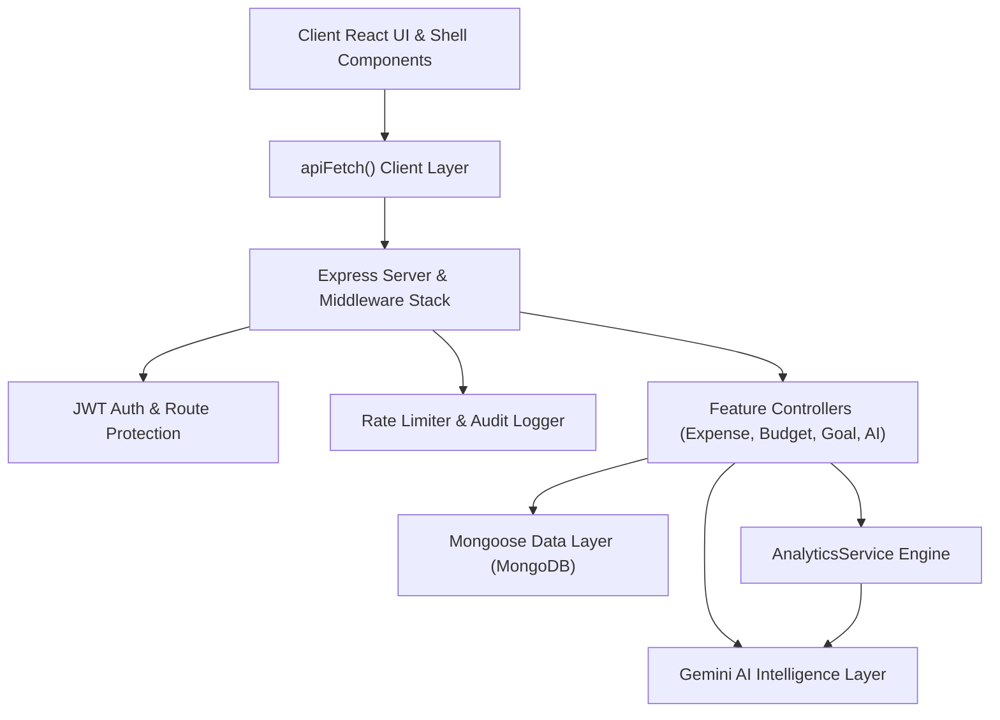

# Project Status & Architectural Knowledge Report

**Project**: AI-First Personal Finance Intelligence Platform  
**Version**: `2.2.0`  
**Generated On**: `2026-08-15`  
**Knowledge Engine**: Graphify v0.9.43  

---

## 1. Executive Summary & Runtime Health

| Service / Component | Status | Port / Target | Key Metrics / Health Details |
| :--- | :--- | :--- | :--- |
| **Backend API Server** | 🟢 **Online** | `http://localhost:5000` | Database Connected (MongoDB), 0 open socket leaks |
| **Frontend Web App** | 🟢 **Active** | `http://localhost:5173` | Vite Dev Server, HTTP 200 OK |
| **Database** | 🟢 **Connected** | MongoDB Local/Atlas | Mongoose connection active with graceful teardown handlers |
| **Enterprise Middleware** | 🟢 **Active** | In-Memory / Express | Rate Limiting, Audit Logging, Idempotency, Request Sanitization |
| **Backend Test Suite** | 🟢 **100% Passing** | Jest / Supertest | 9 test suites, 79/79 tests passing (0 failures) |
| **AI Copilot Subsystem** | 🟢 **Ready** | Gemini Flash Service | Dynamic fallback enabled for deterministic calculation modes |

---

## 2. Graphify Knowledge Graph Mapping

```
Corpus Size: 99 files · ~67,335 words
Knowledge Graph: 527 nodes · 738 edges · 33 communities (100% mapped)
Extraction Integrity: 99% EXTRACTED · 1% INFERRED · 0% AMBIGUOUS
Import Cycles: 0 detected (Clean architecture)
```

### Knowledge Graph Artifacts
- **Interactive Visualizer**: [`graphify-out/graph.html`](file:///Users/anvitha/Documents/project/ep/graphify-out/graph.html)
- **Hierarchical D3 Tree**: [`graphify-out/GRAPH_TREE.html`](file:///Users/anvitha/Documents/project/ep/graphify-out/GRAPH_TREE.html)
- **Full Audit Report**: [`graphify-out/GRAPH_REPORT.md`](file:///Users/anvitha/Documents/project/ep/graphify-out/GRAPH_REPORT.md)
- **Raw Graph Data**: [`graphify-out/graph.json`](file:///Users/anvitha/Documents/project/ep/graphify-out/graph.json)

---

## 3. Core Architectural Hubs ("God Nodes")

The most connected nodes representing the platform's core abstractions:

1. **`apiFetch()`** (21 edges) — Central unified client HTTP client layer orchestrating request authentication, error formatting, and token refresh.
2. **`react`** (16 edges) — Core UI rendering runtime across components, providers, and hooks.
3. **`AppError`** (13 edges) — Centralized operational error hierarchy standardizing HTTP response codes and sanitization.
4. **`express`** (12 edges) — HTTP routing, controller execution, and middleware pipeline foundation.
5. **`protect()`** (11 edges) — Security middleware enforcing JWT validation, user hydration, and route authorization.
6. **`AnalyticsService`** (10 edges) — Deterministic financial calculation engine for budget utilization, category breakdowns, savings velocities, and anomalous spend detection.
7. **`BadRequestError`** (10 edges) — Standard validation exception across controllers.
8. **`useAuth()`** (9 edges) — Frontend auth state hook bridging session data to shell components and route guards.

---

## 4. Key Subsystems & Community Structure

The codebase is partitioned into 33 functional communities. Major active clusters:



### Major Subsystem Breakdown
1. **Client React UI & Shell Components**:
   - Pinterest-inspired responsive masonry layout (`PinCard`).
   - Copilot drawer (`CopilotDrawer`), modal management (`ExpenseFormModal`), analytics views, and contextual navigation headers.
2. **AI Copilot & Analytics Engine**:
   - `AIService`: Multi-turn conversational financial copilot with contextual memory.
   - `AnalyticsService`: Deterministic financial indicators (run-rate forecasting, burn rate, volatility indices, anomaly detection).
   - `IntentRouter` & `ToolRegistry`: Structured tool invocation and safe context preparation.
3. **Backend Middleware & Security**:
   - Rate limiting tiers (`aiLimiter`, `authLimiter`, `demoLimiter`, `globalLimiter`).
   - Audit logging with automated sensitive data redaction (`auditLogger`).
   - Structured JSON validation with Joi schemas (`validate`).
4. **Data Models & Business Domain**:
   - Core Mongoose Schemas: `User`, `Expense`, `Budget`, `Goal`, `Category`, `RecurringExpense`, `AuditLog`, `RefreshToken`.
5. **Workflow & Team Automation**:
   - Git post-merge automation hooks (`scripts/setup-git-hooks.cjs`).
   - Team Collaboration Manual and Codebase Architectural Standards (`.agents/rules/`).

---

## 5. Active Feature Checklist

- [x] **JWT Authentication & Refresh Token Rotation**: Secure session persistence with blacklist/invalidation support.
- [x] **Expense & Income Tracking**: Multi-criteria querying, pagination, aggregation, and category assignment.
- [x] **Budget Management**: Monthly spending limits, category allocations, and threshold breach indicators.
- [x] **Goal Planning & Tracking**: Target date tracking and velocity-based progress forecasting.
- [x] **Recurring Subscriptions**: Cadence tracking and payment logging.
- [x] **Deterministic Financial Analytics**: Category concentration, savings rates, and burn metrics.
- [x] **AI Financial Intelligence**: Contextual chat, proactive insights, and category recommendation.
- [x] **CSV/JSON Data Export**: Sanitized streaming transaction exports.
- [x] **Interactive Knowledge Graph**: Fully indexed AST & documentation semantic graph with browser visualizations.
