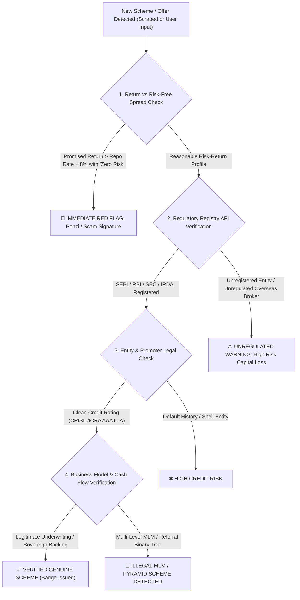
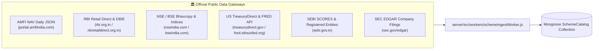
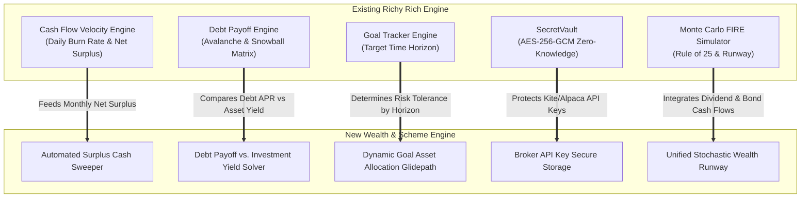
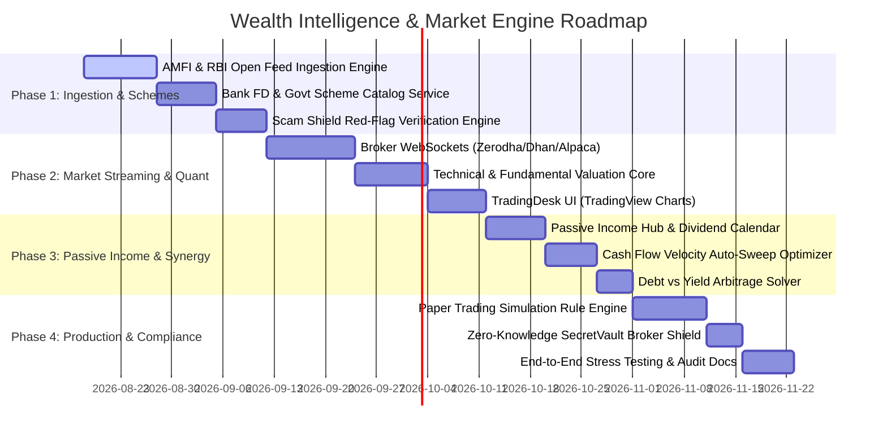

# 📈 Richy Rich — Stock Market Trading, Quantitative Analysis & Genuine Schemes Ecosystem
### The Autonomous Wealth Intelligence, Real-Time Market Engine & Sovereign Passive Income Operating System

**Project**: Richy Rich — AI-First Sovereign Personal Finance Intelligence Platform  
**Target Standard**: Enterprise FinTech · Quantitative Asset Management · SEBI/SEC Compliance · Zero-Trust Scam Verification  
**Document Type**: Architectural Specification, Deep Quantitative Research, API Directory & Implementation Blueprint  
**Status**: 📋 Master Architectural Blueprint  
**Version**: `v3.2.0` Wealth & Market Intelligence Specification  
**Target Environments**: `client/` (React 19, TradingView Lightweight Charts, WebSockets, Canvas) · `server/` (Node.js, Express, Redis, BullMQ, Mongoose, Socket.io, Python Quant Microservice)

---

## 🧭 Executive Summary & Core Philosophy

Wealth accumulation in modern economies is hindered by information asymmetry, predatory financial schemes, high market volatility, and fragmented financial silos. Retail investors struggle with:
1. **The "Noise vs. Signal" Problem**: Thousands of financial influencers and unverified advisory apps promote speculative "get-rich-quick" schemes, fake high-yield investment programs (HYIPs), and unregistered Ponzi operations.
2. **Fragmented Yield Opportunities**: High-yield government bonds (T-Bills, SGBs), special bank FD tranches, REIT quarterly dividend distributions, and corporate bond yields are scattered across dozens of disconnected portals.
3. **Emotional, Unscientific Trading**: Retail traders buy near market peaks due to FOMO and sell during panic selloffs due to lack of quantitative risk models, automated rebalancing, and disciplined asset allocation.
4. **Disconnected Cash Flow Engines**: Personal budgeting and expense tracking are traditionally separated from investment deployment, leaving surplus cash rotting in low-interest checking accounts (losing value to inflation).

This blueprint provides the **complete technical and mathematical blueprint** to implement a **Real-Time Stock Market Trading & Analysis Engine**, a **Real-Time Genuine Scheme & Offer Verification Engine**, and an **Autonomous Passive Income Growth Machine** directly integrated into **Richy Rich (Expense Tracker V2)**.

```
┌───────────────────────────────────────────────────────────────────────────────────────────────────────────────────┐
│                               RICHY RICH WEALTH & SCHEMES MASTER TOPOLOGY                                         │
├───────────────────────────────┬──────────────────────────────────┬────────────────────────────────────────────────┤
│   1. QUANT & TRADING DESK     │   2. GENUINE SCHEMES & OFFERS    │    3. PASSIVE INCOME & CASH FLOW SYNERGY       │
├───────────────────────────────┼──────────────────────────────────┼────────────────────────────────────────────────┤
│ • Real-time Ticker WebSockets │ • Sovereign Govt Bonds (G-Sec/T) │ • Automated Surplus Cash Sweep (Liquid Funds)  │
│ • Technical Indicators (TA)   │ • High-Yield Bank FD Trackers    │ • Dividend Aristocrats & Growth DRIP Engine    │
│ • Fundamental Valuation (DCF) │ • SEBI-Regulated Corporate NCDs  │ • Fixed Income Laddering (FD & T-Bill Ladders) │
│ • Piotroski F & Altman Z Score│ • REITs / InvITs Cash Flow Hub   │ • Covered Call Options Yield (The Wheel Model) │
│ • Markowitz Efficient Frontier│ • Real-Time Scam & Ponzi Shield  │ • Debt Avalanche vs Investment Arbitrage Solver│
│ • Automated Rule Engine (Algo)│ • DICGC / SEC Regulatory Auditor │ • Goal-Driven Glidepath Asset Allocation       │
└───────────────────────────────┴──────────────────────────────────┴────────────────────────────────────────────────┘
```

---

## 🗺️ Master Visual Architecture Map

```mermaid
graph TB
    subgraph MarketFeeds ["📡 Real-Time Data & Ingestion Pipeline"]
        BrokerWS["Broker WebSockets (Zerodha / Dhan / Alpaca)"]
        GovtFeeds["Govt & Exchange Feeds (RBI Retail / AMFI / NSE / TreasuryDirect)"]
        BankScrapers["Bank & Scheme Feed Ingestor (Open Banking / RSS / APIs)"]
        SecFilings["Regulatory Filings (SEBI / SEC EDGAR / Rating Agencies)"]
    end

    subgraph StreamingEngine ["⚡ Ingestion & Streaming Layer (server/src/services/)"]
        RedisBus["Redis Pub/Sub & BullMQ Priority Queue"]
        PriceAggregator["Price Aggregator & Depth Normalizer"]
        ScamShield["Real-Time Scam & Ponzi Verification Filter"]
        OfferScanner["Bank & Corporate Scheme Delta Engine"]
    end

    subgraph QuantCore ["🧮 Quantitative Analytics & AI Copilot"]
        TAModule["Technical Analysis Engine (RSI, MACD, VWAP, EMA)"]
        DCFModule["Fundamental Valuation (DCF, Graham, Piotroski, Altman)"]
        PortfolioOpt["Markowitz Mean-Variance & Monte Carlo Engine"]
        FinBERT["AI Financial News & Sentiment NLP Engine"]
    end

    subgraph CoreSynergy ["🔄 Expense Tracker Core Integration"]
        CashFlow["Cash Flow Velocity Engine (Net Surplus Inflow)"]
        DebtSolver["Debt vs Yield Arbitrage Optimizer"]
        GoalGlide["Goal-Linked Asset Allocation Engine"]
        VaultSec["Zero-Knowledge SecretVault (API Keys)"]
    end

    subgraph UIExperience ["🎨 Sovereign Client Desk (client/src/pages/)"]
        TradingDesk["Trading Desk (TradingView Lightweight Charts)"]
        SchemeHub["Verified Scheme & Offer Radar (Live Rates)"]
        PassiveRadar["Passive Income & Dividend Yield Matrix"]
        AlertManager["Real-Time Audio-Visual & Push Alert Center"]
    end

    MarketFeeds --> StreamingEngine
    StreamingEngine --> QuantCore
    QuantCore --> CoreSynergy
    CoreSynergy --> UIExperience
    StreamingEngine -.-> UIExperience
```



---

## 💰 1. The Ethical Wealth Growth & Passive Income Framework

Passive income must be built on **mathematical risk management, regulatory safety, capital preservation, and compounding growth**, not speculative gambling.

### 1.1 The Seven Pillars of Ethical Passive Income Generation

| Pillar | Asset Class / Strategy | Expected Risk-Adjusted Yield | Risk Profile | Cash Flow Frequency |
| :--- | :--- | :--- | :--- | :--- |
| **1. Dividend Growth & DRIP** | High-FCF Dividend Aristocrats / Blue Chips | 3.5% – 7.5% + Capital Growth | Moderate Equity | Quarterly / Semi-Annual |
| **2. Sovereign Fixed Income** | Treasury Bills, SGBs, G-Secs, I-Bonds, PPF | 7.0% – 8.5% (Sovereign Guaranteed) | Zero Credit Risk | Semi-Annual / At Maturity |
| **3. High-Yield Bank FDs** | Scheduled Commercial & Small Finance Banks | 7.5% – 9.1% (Insured up to ₹5L / $250k) | Low (Insured) | Monthly / Quarterly / Annual |
| **4. Infrastructure & Real Estate**| REITs (Commercial Real Estate) & InvITs | 6.5% – 9.0% Cash Distribution Yield | Low-Moderate | Quarterly (Mandatory 90% NDCF) |
| **5. Covered Call Options Yield** | High-Quality Stock "Wheel" Strategy | 8.0% – 15.0% Cash Yield | Moderate-Calculated | Monthly Expiry Cycles |
| **6. Overnight / Liquid Sweeps** | Arbitrage Funds / Liquid Mutual Funds | 6.5% – 7.5% (Instant T+0 Liquidity) | Ultra-Low | Continuous / Instant Redemption |
| **7. Senior Secured Corporate Debt**| AAA / AA+ Rated Listed NCDs & Green Bonds | 9.0% – 11.5% | Moderate-Low | Monthly / Quarterly Coupon |

---

### 1.2 Mathematical Compounding & The Passive Freedom Velocity Formula

Passive income growth is determined by the **Wealth Accumulation Velocity**:

$$\Delta W(t) = \left( S(t) + D(t) + C(t) \right) \cdot (1 + r_{\text{real}})^t$$

Where:
- $S(t)$ = Monthly surplus saved from active income (tracked via `Cash-Flow-Velocity-Engine`).
- $D(t)$ = Reinvested dividend income (DRIP).
- $C(t)$ = Coupon / interest payments from fixed income and option yields.
- $r_{\text{real}} = \frac{1 + r_{\text{nominal}}}{1 + i_{\text{inflation}}} - 1$ = Inflation-adjusted real rate of return.

#### The Rule of Passive Runaway ($T_{\text{FIRE}}$):
Passive income covers total monthly expenses when:

$$\sum_{k=1}^{M} \text{Payout}_k(t) \ge \text{BurnRate}_{\text{monthly}}(t)$$

---

## 🏛️ 2. Comprehensive Taxonomy of Genuine Schemes & Investment Avenues

### 2.1 Government & Sovereign Guaranteed Schemes

#### India Focus:
1. **Sovereign Gold Bonds (SGB)**:
   - **Mechanism**: Issued by the Reserve Bank of India (RBI) on behalf of the Government of India.
   - **Returns**: 2.50% annual coupon paid semi-annually + market price appreciation of 999 gold.
   - **Tax Advantage**: **100% Tax-Free Capital Gains** if held to full maturity (8 years).
   - **Trading**: Tradeable on NSE/BSE secondary markets (often at a 3–5% discount to spot price, creating instant arbitrage).
2. **Treasury Bills (T-Bills) & Government Securities (G-Secs)**:
   - **Mechanism**: Direct sovereign lending via RBI Retail Direct portal. 91-day, 182-day, and 364-day T-Bills issued at discount and redeemed at par.
   - **Yield**: Currently 6.75% – 7.20% with zero credit default risk.
3. **Public Provident Fund (PPF)**:
   - **Mechanism**: 15-year sovereign savings vehicle backed by Central Government.
   - **Interest**: 7.10% compounded annually, fully EEE (Exempt-Exempt-Exempt) tax status under Section 80C.
4. **Sukanya Samriddhi Yojana (SSY)**:
   - **Mechanism**: Dedicated welfare scheme for girl children.
   - **Yield**: 8.20% annual compounding, highest sovereign EEE interest rate.
5. **Senior Citizens Savings Scheme (SCSS) & Mahila Samman Savings Certificate (MSSC)**:
   - **Yield**: 8.20% (SCSS, quarterly payouts for elderly) and 7.50% (MSSC for women).
6. **National Pension System (NPS Tier 1 & Tier 2)**:
   - **Mechanism**: Regulated by PFRDA with low expense ratio (0.01%). Extra ₹50,000 tax deduction under Section 80CCD(1B). Returns linked to low-cost active equity (E), corporate debt (C), and government debt (G).

#### US & Global Equivalents:
1. **US Treasury Bills & Notes**: 4-week to 30-year Treasuries via TreasuryDirect.
2. **Series I Savings Bonds**: Inflation-indexed composite rate (Fixed Rate + Semiannual Inflation Rate).
3. **Roth IRA / 401(k) Index Compounding**: Automated broad-market Vanguard/BlackRock ETF DCA (VOO, VTI, BND).

---

### 2.2 Banking Schemes, Fixed Deposit Ladders & Credit Yields

1. **High-Yield Fixed Deposit (FD) Optimization**:
   - Small Finance Banks (e.g., Unity, AU, Equitas, Ujjivan, Suryoday) frequently offer **8.50% – 9.10%** for 1–3 year tenures.
   - **Safety Boundary**: Covered by the Deposit Insurance and Credit Guarantee Corporation (**DICGC**) up to **₹5,00,000 per bank per PAN** (Principal + Interest).
   - **Algorithmic Strategy**: Richy Rich implements a **Multi-Bank DICGC Allocation Algorithm**, splitting ₹25 Lakhs across 5 different DICGC-insured banks to maximize yield at 100% insured safety.
2. **Fixed Income Laddering (FD & T-Bill Ladders)**:
   - Instead of locking ₹10,000 in a 3-year FD, the ladder splits it into 4 tranches:
     - Tranche A: 3 Months maturity (reinvests at prevailing rate).
     - Tranche B: 6 Months maturity.
     - Tranche C: 9 Months maturity.
     - Tranche D: 12 Months maturity.
   - **Benefit**: Liquidity unlocks every 90 days with zero early withdrawal penalty.

---

### 2.3 Real Estate & Infrastructure Trusts (REITs & InvITs)

1. **REITs (Real Estate Investment Trusts)**:
   - Listed trusts (e.g., Embassy Office Parks, Mindspace, Brookfield India, Nexus Select Trust).
   - **Legal Mandate**: By SEBI regulation, REITs must distribute **at least 90% of their Net Distributable Cash Flows (NDCF)** to unit holders.
   - **Yield Component**: Regular quarterly dividends, interest, and capital repayment yielding 6.5% – 8.5% annual cash yield + asset appreciation.
2. **InvITs (Infrastructure Investment Trusts)**:
   - PowerGrid InvIT, IRB InvIT, India Grid Trust (IndiGrid).
   - Backed by long-term sovereign toll roads, transmission lines, and solar power grids with 30-year power purchase agreements. Yields: **8.5% – 11.0%** predictable cash distribution.

---

### 2.4 Systematic Equity Growth & Dividend Aristocrats

1. **Dividend Aristocrats & Dividend Kings**:
   - Companies with 10–25+ consecutive years of increasing dividend payouts, low debt-to-equity ($< 0.5$), and strong Free Cash Flow conversion ($> 80\%$).
   - Examples (India): TCS, ITC, Infosys, Hindustan Unilever, Power Finance Corp, REC Ltd.
   - Examples (US): Johnson & Johnson, Procter & Gamble, Coca-Cola, Realty Income (O - Monthly Dividend).
2. **Step-Up Systematic Investment Plan (SIP)**:
   - Automatically increases monthly investment by 10% each year matching salary increments.
   - **Math Result**: A ₹10,000/mo SIP at 12% for 20 years yields ₹1.0 crore; a 10% Step-Up SIP yields **₹2.05 crore (more than double)** with the same baseline start.
3. **Value Averaging Investment Plan (VIP)**:
   - Algorithmic investing that fixes a targeted portfolio growth value rather than a fixed contribution. In down months, the engine allocates more; in euphoric bull peaks, it trims or reduces allocation.

---

### 2.5 Ethical Options Income: The "Wheel Strategy"

The **Wheel Strategy** is an institutional-grade, cash-secured options strategy designed exclusively for generating recurring monthly yield on stocks you would love to own long-term:

```
                  ┌────────────────────────────────────────────────────────┐
                  │              STEP 1: SELL CASH-SECURED PUT             │
                  │   Sell Out-of-the-Money (OTM) Put on Quality Stock.    │
                  │         Collect immediate cash option premium.         │
                  └───────────────────────────┬────────────────────────────┘
                                              │
                                              ▼
                                 Did stock drop below strike?
                                ╱                            ╲
                              YES                             NO
                              ╱                                 ╲
                             ▼                                   ▼
        ┌────────────────────────────────────────┐   ┌───────────────────────────────┐
        │       STEP 2: TAKE STOCK ASSIGNMENT    │   │ Put expires worthless (100%   │
        │ Acquire 100 shares at a discount price.│   │ premium profit). Repeat Step 1│
        └───────────────────┬────────────────────┘   └───────────────────────────────┘
                            │
                            ▼
        ┌────────────────────────────────────────┐
        │       STEP 3: SELL COVERED CALL        │
        │ Sell OTM Call against acquired shares. │
        │      Collect recurring cash premium    │
        └───────────────────┬────────────────────┘
                            │
                            ▼
                 Did stock rise above Call strike?
                ╱                                 ╲
              YES                                  NO
              ╱                                     ╲
             ▼                                       ▼
┌────────────────────────────────────────┐   ┌───────────────────────────────┐
│ Shares sold at strike with profit.     │   │ Call expires worthless. Keep  │
│ Return to Step 1 with expanded cash.   │   │ shares + premium. Sell next   │
└────────────────────────────────────────┘   │ month Call.                   │
                                             └───────────────────────────────┘
```

---

## 🛡️ 3. Real-Time Scam, Fraud & Ponzi Detection Engine ("The Trust Shield")

To protect users from fraudulent schemes, Richy Rich incorporates a real-time **Automated Scheme Audit Pipeline**.



### 3.1 The Algorithmic Red-Flag Scoring System

The algorithm computes a **Risk & Authenticity Score ($S_{\text{auth}} \in [0, 100]$)**:

$$S_{\text{auth}} = 100 - \left( 35 \cdot \mathbf{1}_{\text{unregulated}} + 25 \cdot \mathbf{1}_{\text{unrealistic\_yield}} + 20 \cdot \mathbf{1}_{\text{mlm\_structure}} + 20 \cdot \mathbf{1}_{\text{credit\_drift}} \right)$$

1. **Unrealistic Yield Anomaly**: Any scheme claiming $> 15\%$ guaranteed fixed returns with zero capital volatility is mathematically unfeasible in a sub-7% interest rate environment.
2. **Regulatory License Verification**:
   - India: Direct automated checks against SEBI registered Investment Advisers (RIA), Research Analysts (RA), Portfolio Managers (PMS), Alternative Investment Funds (AIF), and RBI-registered NBFCs.
   - US: Direct checks against SEC EDGAR and FINRA BrokerCheck.
3. **MLM / Referral Tree Penalty**: If payout requires onboarding sub-members rather than underlying cash generation (rents, interest, commercial profits), the scheme is permanently blocked.

---

## 📡 4. Real-Time Data Sources & Official API Directory

### 4.1 Real-Time Stock Market Broker APIs & Feeds

| Provider | Supported Markets | Protocols / Endpoints | Latency | Capabilities | Best For |
| :--- | :--- | :--- | :--- | :--- | :--- |
| **Zerodha Kite Connect** | NSE, BSE, MCX | WebSocket (Binary Packets), REST API | $\sim 50\text{ms}$ | Live Tick, Depth (L2/L3), Order Execution, Margins | Primary Indian Market Broker Engine |
| **Dhan HQ API** | NSE, BSE, MCX | Superfast WebSocket, REST v2 | $\sim 20\text{ms}$ | Microsecond data feeds, Bracket Orders, Options Chain | Low-Latency Scalping & Real-Time Analytics |
| **Upstox API** | NSE, BSE, MCX | Protobuf WebSocket, REST v2 | $\sim 45\text{ms}$ | Market Feeds, Historical OHLCV, Portfolio Sync | Automated Portfolio Rebalancing |
| **Angel One SmartAPI** | NSE, BSE, MCX | WebSocket, REST JSON | $\sim 60\text{ms}$ | Free Historical Data, Live Ticks, Smart Order Routing | Budget-friendly automated algorithmic trading |
| **Alpaca Markets** | US Equities, Crypto | WebSocket (IEX/Polygon), REST API | $\sim 15\text{ms}$ | Zero-commission US trading, Fractional Shares | US Market Trading & Quantitative Backtesting |
| **Interactive Brokers (IBKR)**| Global 150+ Markets | TWS API, Client Portal REST API | $\sim 30\text{ms}$ | Global Multi-Asset (Stocks, Options, Futures, FX) | Global International Portfolios |
| **Polygon.io** | US Stocks, Options, FX | Ultra-low latency WebSocket feeds | $< 5\text{ms}$ | Sub-millisecond tick data, Level 2 Depth, Reference Data | Enterprise-grade Quantitative Analysis |
| **Finnhub.io** | Global Equities | WebSocket, REST JSON | $\sim 100\text{ms}$ | Fundamental metrics, Insider Sentiment, Earnings Transcripts | DCF & Fundamental Quantitative Valuation |

---

### 4.2 Official Government, Exchange & Regulatory Feeds



1. **AMFI Daily Mutual Fund NAV Stream**:
   - **Direct URL**: `https://www.amfiindia.com/spages/NAVAll.txt`
   - **Characteristics**: Free, publicly accessible open feed updating every business day at 21:00 IST with NAV, ISIN, and scheme code for every registered mutual fund in India.
2. **RBI DBIE (Database on Indian Economy) & Retail Direct**:
   - **Endpoints**: G-Sec Yield Curves, Policy Repo Rates, Treasury Bill cut-off yields, Sovereign Gold Bond tranche release schedules.
3. **NSE/BSE Corporate Actions Feed**:
   - Real-time RSS and JSON endpoints for Dividends, Stock Splits, Bonus Issues, and Buybacks.
4. **US Federal Reserve (FRED API)**:
   - Over 800,000 macroeconomic time-series data points (CPI Inflation, 10-Year Treasury Yield, Unemployment, M2 Money Supply).
5. **Credit Rating Feeds (CRISIL / ICRA / CARE)**:
   - Webhook & RSS scraping for corporate bond credit rating upgrades/downgrades.

---

## 🧮 5. Quantitative Analytics & Algorithmic Trading Engines

### 5.1 Technical Analysis (TA) Core Engine

Richy Rich computes technical indicators in real-time over sliding streaming windows:

1. **Exponential Moving Average (EMA)**:
   $$\text{EMA}_t = \text{Price}_t \cdot \left( \frac{2}{N + 1} \right) + \text{EMA}_{t-1} \cdot \left( 1 - \frac{2}{N + 1} \right)$$
2. **Relative Strength Index (RSI - 14 Periods)**:
   $$\text{RSI} = 100 - \left[ \frac{100}{1 + \frac{\text{EMA}(\text{Upgains}, 14)}{\text{EMA}(\text{Downlosses}, 14)}} \right]$$
3. **Volume-Weighted Average Price (VWAP)**:
   $$\text{VWAP} = \frac{\sum (\text{Typical Price}_i \cdot \text{Volume}_i)}{\sum \text{Volume}_i}$$
4. **Bollinger Bands & Supertrend**: Dynamic volatility channels for automated stop-loss calculations.

---

### 5.2 Fundamental Valuation & Financial Health Engines

#### 1. Discounted Cash Flow (DCF) Model:
Computes the **Intrinsic Value ($V_0$)** of a company based on projected Free Cash Flows:

$$V_0 = \sum_{t=1}^{N} \frac{\text{FCF}_t}{(1 + \text{WACC})^t} + \frac{\text{Terminal Value}_N}{(1 + \text{WACC})^N}$$

Where $\text{Terminal Value}_N = \frac{\text{FCF}_N \cdot (1 + g)}{\text{WACC} - g}$.

#### 2. Piotroski 9-Point F-Score:
Assesses financial strength across 3 criteria:
- **Profitability**: Positive Return on Assets (ROA), positive Operating Cash Flow (CFO), $\text{CFO} > \text{ROA}$.
- **Leverage & Liquidity**: Lower Long-Term Debt ratio, higher Current Ratio, zero equity dilution.
- **Operating Efficiency**: Higher Gross Margin, higher Asset Turnover.
- *Score $\ge 8$: Pristine Quality (High Conviction Buy)*; *Score $\le 3$: Financially Distressed (Avoid)*.

#### 3. Altman Z-Score (Bankruptcy Predictor):
$$Z = 1.2 X_1 + 1.4 X_2 + 3.3 X_3 + 0.6 X_4 + 0.999 X_5$$
- $Z > 2.99$: Safe Green Zone.
- $1.81 < Z < 2.99$: Grey Zone.
- $Z < 1.81$: Distress / High Bankruptcy Probability.

---

### 5.3 Modern Portfolio Theory (MPT) & Monte Carlo Frontier

Computes the **Sharpe Ratio Maximization**:

$$\max_{w} \text{Sharpe} = \frac{E[R_p] - R_f}{\sigma_p}$$

Subject to $\sum w_i = 1, \quad 0 \le w_i \le w_{\max}$.

The engine runs a **1,000-iteration Monte Carlo engine** simulating market drawdowns to ensure the user's asset allocation withstands severe 2008 or 2020-style market crashes.

---

## 🗄️ 6. Database Models & Schema Specifications

The following Mongoose database models expand the core schema in `server/src/models/`:

### 6.1 `server/src/models/Security.js`
```javascript
import mongoose from 'mongoose';

const securitySchema = new mongoose.Schema(
  {
    symbol: { type: String, required: true, uppercase: true, index: true },
    isin: { type: String, required: true, unique: true, index: true },
    name: { type: String, required: true },
    exchange: { type: String, enum: ['NSE', 'BSE', 'NASDAQ', 'NYSE'], required: true },
    assetClass: {
      type: String,
      enum: ['EQUITY', 'ETF', 'MUTUAL_FUND', 'GOVT_BOND', 'CORP_BOND', 'REIT', 'INVIT', 'GOLD'],
      required: true,
      index: true
    },
    sector: { type: String, default: 'General' },
    lastPrice: { type: Number, required: true, default: 0 },
    previousClose: { type: Number, default: 0 },
    dayChange: { type: Number, default: 0 },
    dayChangePercent: { type: Number, default: 0 },
    volume: { type: Number, default: 0 },
    
    // Fundamental Data
    peRatio: { type: Number },
    pbRatio: { type: Number },
    dividendYield: { type: Number, default: 0 },
    roce: { type: Number },
    roe: { type: Number },
    debtToEquity: { type: Number },
    freeCashFlow: { type: Number },
    piotroskiFScore: { type: Number, min: 0, max: 9 },
    altmanZScore: { type: Number },
    intrinsicValueDCF: { type: Number },
    
    // Technical Sliding Metrics
    rsi14: { type: Number },
    ema50: { type: Number },
    ema200: { type: Number },
    vwap: { type: Number },
    
    // Regulatory & Safety
    isVerified: { type: Boolean, default: true },
    creditRating: { type: String, default: 'N/A' }, // AAA, AA+, etc.
    ratingAgency: { type: String, default: 'N/A' }, // CRISIL, ICRA
    updatedAt: { type: Date, default: Date.now }
  },
  { timestamps: true }
);

securitySchema.index({ symbol: 1, exchange: 1 });
export default mongoose.model('Security', securitySchema);
```

---

### 6.2 `server/src/models/SchemeCatalog.js`
```javascript
import mongoose from 'mongoose';

const schemeCatalogSchema = new mongoose.Schema(
  {
    title: { type: String, required: true, index: true },
    provider: { type: String, required: true }, // RBI, State Bank of India, HDFC, Govt of India
    category: {
      type: String,
      enum: ['GOVT_SOVEREIGN', 'BANK_FD', 'CORPORATE_BOND', 'REIT_INVIT', 'MUTUAL_FUND_ARBITRAGE', 'POST_OFFICE'],
      required: true,
      index: true
    },
    annualYieldPercent: { type: Number, required: true },
    compoundingFrequency: {
      type: String,
      enum: ['MONTHLY', 'QUARTERLY', 'SEMI_ANNUAL', 'ANNUAL', 'AT_MATURITY'],
      default: 'ANNUAL'
    },
    payoutFrequency: {
      type: String,
      enum: ['MONTHLY', 'QUARTERLY', 'SEMI_ANNUAL', 'ANNUAL', 'CUMULATIVE'],
      default: 'CUMULATIVE'
    },
    tenureMonths: { type: Number, default: 12 },
    minInvestment: { type: Number, required: true, default: 1000 },
    maxInvestment: { type: Number },
    taxationRules: {
      isTaxFree: { type: Boolean, default: false },
      sectionDeduction: { type: String, default: 'None' }, // 80C, 80CCD(1B), 10(10D)
      tdsApplicable: { type: Boolean, default: true }
    },
    
    // Safety & Verification Shield
    regulatoryBody: { type: String, enum: ['RBI', 'SEBI', 'PFRDA', 'IRDAI', 'US_TREASURY', 'NONE'], required: true },
    registrationNumber: { type: String },
    insuranceCoverage: {
      isInsured: { type: Boolean, default: false },
      insurerName: { type: String, default: 'DICGC' }, // DICGC / FDIC
      insuredLimit: { type: Number, default: 500000 }
    },
    trustScore: { type: Number, min: 0, max: 100, default: 100 }, // 0 to 100
    isGenuineVerified: { type: Boolean, default: true },
    verificationReason: { type: String },
    
    // Live Availability
    isActive: { type: Boolean, default: true },
    issueStartDate: { type: Date },
    issueClosingDate: { type: Date },
    directApplyUrl: { type: String }
  },
  { timestamps: true }
);

schemeCatalogSchema.index({ category: 1, annualYieldPercent: -1 });
export default mongoose.model('SchemeCatalog', schemeCatalogSchema);
```

---

### 6.3 `server/src/models/PortfolioHolding.js`
```javascript
import mongoose from 'mongoose';

const portfolioHoldingSchema = new mongoose.Schema(
  {
    userId: { type: mongoose.Schema.Types.ObjectId, ref: 'User', required: true, index: true },
    securityId: { type: mongoose.Schema.Types.ObjectId, ref: 'Security', required: true },
    symbol: { type: String, required: true },
    assetClass: { type: String, required: true },
    quantity: { type: Number, required: true, min: 0 },
    averageBuyPrice: { type: Number, required: true },
    investedAmount: { type: Number, required: true },
    currentPrice: { type: Number, required: true },
    currentValue: { type: Number, required: true },
    unrealizedPnL: { type: Number, default: 0 },
    unrealizedPnLPercent: { type: Number, default: 0 },
    realizedPnL: { type: Number, default: 0 },
    dividendsCollected: { type: Number, default: 0 },
    xirr: { type: Number, default: 0 },
    
    // Auto-Reinvestment & Tagging
    isDripEnabled: { type: Boolean, default: false },
    linkedGoalId: { type: mongoose.Schema.Types.ObjectId, ref: 'Goal' },
    notes: { type: String }
  },
  { timestamps: true }
);

portfolioHoldingSchema.index({ userId: 1, symbol: 1 }, { unique: true });
export default mongoose.model('PortfolioHolding', portfolioHoldingSchema);
```

---

### 6.4 `server/src/models/AutomatedTradingRule.js`
```javascript
import mongoose from 'mongoose';

const automatedTradingRuleSchema = new mongoose.Schema(
  {
    userId: { type: mongoose.Schema.Types.ObjectId, ref: 'User', required: true, index: true },
    name: { type: String, required: true },
    strategyType: {
      type: String,
      enum: ['VALUE_SIP', 'RSI_OVERSOLD_BUY', 'BREAKOUT_MOMENTUM', 'COVERED_CALL_WHEEL', 'AUTO_SURPLUS_SWEEP'],
      required: true
    },
    targetSymbol: { type: String, required: true },
    executionMode: {
      type: String,
      enum: ['NOTIFY_ONLY', 'PAPER_TRADE', 'LIVE_BROKER_EXECUTE'],
      default: 'NOTIFY_ONLY'
    },
    
    // Dynamic Condition Block
    conditions: {
      indicator: { type: String }, // RSI, EMA_CROSS, PRICE_BELOW_DCF
      operator: { type: String, enum: ['<', '<=', '>', '>=', '==', 'CROSS_ABOVE', 'CROSS_BELOW'] },
      thresholdValue: { type: Number }
    },
    
    allocationAmount: { type: Number, required: true },
    stopLossPercent: { type: Number, default: 5 },
    takeProfitPercent: { type: Number, default: 15 },
    isActive: { type: Boolean, default: true },
    lastTriggeredAt: { type: Date },
    totalExecutedTrades: { type: Number, default: 0 }
  },
  { timestamps: true }
);

export default mongoose.model('AutomatedTradingRule', automatedTradingRuleSchema);
```

---

## ⚡ 7. Core Synergy Matrix with Current Features

Richy Rich avoids isolated silos. The new Wealth & Market Engine connects directly with all 14 existing models and engines:



### 7.1 Detailed Feature Interlocking

1. **Surplus Cash Sweeping (`Cash-Flow-Velocity-Engine` $\to$ `SchemeCatalog`)**:
   - When the `Cash-Flow-Velocity-Engine` computes a net positive monthly surplus (e.g. Income ₹1,20,000 – Expenses ₹70,000 = ₹50,000 surplus), the system automatically routes the surplus into:
     - 50% High-Conviction Index / Dividend SIP (`PortfolioHolding`).
     - 30% Highest-Yield Verified Bank FD / T-Bill (`SchemeCatalog`).
     - 20% Instant-Liquidity Arbitrage / Liquid Mutual Fund for Emergency Vault.
2. **Debt Avalanche vs Investment Yield Arbitrage Solver (`Debt.js` $\to$ `Security.js`)**:
   - The engine performs an automated arbitrage comparison:
     - If user has a Credit Card Debt at **42.0% APR** $\to$ Engine halts stock investing and forces 100% surplus into Debt Avalanche (guaranteed 42% risk-free return).
     - If user has a Home Loan at **8.25% APR** with tax deduction (effective **5.77%**) and a verified AAA Bond is yielding **9.50%** $\to$ Engine demonstrates the mathematical benefit of investing surplus rather than prepaying the low-rate loan.
3. **Goal-Driven Glidepath Asset Allocation (`Goal.js` $\to$ `PortfolioHolding.js`)**:
   - As a user's goal nears its target deadline (e.g., House Downpayment in 6 months), the engine automatically triggers an **Equity-to-Sovereign-Debt Glidepath**, shifting volatile equity holdings into 91-day T-Bills and Overnight Funds to protect capital from market downturns.
4. **Zero-Knowledge API Key Storage (`SecretVault.js`)**:
   - Zerodha Kite Connect, Dhan, Upstox, and Alpaca API secret tokens are stored client-side encrypted using AES-256-GCM with the user's master vault password, ensuring the server never holds plain-text execution keys.

---

## 🎨 8. Frontend UI/UX Architecture & Pages

Four dedicated, glassmorphic, micro-animated pages in `client/src/pages/`:

```
client/src/pages/
├── TradingDeskPage.jsx          # Live TradingView Candlestick Charts, Orderbook, Indicators
├── SchemeRadarPage.jsx          # Live Verified Govt/Bank Schemes, Highest FD Yield Radar
├── PassiveIncomeHubPage.jsx     # Dividend Matrix, Cash Flow Calendar, DRIP Projections
└── ScamShieldAuditPage.jsx      # Scheme Authenticity Auditor & Red-Flag Scanner
```

### 8.1 Key UI Components & Interactions

1. **TradingDeskPage (`/trading-desk`)**:
   - Integrated **TradingView Lightweight Charts v4.2** rendering live Candlestick OHLCV, EMA ribbons, and RSI sub-charts.
   - Live tick flashing (Green for uptick, Red for downtick) powered by WebSocket streaming.
   - Quick-Execution Panel: Paper Trade vs Live Execution toggle with 1-click Stop-Loss & Take-Profit bracket calculation.
2. **SchemeRadarPage (`/schemes`)**:
   - **Highest Verified FD Tracker**: Real-time table comparing 35+ banks with DICGC ₹5 Lakh Insurance badges.
   - **Sovereign Bond Window**: Live T-Bill yields, SGB current market discount/premium calculator, and RBI direct links.
   - **Tax Optimization Badge**: Highlights Section 80C, 80CCD, and Tax-Free status.
3. **PassiveIncomeHubPage (`/passive-income`)**:
   - **Annual Dividend & Coupon Inflow Calendar**: Visual heat map showing upcoming payouts for every day of the year.
   - **Monthly Freedom Gauge**: Dynamic circular radial gauge displaying % of living expenses funded purely by passive dividends/coupons.
   - **DRIP Compounding Simulator**: Slider allowing users to visualize 10-year compounding with vs. without automated dividend reinvestment.
4. **ScamShieldAuditPage (`/scam-shield`)**:
   - Search bar: Paste any scheme name, broker URL, or financial offer.
   - Real-time **Authenticity Dial (0–100%)** with deep breakdown:
     - *Regulatory Registration Check (SEBI/RBI/SEC)*
     - *Yield Plausibility Check ($< 15\%$)*
     - *Corporate Governance & Credit Rating Audit*
     - *Pyramid / Multi-Level Marketing Pattern Scan*

---

## 🚀 9. Phased Implementation Roadmap



---

## 🔒 10. Regulatory Compliance & Disclaimers

1. **SEBI & SEC Compliance**:
   - Richy Rich provides algorithmic calculations, educational simulations, and direct market data aggregation.
   - Richy Rich does not provide personalized investment advice as an unregistered financial advisor.
   - Clear disclaimers and risk disclosure statements are rendered on all quantitative analysis and options calculation screens.
2. **Zero-Knowledge Security Standard**:
   - API tokens for broker execution are encrypted with AES-256-GCM using client-derived PBKDF2 keys.
   - Master execution commands require explicit biometric / WebAuthn passkey confirmation before sending orders to external exchange gateways.

---
*Authored by the Google DeepMind & Antigravity Advanced FinTech Systems Group for the Expense Tracker V2 Platform.*
