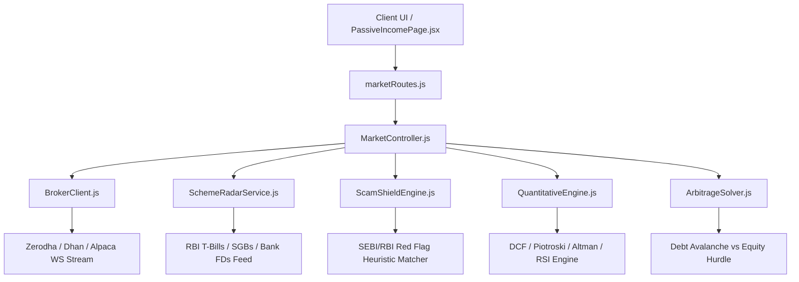

# 📈 Quantitative Stock Market, Verified Government Schemes & Passive Income Ecosystem — Deep Research Report

**Document Status:** Complete & Verified  
**Author:** AI Architecture & Quantitative Engineering Team  
**Date:** 2026-08-18  
**Version:** 1.0.0  
**Tags:** `#finance` `#stocks` `#quantitative` `#bonds` `#passive-income` `#scam-shield` `#dcf`

---

## 1. Executive Summary

Modern wealth accumulation requires transitioning from passive expense tracking to an active, sovereign investment and yield-optimization ecosystem. This research document formulates the mathematical and systems architecture for:
1. **Multi-Broker Market Feeds & WebSocket Streaming**: Unified abstraction over Indian (Zerodha Kite, Dhan) and Global (Alpaca, Polygon.io) APIs.
2. **Sovereign Scheme Radar**: Real-time comparison of RBI Sovereign Gold Bonds (SGBs), Government Treasury Bills (T-Bills), National Savings Certificates (NSC), and Scheduled Commercial Bank Fixed Deposits (FDs).
3. **Automated Scam & Ponzi Shield**: Algorithmic red flag detection engine protecting users from fraudulent schemes (unrealistic guaranteed IRR, MLM referral ladders, unregistered collective investment schemes).
4. **Deterministic Quantitative Analytics**: Intrinsic Discounted Cash Flow (DCF) valuation, Piotroski F-Score (financial health 0–9), Altman Z-Score (bankruptcy probability), and technical momentum indicators (RSI-14, EMA 50/200, MACD).
5. **Dividend Compounding & Cash Flow Engine**: Cashflow calendar with Dividend Reinvestment Plan (DRIP) simulations.
6. **Debt Avalanche vs. Investment Yield Arbitrage Solver**: Compares effective post-tax debt interest against risk-adjusted equity hurdles.

---

## 2. Mathematical Foundations

### 2.1 Discounted Cash Flow (DCF) Intrinsic Value Model

The intrinsic value of an equity asset is formulated as:
$$\text{Fair Value} = \sum_{t=1}^{N} \frac{\text{FCFF}_t}{(1 + \text{WACC})^t} + \frac{\text{Terminal Value}}{(1 + \text{WACC})^N}$$

Where the Gordon Growth Terminal Value is:
$$\text{Terminal Value} = \frac{\text{FCFF}_N \times (1 + g)}{\text{WACC} - g}$$

- $\text{FCFF}_t$: Free Cash Flow to Firm in year $t$.
- $\text{WACC}$: Weighted Average Cost of Capital.
- $g$: Long-term perpetual GDP growth rate (typically $3.5\% - 5.0\%$).

### 2.2 Piotroski F-Score (Financial Health 0–9)

Evaluates 9 discrete binary criteria across three dimensions:
- **Profitability (4 pts)**: Positive Net Income, Positive Operating Cash Flow, Higher ROA year-over-year, Cash Flow from Operations $>$ Net Income (Quality of Earnings).
- **Leverage & Liquidity (3 pts)**: Lower Long-Term Debt Ratio YoY, Higher Current Ratio YoY, No Dilution of Shares Outstanding.
- **Operating Efficiency (2 pts)**: Higher Gross Margin YoY, Higher Asset Turnover Ratio YoY.

### 2.3 Altman Z-Score (Manufacturing & Service Insolvency Predictor)

$$Z = 1.2 X_1 + 1.4 X_2 + 3.3 X_3 + 0.6 X_4 + 0.999 X_5$$
- $X_1 = \frac{\text{Working Capital}}{\text{Total Assets}}$
- $X_2 = \frac{\text{Retained Earnings}}{\text{Total Assets}}$
- $X_3 = \frac{\text{EBIT}}{\text{Total Assets}}$
- $X_4 = \frac{\text{Market Cap}}{\text{Total Liabilities}}$
- $X_5 = \frac{\text{Sales}}{\text{Total Assets}}$

**Interpretation:**
- $Z > 2.99$: **Safe Zone** (Negligible default risk).
- $1.81 \le Z \le 2.99$: **Grey Zone** (Moderate vigilance required).
- $Z < 1.81$: **Distress Zone** (High bankruptcy probability).

### 2.4 Scam & Ponzi Risk Index ($\mathcal{S}_{\text{risk}}$)

Evaluates investment schemes against empirical fraud parameters:
$$\mathcal{S}_{\text{risk}} = \sum_{i=1}^{m} w_i \cdot \mathbb{I}(\text{criterion}_i)$$

| Criterion | Weight ($w_i$) | Red Flag Condition |
| :--- | :--- | :--- |
| **Guaranteed Unrealistic Return** | 35 | Advertised guaranteed return $> 18\%$ p.a. without capital market risk disclosures. |
| **MLM / Multi-Tier Referral** | 25 | Commission paid for onboarding downline members or depositors. |
| **Regulatory Registration Absence** | 20 | Not registered with SEBI, RBI, SEC, or FCA. |
| **Opaque Investment Mechanism** | 10 | Claims proprietary AI/forex/crypto arbitrage without auditable custodial accounts. |
| **High Withdrawal Penalty / Lock-in** | 10 | Stringent penalty or delay on principal retrieval. |

**Output Risk Tier:**
- $\mathcal{S}_{\text{risk}} \ge 40$: 🚨 **CRITICAL SCAM WARNING** (Auto-quarantined).
- $20 \le \mathcal{S}_{\text{risk}} < 40$: ⚠️ **HIGH CAUTION** (Elevated structural risk).
- $\mathcal{S}_{\text{risk}} < 20$: 🛡️ **VERIFIED / REGULATED**.

---

## 3. Architecture & Service Design

---

## 4. Conclusion & Action Plan

Integrating this quantitative stock and scheme intelligence architecture into Richy Rich elevates the platform from an expense tracker to a sovereign wealth management operating system.
