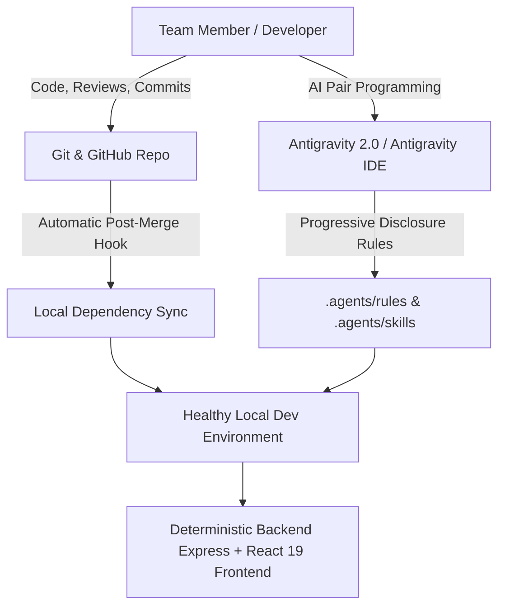
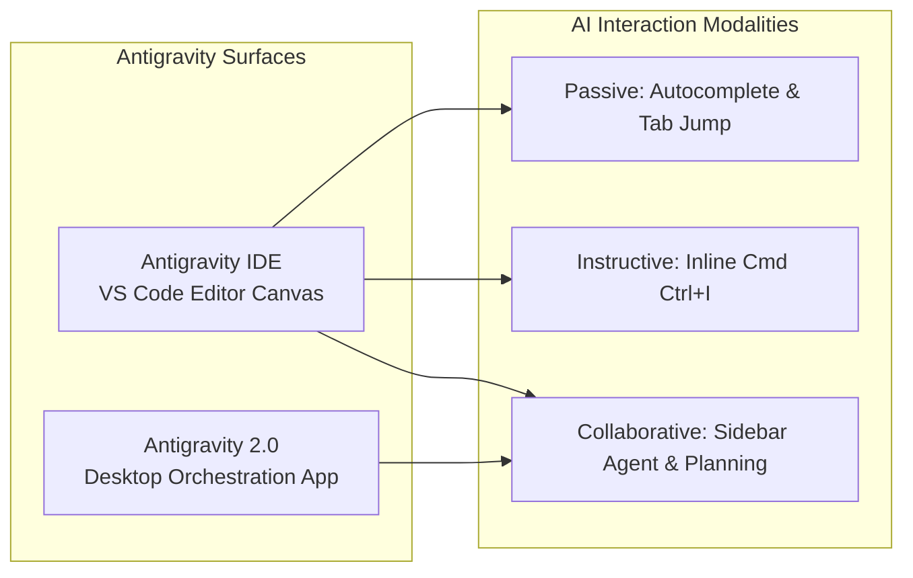

# Richy Rich v2.2 — Engineering Team Collaboration & Antigravity Manual

> **Authoritative User Manual & Team Collaboration Guide**  
> *Target Audience:* Software Engineers, Frontend/Backend Developers, AI Engineers, and QA Teams.  
> *Scope:* End-to-end local setup, Git/GitHub collaborative workflows, automated dependency syncing, and mastering Google Antigravity 2.0 & Antigravity IDE.

---

## Table of Contents

1. [Executive Summary & Core Philosophy](#1-executive-summary--core-philosophy)
2. [Repository Layout & Project Anatomy](#2-repository-layout--project-anatomy)
3. [Local Development Setup (Zero to Hero)](#3-local-development-setup-zero-to-hero)
4. [Automated Dependency Synchronization & Git Hooks](#4-automated-dependency-synchronization--git-hooks)
5. [Git & GitHub Professional Collaboration Standards](#5-git--github-professional-collaboration-standards)
6. [Mastering Google Antigravity 2.0 & Antigravity IDE](#6-mastering-google-antigravity-20--antigravity-ide)
7. [Team AI Customizations (.agents Workspace)](#7-team-ai-customizations-agents-workspace)
8. [Full-Stack Architecture & Code Conventions](#8-full-stack-architecture--code-conventions)
9. [Testing, Quality Assurance & Production Builds](#9-testing-quality-assurance--production-builds)
10. [Troubleshooting, Common Traps & Quick Reference](#10-troubleshooting-common-traps--quick-reference)

---

## 1. Executive Summary & Core Philosophy

**Richy Rich v2.2** is an AI-first Personal Finance Intelligence Platform engineered with a dual-layer philosophy:
1. **100% Deterministic Financial Arithmetic**: All calculations (budget pacing, savings milestones, recurring burn-rate trajectories, runway indicators, safe-to-spend quotas) rely on strictly validated mathematical models and database transactions.
2. **Autonomous AI Copilot Layer**: Built on top of Google Gemini models to provide natural language financial reasoning, automated categorization, receipt anomaly detection, and wealth acceleration advice.

To maintain industrial velocity, the codebase is structured so that team members can collaborate seamlessly across branches without experiencing environment drift, missing dependencies, or merge breakage.



---

## 2. Repository Layout & Project Anatomy

The repository uses a cohesive multi-package workspace structure:

```
Expense-Tracker-V2/
├── .agents/                        # Version-controlled Antigravity AI Customizations
│   └── rules/                      # Project-wide engineering & coding rules
│       └── codebase-standards.md   # Automatic standards for AI agents & team
├── .git/                           # Git metadata & automated hooks
│   └── hooks/                      # Local Git hooks (e.g. post-merge)
├── client/                         # Modern React 19 + Vite Frontend
│   ├── public/                     # Static assets (favicons, logos)
│   ├── src/
│   │   ├── api/                    # API client layer with JWT refresh rotation
│   │   │   └── client.js           # Central fetch wrapper (apiFetch)
│   │   ├── components/             # Reusable UI component library & Shell
│   │   ├── context/                # React Contexts (AuthContext, ThemeContext)
│   │   ├── pages/                  # Route views (Dashboard, Auth, Expenses, etc.)
│   │   ├── index.css               # Vanilla CSS design token system
│   │   └── main.jsx                # React root entry point
│   ├── package.json                # Client dependencies & build scripts
│   └── vite.config.js              # Vite server & proxy configuration (/api -> :5000)
├── server/                         # Express.js REST API Backend
│   ├── src/
│   │   ├── config/                 # DB connection with in-memory fallback
│   │   ├── controllers/            # Request handlers (auth, expense, budget, ai)
│   │   ├── middleware/             # Security stack (helmet, rateLimiter, audit, etc.)
│   │   ├── models/                 # Mongoose schemas (User, Expense, Goal, etc.)
│   │   ├── routes/                 # Express route definitions
│   │   ├── services/               # Core business logic (analytics, AI copilot)
│   │   ├── utils/                  # AppError class, asyncHandler, response formatters
│   │   ├── validators/             # Joi input validation schemas
│   │   └── server.js               # Express application bootstrap & lifecycle
│   ├── tests/                      # Jest & Supertest automated test suites (9 suites)
│   ├── package.json                # Server dependencies & test scripts
│   └── package-lock.json           # Locked dependency tree
├── scripts/                        # Automation & devops scripts
│   └── setup-git-hooks.cjs         # Cross-platform Git hook installer
├── user manual/                    # Documentation hub for team members
│   └── TEAM_COLLABORATION_MANUAL.md# Authoritative team guide
├── package.json                    # Workspace root task orchestrator
├── .env.example                    # Environment variable template
├── .gitignore                      # Git ignore specifications
└── README.md                       # High-level project overview
```

---

## 3. Local Development Setup (Zero to Hero)

### Step 1: System Prerequisites

Ensure you have the following installed on your workstation:
- **Node.js**: Version `v20.x` or higher (LTS recommended). Check with `node -v`.
- **npm**: Version `10.x` or higher. Check with `npm -v`.
- **Git**: Version `2.30+`. Check with `git --version`.
- **MongoDB (Optional)**: If you do not have MongoDB installed locally, the server **automatically provisions an In-Memory MongoDB Server (`mongodb-memory-server`)**, ensuring 100% zero-dependency out-of-the-box startup!

---

### Step 2: Clone & One-Command Setup

1. Clone the repository:
   ```bash
   git clone https://github.com/NotAnAyush/Expense-Tracker.git
   cd "Expense-Tracker/V2"
   ```

2. Run the one-step workspace setup:
   ```bash
   npm run setup
   ```
   > **What `npm run setup` does:**
   > 1. Configures the automated Git `post-merge` hook in `.git/hooks/post-merge`.
   > 2. Installs all backend dependencies inside `server/`.
   > 3. Installs all frontend dependencies inside `client/`.

---

### Step 3: Environment Variables (`.env`)

In the `server/` directory, create a `.env` file (or copy from `.env.example` in the root):

```ini
# Server Configuration
PORT=5000
NODE_ENV=development

# MongoDB Connection String (Leave empty to use automatic in-memory fallback)
MONGODB_URI=mongodb://127.0.0.1:27017/expense-tracker-v2

# JWT Secret for access token signing
JWT_SECRET=super_secret_jwt_key_personal_finance_v2_2026

# Gemini API Key (Optional: fallback analytics are used if omitted)
GEMINI_API_KEY=your_gemini_api_key_here

# Frontend URL for CORS Whitelisting
FRONTEND_URL=http://localhost:5173
```

---

### Step 4: Running the Application Locally

You can run both services via separate terminal tabs or root scripts:

#### Terminal 1 — Backend API Server:
```bash
npm run dev:server
# Runs on http://localhost:5000 (with nodemon auto-restart)
```

#### Terminal 2 — Frontend Client:
```bash
npm run dev:client
# Runs on http://localhost:5173 (with Vite HMR)
```

---

### Step 5: Smoke Testing & Verification

1. Open your browser and navigate to `http://localhost:5173`.
2. Click **"Launch Instant Sandbox Demo"** on the Sign-In screen:
   - This seeds sample transactions, goals, budgets, and recurring expenses.
3. Check the Backend Health Endpoint:
   ```bash
   curl http://localhost:5000/api/health
   ```
   Expected response:
   ```json
   {
     "status": "online",
     "database": "connected",
     "system": "AI-First Personal Finance Intelligence Platform",
     "version": "2.2.0"
   }
   ```

---

## 4. Automated Dependency Synchronization & Git Hooks

### The "Missing Package After Pull" Problem

When teammates add new packages (e.g., adding `helmet`, `joi`, `compression`), they commit `package.json` and `package-lock.json`. When you run `git pull`, Git merges the code changes into your workspace, but **it does not automatically run `npm install`**. As a result, your running server crashes with:
```
Error: Cannot find module 'package-name'
```

### The Solution: Automated `post-merge` Git Hook

The project includes an automatic Git hook in `.git/hooks/post-merge` installed via `scripts/setup-git-hooks.cjs`.

Every time you execute `git pull` or `git merge`:
1. Git triggers the `post-merge` script.
2. The script diffs the incoming commits against `ORIG_HEAD`.
3. If `server/package.json` or `server/package-lock.json` changed, it automatically runs `npm install` inside `server/`.
4. If `client/package.json` or `client/package-lock.json` changed, it automatically runs `npm install` inside `client/`.
5. Your running `nodemon` or Vite dev servers reload with the updated packages without manual intervention!

#### Manual Hook Re-installation:
If you clone the repo onto a new computer or recreate `.git`, re-run:
```bash
npm run setup:hooks
```

---

## 5. Git & GitHub Professional Collaboration Standards

To maintain clean git history and prevent merge conflicts across team members, follow these standards:

### 5.1. Branching Strategy

- **`main`**: Production-ready, stable code. Direct commits to `main` are restricted.
- **`feature/<feature-name>`**: For new capabilities (e.g., `feature/recurring-insights`, `feature/pdf-export`).
- **`fix/<bug-name>`**: For bug fixes (e.g., `fix/auth-token-refresh`, `fix/budget-pacing-rounding`).
- **`refactor/<component>`**: For structural improvements without functional changes.

---

### 5.2. Conventional Commits 1.0

Write clear, structured commit messages following the Conventional Commits specification:

```
<type>(<optional scope>): <short description in present tense>

[optional body with rationale and details]

[optional footer(s) e.g., Closes #123]
```

#### Commit Types:
| Type | Purpose | Example |
| :--- | :--- | :--- |
| `feat` | New feature or capability | `feat(recurring): add pause and resume recurring bill toggle` |
| `fix` | Bug fix in code | `fix(auth): prevent unhandled error on expired refresh token` |
| `docs` | Documentation updates | `docs(manual): add Antigravity IDE team collaboration guide` |
| `style` | Formatting, CSS, no code logic change | `style(dashboard): refine neon glow on discretionary card` |
| `refactor`| Code restructuring without changing behavior | `refactor(analytics): extract trend calculation to service` |
| `test` | Adding or updating tests | `test(expenses): add boundary tests for multi-currency filter` |
| `chore` | Build tasks, dependency updates, configs | `chore(deps): bump helmet from 8.2.0 to 8.3.0` |

---

### 5.3. Daily Synchronization Workflow

Before starting new work or submitting a Pull Request, always sync with `main`:

```bash
# 1. Stash any uncommitted work if needed
git stash

# 2. Switch to main and pull latest remote updates
git checkout main
git pull origin main

# 3. Switch back to your feature branch and rebase on main
git checkout feature/your-feature
git rebase main

# 4. Pop stashed changes if any
git stash pop
```

> **Why Rebase over Merge for Feature Branches?**  
> Rebasing places your feature commits on top of the latest `main` commits, maintaining a linear, readable Git history free from cluttered merge commits.

---

### 5.4. Pull Request (PR) Quality Checklist

Before marking a Pull Request ready for review:
1. **Run Backend Tests**: `npm test` (all 9 suites and 79+ tests must pass).
2. **Run Frontend Build**: `npm run build` (must build cleanly with Vite).
3. **Verify API Contract**: Ensure any new endpoints use Joi validation and `AppError`.
4. **Self-Review Diff**: Check `git diff` to ensure no debug `console.log` or `.env` secrets are committed.

---

## 6. Mastering Google Antigravity 2.0 & Antigravity IDE

Google Antigravity is an AI-first collaborative engineering environment. Depending on your workflow, you can use the **Antigravity IDE** or the **Antigravity 2.0 Desktop Platform**.



---

### 6.1. The Three AI Interaction Modalities

#### A. Passive Modality: Antigravity Tab (Autocomplete & Supercomplete)
- **Context-Aware Suggestions**: Anticipates your next line of code, import statement, or function parameter based on open files, surrounding AST, and terminal output.
- **Tab to Jump**: Predicts your next navigation target in the file; press <kbd>Tab</kbd> to jump directly there.
- **Tab to Import**: Automatically resolves missing module imports at the top of the file when typing a new component or utility.
- **Controls**:
  - Accept full suggestion: <kbd>Tab</kbd>
  - Reject / Dismiss: <kbd>Esc</kbd>
  - Accept word-by-word: <kbd>Ctrl</kbd> + <kbd>→</kbd> (Windows/Linux) or <kbd>Cmd</kbd> + <kbd>→</kbd> (macOS)

#### B. Instructive Modality: Inline Command (<kbd>Ctrl</kbd>+<kbd>I</kbd> / <kbd>Cmd</kbd>+<kbd>I</kbd>)
- Highlight any code block and press <kbd>Ctrl</kbd>+<kbd>I</kbd> to execute localized refactoring, documentation generation, or targeted bug fixes without changing surrounding code.
- Trigger without highlighting to generate boilerplate or new functions at the current cursor position.

#### C. Collaborative Modality: Agent & Planning Mode
- For complex, multi-file tasks (e.g. creating a new analytics endpoint, refactoring state management, or debugging full-stack flows).
- The Agent operates with tool capabilities: reading/writing files, running tests, inspecting terminal output, searching documentation, and creating structured visual artifacts.

---

### 6.2. Planning Mode Workflow

When tackling non-trivial tasks in Antigravity, the agent follows the structured **Planning Mode**:

```
[1. Research & Analysis] ──► [2. Implementation Plan Artifact] ──► [3. User Approval Review]
                                                                          │
[5. Walkthrough & Verification] ◄── [4. Autonomous Tool Execution] ◄──────┘
```

1. **Research**: The agent inspects files, runs diagnostic tests, and gathers context without modifying production code.
2. **Implementation Plan (`implementation_plan.md`)**: Generates an interactive plan artifact detailing proposed changes, impacted files, open questions, and verification steps.
3. **User Review**: Execution pauses until you click **"Proceed"** or provide refining feedback.
4. **Execution**: The agent performs code edits, runs builds, and verifies behavior.
5. **Walkthrough (`walkthrough.md`)**: Documents the finished changes with clickable file links, diffs, and verification proof.

---

### 6.3. Context `@ Mentions` & Slash Commands

Enhance your pair programming prompts using Antigravity shortcuts:

#### High-Value Slash Commands:
- `/goal`: Launch a deep, autonomous paired workflow where the agent runs until the defined goal is verified.
- `/grill-me`: Triggers an interactive interview where the agent asks clarifying architectural questions to refine a complex plan before coding.
- `/schedule`: Set a recurring cron job or one-shot delayed reminder (e.g., check build status).
- `/learn`: Persists a newly established rule or pattern to memory for future tasks.

#### Precision `@ Mentions`:
- `@file / @folder`: Pin specific files (e.g., `@server/src/controllers/recurringController.js`) directly into prompt context.
- `@terminal`: Share active terminal logs and error traces directly with the agent.
- `@rule`: Explicitly reference team guidelines in `.agents/rules/`.
- `@mcp`: Query Model Context Protocol tools and connected databases.

---

## 7. Team AI Customizations (`.agents` Workspace)

Antigravity automatically discovers and loads customizations stored in the repository's `.agents/` folder. This ensures every team member's AI assistant follows identical guidelines.

### Customization Directory Structure:
```
.agents/
├── rules/                       # Automatically loaded coding guidelines
│   ├── codebase-standards.md   # Core full-stack architecture standards
│   └── security-rules.md       # API security, secrets, and auth rules
└── skills/                      # On-demand runbooks & domain procedures
    └── deploy-procedure/
        └── SKILL.md             # Multi-step instructions loaded on demand
```

### Rule Precedence Hierarchy:
1. **Workspace Rules (`<repo>/.agents/rules/`)** *(Highest Priority)*
2. **Declared Configs (`skills.json`, `plugins.json`)**
3. **Global User Rules (`~/.gemini/config/`)**
4. **Built-in System Skills** *(Baseline)*

---

## 8. Full-Stack Architecture & Code Conventions

### 8.1. Backend REST Architecture (`server/`)

- **Async Error Handling**: Every controller action must be wrapped in `asyncHandler`:
  ```javascript
  const asyncHandler = require('../utils/asyncHandler');
  const { BadRequestError, NotFoundError } = require('../utils/errors');

  exports.getExpenseById = asyncHandler(async (req, res) => {
    const expense = await Expense.findOne({ _id: req.params.id, userId: req.user._id });
    if (!expense) {
      throw new NotFoundError('Expense not found');
    }
    res.json({ data: expense });
  });
  ```
- **Validation Middleware**: Declare Joi schemas in `server/src/validators/` and inject them via `validate(schema)` on mutating routes:
  ```javascript
  router.post('/', protect, validate(createExpenseSchema), createExpense);
  ```
- **Operational Errors**: Always throw instances of `AppError` (`BadRequestError`, `UnauthorizedError`, `ForbiddenError`, `NotFoundError`, `ConflictError`, `ValidationError`).

---

### 8.2. Frontend Client Architecture (`client/`)

- **Design System Tokens**: Use CSS variables from `client/src/index.css` (`var(--color-mint)`, `var(--color-bg)`, `var(--radius-md)`, etc.).
- **Centralized API Client**: Always use `apiFetch(endpoint, options)` from `client/src/api/client.js`. It automatically injects auth headers and silently refreshes expired access tokens.
- **Micro-Interactions**: Use `framer-motion` for animated transitions and `lucide-react` for iconography.

---

### 8.3. Multi-AI Provider Framework & Local RAG Architecture

Richy Rich v2.2 features a provider-agnostic AI layer. Users and team members can configure any AI model from the **AI & Settings** tab (`/settings`):

#### Supported Providers:
1. **Google Gemini**: Native SDK integration (`gemini-2.0-flash`, `gemini-1.5-flash`, `gemini-1.5-pro`).
2. **OpenAI**: Direct integration (`gpt-4o-mini`, `gpt-4o`, `o3-mini`).
3. **Anthropic Claude**: Messages API (`claude-3-5-haiku`, `claude-3-5-sonnet`).
4. **Groq**: Ultra-fast inference engine (~500+ tokens/s) for `llama-3.3-70b-versatile` and `deepseek-r1-distill-llama-70b`.
5. **DeepSeek**: Direct high-efficiency reasoning (`deepseek-chat`, `deepseek-reasoner`).
6. **Mistral AI**: EU-compliant open models (`mistral-small-latest`, `mistral-large-latest`).
7. **OpenRouter**: Unified gateway for 100+ AI models via a single API key.
8. **Ollama (100% Local / Offline)**: Connects to local daemon at `http://localhost:11434/v1` for zero-cost private execution.
9. **Custom Endpoints**: Any OpenAI-compatible REST endpoint (vLLM, LM Studio, Together, or internal enterprise AI proxy) with customizable base URL and request headers.
10. **Native Local RAG Engine**: Zero external network dependency. Uses database factual retrieval and domain-engineered financial templates to provide 100% reliable copilot and categorization offline.

#### Cascade Fallback System:
```
[User AI Request] ──► [Selected Cloud AI Provider]
                              │
                    (On Timeout / Error / Rate-limit)
                              │
                              ▼
               [Deterministic Local RAG Engine] ──► [Zero-Downtime Response]
```

---

## 9. Testing, Quality Assurance & Production Builds

### Running Automated Test Suites

The backend includes a comprehensive Jest test suite with 10 suites and 87+ tests:

```bash
# Run all test suites
npm test

# Run tests with real-time watch mode
cd server && npx jest --watch

# Run a specific test suite
cd server && npx jest tests/recurring.test.js
```

### Production Build Validation

Validate the client bundle:
```bash
npm run build
```
Vite will compile and output minified static assets to `client/dist/`.

---

## 10. Troubleshooting, Common Traps & Quick Reference

### Issue 1: `Cannot find module 'xyz'` after `git pull`
- **Cause**: New dependencies were added to `package.json` by a teammate.
- **Fix**: Run `npm run install:all` (or verify that `.git/hooks/post-merge` is installed via `npm run setup:hooks`).

---

### Issue 2: `Error: listen EADDRINUSE: address already in use :::5000`
- **Cause**: A background Node process is already running on port 5000.
- **Fix (Windows PowerShell)**:
  ```powershell
  Get-Process -Id (Get-NetTCPConnection -LocalPort 5000).OwningProcess | Stop-Process -Force
  ```
- **Fix (macOS / Linux)**:
  ```bash
  kill -9 $(lsof -ti:5000)
  ```

---

### Issue 3: 401 Unauthorized / Token Expiration Loop
- **Cause**: Expired JWT in browser `localStorage`.
- **Fix**: Sign out and sign back in, or click **"Launch Instant Sandbox Demo"** to refresh session tokens and cookies.

---

### Quick Reference Command Cheat Sheet

| Command | Action |
| :--- | :--- |
| `npm run setup` | Install all dependencies across client/server and install Git hooks |
| `npm run install:all` | Run `npm install` in both `server` and `client` |
| `npm run dev:server` | Start backend Express API server on `http://localhost:5000` |
| `npm run dev:client` | Start frontend Vite development server on `http://localhost:5173` |
| `npm test` | Execute all 9 Jest test suites in `server/` |
| `npm run build` | Compile production frontend bundle in `client/dist/` |
| `git pull --rebase origin main` | Sync feature branch with remote `main` cleanly |
